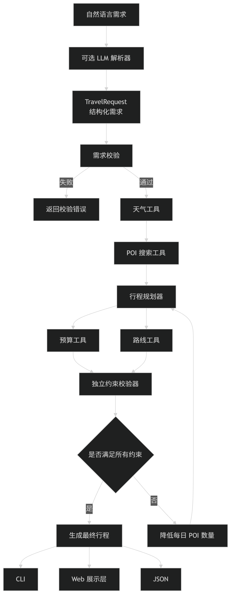

# 基于大模型与工具协同的杭州旅行规划 Agent 总报告

## 摘要

本项目面向“杭州多日旅行规划”场景，设计并实现了一个可运行、可解释、可评测的旅行规划智能体。系统能够从结构化旅行需求或自然语言需求出发，查询杭州 POI 数据集，结合用户偏好、必去景点、避开条件、步行强度、开放时间、天气、路线和预算等约束，生成逐日可执行行程，并在输出前进行独立约束校验。

项目的主方案不是让大模型直接生成完整行程，而是将大模型限制在“自然语言需求解析”环节：大模型只负责把文本转换为 `TravelRequest`，景点、价格、路线、时间和预算均由结构化数据、确定性工具和规划器计算得到。为了完成能力对比，项目另外实现了一个完全隔离的轻量 RAG 基线，使用 BM25 检索 POI 文档后交给 LLM 生成行程。

当前数据集包含 69 条经过核验、可以直接用于规划的杭州 POI。离线功能评测的 4 个场景全部完成，硬约束满足率和必去景点完成率均为 100%；80 项自动化测试全部通过。50 轮性能基准共执行 200 次规划，平均本地规划耗时 1.24 ms。RAG 基线在 4 个案例中的知识库依据率为 100%，但平均生成耗时约 26188.25 ms，且不具备严格的预算计算和约束校验能力。

## 1. 实验目标与问题定义

### 1.1 实验目标

本项目希望回答以下问题：

1. 如何将自然语言旅行需求转化为可计算的结构化约束？
2. 如何构建一个质量可控、可追溯的杭州 POI 数据集？
3. 如何通过 Skill、工具和规划器协同生成满足预算、时间和必去条件的行程？
4. 与“检索文档后直接让 LLM 生成行程”的纯 RAG 方案相比，结构化 Agent 的优势和代价是什么？
5. 如何用自动化测试和场景评测量化系统的正确性、稳定性、性能和降级能力？

### 1.2 输入与输出

系统支持两类输入：

- 结构化 JSON：直接包含城市、天数、日期、人数、预算、偏好和约束等字段。
- 自然语言：例如“两个成年人去杭州玩两天，预算 1200 元，喜欢历史和美术，灵隐寺必去，尽量少走路”。

系统输出包括：

- 结构化旅行需求摘要；
- 每天的 POI 顺序、到达时间、离开时间和停留时长；
- POI 之间的交通方式、距离和时间；
- 门票、交通、餐饮和总预算估算；
- 数据质量提醒、天气提醒和硬约束校验结果；
- Agent 各阶段的工具调用轨迹，便于解释和调试。

## 2. 总体方案与系统架构

### 2.1 主方案定位

主方案采用“LLM 负责理解，程序负责事实和决策”的分工：



`TravelPlanningAgent` 使用显式状态机协调各阶段，不依赖 LangGraph 等额外框架。每个阶段都会记录状态、耗时或降级原因，最终结果中保留完整调用轨迹。

### 2.2 项目目录和模块职责

```text
项目根目录/
  app.py                         命令行入口
  web_app.py                     本地 Web 服务入口
  config/amap_keywords.json      高德采集关键词与类别配置
  data/
    raw/                         高德原始数据
    review/                      人工核验 CSV
    processed/                   Agent 实际读取的 JSONL 数据
  src/travel_agent/
    models.py                    POI、TravelRequest、行程和校验模型
    config.py                    环境变量与规划参数
    data/poi_repository.py       POI 加载、索引、查询和筛选
    services/amap_client.py      高德 HTTP、SSL、重试和错误处理
    tools/poi_search.py          结构化偏好到候选 POI
    tools/amap_route.py          高德路线与本地降级估算
    tools/weather.py             高德天气与室内活动建议
    tools/budget.py              门票、交通、餐饮和总预算计算
    planner/optimizer.py         POI 分配、时间和距离优化
    planner/itinerary.py         逐日行程和费用生成
    planner/validator.py         独立约束校验
    agent/graph.py               Agent 状态机与一次重规划
    agent/prompts.py             自然语言解析提示词
    llm/client.py                OpenAI 兼容接口客户端
    presentation/cli.py          命令行可读输出
  rag_baseline/                  隔离的 RAG 对比基线
  eval/                          场景评测、性能基准和正式结果
  tests/                         单元测试和端到端测试
  web/index.html                 本地 Web 展示页面
```

### 2.3 LLM、知识库和工具的边界

LLM 只负责以下任务：

- 从自然语言识别旅行天数、人数、预算和日期；
- 提取偏好、地区、必去景点、避开条件和交通偏好；
- 按提示词输出符合数据格式规范的 JSON。

LLM 不负责直接决定以下事实：

- 景点是否存在；
- 门票价格和开放时间；
- 两个地点之间的距离和交通费用；
- 总预算是否超限；
- 必去景点是否真正进入最终行程。

这些事实由本地 POI 数据集和工具计算，最后由 `ItineraryValidator` 独立检查。因此，即使模型输出不稳定，也不会直接把虚构景点或未经核验的价格写进行程。

## 3. POI 数据集构建

### 3.1 数据来源

数据主要来自高德地图 Web 服务 API。采集脚本按照 `config/amap_keywords.json` 中的关键词和类别进行分页搜索，保存高德返回的原始 JSON，并生成标准化草稿和人工核验 CSV。

采集链路为：

```text
高德 Web 服务 API
      |
      v
data/raw/amap_pois.json
      |
      v
字段标准化、去重、类别均衡
      |
      v
data/processed/hangzhou_pois_draft.jsonl
      |
      v
data/review/hangzhou_poi_review.csv 人工核验
      |
      v
data/processed/hangzhou_pois.jsonl
```

### 3.2 数据筛选过程

本次数据经历了以下阶段：

| 阶段 | 数量 | 说明 |
| --- | ---: | --- |
| 初始采集候选 | 约 100 条 | 高德分页搜索并按 POI ID 去重 |
| 人工核验表 | 71 条 | 删除重复、无关或不适合规划的记录 |
| 最终规划数据集 | 69 条 | 通过严格构建，全部 `planning_ready=true` |

### 3.3 字段设计

下面是一条最终 JSONL 数据的示例。字段名是程序内部使用的固定格式，字段值由高德原始数据和人工核验结果共同得到：

```json
{
  "id": "amap_B0HGNGK3FG",
  "name": "南宋德寿宫遗址博物馆",
  "category": "museum",
  "district": "上城区",
  "address": "望江路228-264号",
  "longitude": 120.173273,
  "latitude": 30.238678,
  "opening_hours": {
    "mon": [],
    "tue": [{"open": "09:30", "close": "17:00"}],
    "wed": [{"open": "09:30", "close": "17:00"}],
    "thu": [{"open": "09:30", "close": "17:00"}],
    "fri": [{"open": "09:30", "close": "17:00"}],
    "sat": [{"open": "09:30", "close": "17:00"}],
    "sun": [{"open": "09:30", "close": "17:00"}]
  },
  "ticket_price_yuan": 0.0,
  "recommended_duration_min": 120,
  "indoor": true,
  "requires_reservation": true,
  "walk_level": "low",
  "tags": ["博物馆", "历史遗址"],
  "planning_ready": true
}
```

其中 `opening_hours_raw` 只作为高德参考原文，不能替代人工核验。`business.cost` 可能是人均消费，程序不会将其误当成景点门票。严格构建会拒绝缺少坐标、时间窗口、票价策略或规划所需字段的记录。

## 4. 能力构建与优化设计

### 4.1 POI 搜索 Skill

`poi_search.py` 接收结构化 `POISearchInput`，不依赖 LLM，主要步骤如下：

1. 将“历史、艺术、自然、亲子、湿地”等用户偏好映射到预定义 POI 类别。
2. 优先解析必去景点，精确名称或包含关系匹配成功后强制保留。
3. 根据地区、室内偏好、预约要求和最大步行强度过滤候选。
4. 根据偏好匹配、标签命中、室内属性、步行等级和数据完整度计算分数。
5. 对候选按分数排序，并通过类别轮换避免结果全部集中在同一类别。
6. 对避开条件执行最后过滤，同时报告未解析的必去景点或数据提醒。

这种设计将“语义偏好”限制在可审计的类别映射和打分规则中，保证同一输入在相同数据集下可以稳定复现。

### 4.2 路线工具

`amap_route.py` 支持步行和驾车/出租车路线。启用高德 API 时使用真实路线；请求失败、配额不足或网络异常时，使用本地 Haversine 直线距离乘以道路系数，并按交通模式估算时间。所有降级会写入工具调用轨迹和提醒，不会静默伪装成真实路线。

### 4.3 天气工具

天气工具可以读取高德当前天气和未来预报，并将结果转化为确定性建议：

- 雨、雪和强对流时，将室内景点作为优先候选；
- 高温时减少午间长时间户外活动；
- 极低温时减少长时间户外停留；
- 正常晴天或多云时允许户外景点正常参与规划。

如果出发日期超出高德预报范围，系统返回 `partial`，只使用实际获得的日期，不编造未来天气。

### 4.4 预算工具

预算由三部分组成：

```text
总预算 = 景点门票 + 交通费用 + 餐饮估算
```

默认餐饮估算为每人每天 100 元；出租车费用按照基础车费、基础距离和超出距离计算，并按 4 人/车估计车辆数。未知票价会标记为估算值，预算摘要中同时输出提醒。预算工具只进行数值计算，最终是否超预算由独立校验器判断。

### 4.5 行程优化与重规划

优化器采用确定性的贪心策略：在每天活动时间窗内，综合候选分数、前后站交通时间和同类别重复惩罚，最多安排配置允许数量的 POI，默认不超过每天 4 个。必去景点优先级最高。

校验器至少检查以下硬约束：

- 天数是否匹配；
- 行程顺序是否连续；
- POI 是否重复；
- 是否超出每日活动时间；
- 是否超出开放时间；
- 必去景点是否出现；
- 预算是否超限；
- 行程是否为空。

若首版行程校验失败，Agent 会根据错误类型执行一次重规划。例如预算超限时减少每日 POI 数量，并降低高票价候选的优先级。重规划仍失败时，系统返回明确错误而不是输出未经验证的“成功”结果。

## 5. 轻量 RAG 对比方案

### 5.1 RAG 结构

RAG 代码位于 `rag_baseline/`，不调用主 Agent 的路线、预算、规划器和校验器。

```text
用户文本
   |
   v
中文 unigram + bigram 分词
   |
   v
BM25 检索 POI 文档 Top-K
   |
   v
RAG Prompt 将候选文本交给 LLM
   |
   v
生成 JSON 行程
   |
   v
确定性转换为自然语言说明
```

语料由最终 69 条 POI 转换而来，每个文档包含名称、类别、区域、地址、票价、开放时间、室内属性、步行强度和标签。BM25 对中文同时保留单字和相邻双字词，并对查询中直接出现的 POI 名称增加匹配分。

Prompt 要求模型严格只使用 Top-K 文档，不编造景点、价格、地址和开放时间，并输出固定 JSON。程序保留原始 JSON，并将其中的逐日景点、时间、预计费用和假设条件转换为自然语言说明；这个转换过程不再次调用大模型，因此不会增加生成延迟或改变评测数据。但 RAG 基线没有执行真实的时间窗、路线、餐饮和预算校验，所以其结果主要用来衡量检索结果的知识库依据程度和生成链路，不代表完整旅行规划能力。

### 5.2 方案对比假设

本实验比较两种设计：

| 方案 | 事实来源 | 规划方式 | 约束校验 | 主要优点 |
| --- | --- | --- | --- | --- |
| RAG + LLM | Top-K POI 文档 | LLM 直接生成 | 无完整校验 | 实现简单，生成灵活 |
| 结构化 Agent | POI 仓库和工具 | 确定性优化器 | 有预算、时间和必去校验 | 可控、可解释、速度快 |

两种方案使用同一批 POI 事实和 4 个相同语义场景，RAG 取 `top_k=8`，记录完成率、知识库依据率、必去完成率和生成耗时；结构化 Agent 记录完成率、约束满足率、预算合规率和本地规划耗时。

## 6. 程序运行方法

### 6.1 环境准备

项目核心流程只使用 Python 标准库。建议使用 Python 3.10 及以上版本，本次测试环境为 Windows PowerShell、MSYS2 Python 3.12。

复制环境变量模板：

```powershell
Copy-Item .env.example .env
notepad .env
```

离线结构化需求不需要 LLM Key。自然语言输入需要配置 OpenAI 兼容接口：

```dotenv
AMAP_API_KEY=你的高德Web服务Key
LLM_API_KEY=你的大模型APIKey
LLM_BASE_URL=https://api.deepseek.com/v1
LLM_MODEL=deepseek-chat
```

不要把真实 Key 写入 Python 文件或提交到仓库。若 HTTPS 出现证书错误，应配置可信 CA 文件或安装 `certifi`，不要关闭 SSL 校验。

### 6.2 构建数据集

已有 review CSV 时，直接严格构建：

```powershell
python scripts/build_poi_dataset.py
```

预期结果是 `Included POIs: 69`、`Planning-ready POIs: 69`、`Incomplete POIs: 0`。

若需要重新采集原始 POI：

```powershell
python scripts/fetch_amap_pois.py --pages 2 --limit 100 --overwrite-review
```

重新采集会重新生成 raw、draft 和 review 文件；人工修改后的 CSV 不应随意覆盖。

### 6.3 运行主 Agent

运行内置离线示例：

```powershell
python app.py
```

运行结构化 JSON 文件：

```powershell
python app.py --request-file request.json
```

运行自然语言需求：

```powershell
python app.py --text "两个人去杭州玩两天，预算1200元，喜欢历史和美术，灵隐寺必去，尽量少走路"
```

查看完整 JSON 和工具轨迹：

```powershell
python app.py --request-file request.json --json
python app.py --request-file request.json --show-trace
```

启用高德实时天气和路线：

```powershell
python app.py --request-file request.json --live-weather --live-routes
```

### 6.4 运行 Web 展示层

启动本地服务：

```powershell
python web_app.py
```

浏览器访问：`http://127.0.0.1:8765`

Web 页面通过 `POST /api/plan` 接收如下 JSON：

```json
{
  "text": "一个人去杭州玩一天，喜欢博物馆和历史",
  "live_weather": false,
  "live_routes": false
}
```

### 6.5 运行测试和评测

自动化测试：

```powershell
python -m unittest discover -s tests -v
```

离线场景评测：

```powershell
python eval/run_evaluation.py --output eval/report.json
```

离线性能基准：

```powershell
python eval/run_benchmark.py --iterations 50 --output eval/benchmark.json
```

RAG 只检索不调用 LLM：

```powershell
python -m rag_baseline.run --text "灵隐寺必去，喜欢历史" --top-k 5 --retrieve-only --json
```

将 RAG 的结构化结果显示为自然语言：

```powershell
python -m rag_baseline.run --text "灵隐寺必去，喜欢历史" --top-k 8 --natural-language
```

RAG 与结构化 Agent 对比需要配置 LLM：

```powershell
python -m rag_baseline.compare --top-k 8 --output rag_baseline/data/compare_report.json
```

## 7. 实验设计与评估指标

### 7.1 测试层次

项目采用由内到外的五层测试：

1. **模型和数据单元测试：** 检查字段校验、中文布尔值、开放时间解析、票价和坐标合法性。
2. **工具测试：** 检查 POI 搜索、路线响应解析、天气解析、预算计算、缓存和错误处理。
3. **规划端到端测试：** 使用当前 69 条 POI 运行完整 Agent，检查行程、预算和约束。
4. **场景评测和性能测试：** 使用 4 个固定需求重复执行并统计完成率和耗时分布。
5. **外部服务与展示层测试：** 检查 LLM 解析、高德接口降级和 Web API 行为。
6. **用户满意度测试：**邀请了5位用户体验agent，并给出反馈和建议。

### 7.2 指标定义

- **场景完成率：** `status=completed` 的场景数 / 总场景数。
- **约束满足率：** `ValidationReport.is_valid=true` 的场景数 / 总场景数。
- **必去完成率：** 被排入最终行程的必去 POI 数 / 用户指定的必去 POI 数。
- **预算合规率：** 规划总费用不超过用户预算的场景数 / 有预算场景数。
- **知识库依据率：** LLM 生成的 POI 名称中，能在检索 Top-K 中找到对应项的比例。
- **平均耗时：** 单次规划或 LLM 生成的平均端到端耗时。
- **降级可用性：** 上游天气或路线失败时，系统是否仍能生成可执行结果并明确告知用户。

### 7.3 固定离线场景

| 场景 | 核心约束 |
| --- | --- |
| 历史艺术两日游 | 两天、成人 2 人、预算 1200 元、偏好历史和艺术、南宋德寿宫遗址博物馆必去、避开动物园、范围为上城区和西湖区 |
| 自然景观一日游 | 一天、成人 1 人、预算 500 元、偏好自然和湿地、避开动物园、范围为西湖区、活动时间为 08:30-18:00 |
| 亲子博物馆 | 两天、成人 2 人和儿童 1 人、预算 1800 元、偏好亲子和博物馆、杭州博物馆必去、优先室内景点 |
| 老人低步行 | 一天、成人 1 人和老人 1 人、预算 800 元、偏好文化街区、范围为上城区、最大步行强度为低、只使用出租车 |

这四个场景覆盖了多日规划、不同出行人群、预算限制、兴趣偏好、指定区域、必去景点、避开条件、室内偏好和低步行要求。评测时不调用大模型、实时天气和实时路线接口，只使用固定结构化需求和本地 POI 数据，因此结果不受网络状态、API 配额和模型随机性的影响，能够稳定复现。


### 7.4 用户满意度评估

本项目当前自动化评测主要衡量正确性、约束满足率和运行效率。为了补充真实使用体验，我们邀请了5位实际用户完成若干旅行规划任务，并根据agent回复内容打分。

以下是 5 位用户使用的扩充版提示词：

| 用户 | 扩充后的提示词 |
| --- | --- |
| A | 我和朋友两个人准备去杭州玩两天，总预算大约 1200 元。希望景点门票、交通和吃饭的花销都比较合理，不要安排价格过高或明显超出预算的项目，同时希望保留一些有代表性的杭州景点。 |
| B | 我想去杭州进行两日游，喜欢历史文化和自然景观。请尽量安排交通方便、地铁或出租车容易到达的景点，景点之间的距离不要太远，最好按照区域集中安排，减少长时间坐车和来回奔波。 |
| C | 我们一家三口准备去杭州旅游两天，有一个孩子，希望行程附近有方便入住的酒店或住宿区域。请优先安排酒店周边交通便利、生活设施较齐全的景点，不要每天更换住宿地点，整体行程适合家庭出行。 |
| D | 我计划在国庆等假期去杭州游玩两天，但不希望每天都去特别拥堵、排队时间很长的热门景区。请尽量避开人流高峰，安排预约方便、游客相对少一些的景点，并提示可能出现拥堵的路段或时间。 |
| E | 我准备去杭州玩一天，希望景点附近就有方便吃饭的饭店或商圈。请在行程中安排合理的午餐和晚餐时间，优先选择景区周边餐饮较多、步行距离较近的地点，避免为了吃饭专门往返很远。 |

## 8. 实验结果

### 8.1 数据质量结果

最终数据集包含 69 条 POI、12 个类别，所有纳入记录均通过严格构建，缺少必填字段为 0，`planning_ready=true` 为 69/69。

### 8.2 自动化测试结果

执行：

```powershell
python -m unittest discover -s tests -v
```

结果：

| 指标 | 结果 |
| --- | ---: |
| 测试用例 | 80 |
| 通过 | 80 |
| 失败 | 0 |
| 通过率 | 100% |

测试覆盖模型、POI 仓库、偏好搜索、行程优化、预算校验、路线工具、天气工具、LLM JSON 解析、RAG 检索、自然语言渲染和 Web API。

### 8.3 离线功能评测结果

| 场景 | 计划天数 | POI 数 | 预计总费用 | 预算合规 | 约束满足 | 警告数 |
| --- | ---: | ---: | ---: | --- | --- | ---: |
| 历史艺术两日游 | 2 | 7 | 464.66 元 | 是 | 是 | 1 |
| 自然景观一日游 | 1 | 1 | 100.00 元 | 是 | 是 | 0 |
| 亲子博物馆 | 2 | 8 | 798.19 元 | 是 | 是 | 1 |
| 老人低步行 | 1 | 4 | 239.25 元 | 是 | 是 | 1 |

总体指标：

- 场景完成率：100%；
- 约束满足率：100%；
- 必去景点平均完成率：100%；
- 预算合规率：100%；
- 错误数：0。

警告主要来自交通费用估算、开放时间或其他需要用户最终确认的信息，不属于硬约束失败。

### 8.4 离线性能结果

4 个场景重复 50 次，共执行 200 次本地规划：

| 指标 | 结果 |
| --- | ---: |
| 成功次数 | 200/200 |
| 平均耗时 | 1.24 ms/次 |
| 中位数 | 1.39 ms |
| 最大耗时 | 3.21 ms |
| 吞吐量 | 805.22 次/秒 |

该基准不包含 LLM、天气和路线网络请求，衡量的是本地 POI 加载后的检索、优化、预算和校验性能。它说明确定性规划核心足够轻量，适合作为实时 Agent 的稳定执行层。

### 8.5 自然语言解析结果

测试文本为：

```text
两个人去杭州玩两天，预算1200元，喜欢历史和美术，灵隐寺必去，尽量少走路
```

LLM 成功提取了 2 天、成人 2 人、预算 1200 元、历史和美术偏好、灵隐寺必去以及低步行倾向，并继续生成完整行程。该链路验证了：

```text
自然语言 -> TravelRequest -> POI 搜索 -> 行程规划 -> 约束校验
```

一次端到端运行耗时约 7.08 秒，其中主要耗时来自外部 LLM 请求，而不是本地规划器。

### 8.6 高德联网和失败降级结果

联网测试启用了实时天气和路线：

- 天气接口因部分日期超出高德预报窗口返回 `partial`，系统只使用可获得日期；
- 路线接口出现高德 `10021` 配额限制，系统退回本地直线距离和交通费用估算；
- 最终 Agent 状态仍为 `completed`，预算和硬约束校验通过；
- 降级原因出现在工具轨迹和用户提醒中，最终错误数为 0。

这说明外部 API 不可用时，系统具有“保留结果、标记不确定性、继续完成离线规划”的降级能力。

### 8.7 用户意见反馈

5位用户均觉得agent的规划会比纯RAG更合理一点。

### 8.8 RAG 与结构化 Agent 对比结果

使用相同的 4 个语义案例、同一份 69 条 POI 语料、RAG `top_k=8`：

| 指标 | RAG + LLM | 结构化 Agent |
| --- | ---: | ---: |
| 案例完成率 | 100% | 100% |
| 必去景点完成率 | 100% | 100% |
| POI 知识库依据率 | 100% | 直接读取结构化知识库 |
| 完整硬约束满足率 | 未执行 | 100% |
| 平均耗时 | 26188.25 ms | 1.91 ms |

RAG 基线生成的 POI 均可以在 Top-K 检索结果中找到，说明文档检索有效降低了景点名称幻觉。但 RAG 生成的费用字段出现过 0 元或粗略估算值，且没有调用预算工具、路线工具和硬约束校验器；因此其“预算未超限”不能视为严格的预算正确性。结构化 Agent 的优势在于事实和约束由程序计算，代价是需要提前设计统一的数据格式、工具和规划规则。

## 9. 结果分析与讨论

### 9.1 为什么主方案比纯 RAG 更稳定

纯 RAG 的主要链路是“检索相关文本 -> LLM 自由生成”，它可以较好地完成景点推荐和自然语言表达，但预算、交通时间、开放时间和跨天分配属于多约束计算问题，仅依靠生成模型难以保证严格正确。

主方案将任务拆成多个确定性环节：

- POI 仓库保证实体来自数据集；
- 搜索工具保证偏好和必去条件可审计；
- 路线工具提供距离和时间；
- 预算工具统一计算费用；
- 优化器负责时间和跨天分配；
- 校验器负责判断结果是否真正满足硬约束。

因此主方案的本地规划速度显著更快，也更容易定位错误来源。

### 9.2 为什么仍然需要 LLM

如果只接受 JSON，系统可以完全离线、速度极快，但用户需要自己填写 `TravelRequest` 字段，交互成本较高。LLM 适合处理“喜欢历史、尽量少走路、带孩子”等自然语言表达，将其转换为标准字段后交给确定性规划层。这个分工兼顾了交互灵活性和结果可控性。

### 9.3 当前结果的可信范围

100% 的离线完成率说明当前 4 个固定场景和 69 条数据能够稳定运行，不等于覆盖所有杭州旅行需求。RAG 对比中的 100% 知识库依据率只说明生成景点来自 Top-K，不代表生成时间、价格和行程顺序全部正确。报告中的费用是估算值，开放时间、票价和预约要求仍应以景区官方信息为准。

### 9.4 警告和错误的区别

系统将“交通费用估算、未知开放时间、天气不确定性”等标为 warning，将“必去景点缺失、超预算、时间冲突、空行程”等标为 error。这样既不会因为合理的不确定性阻塞规划，也不会把违反硬约束的结果标记为成功。

## 10. 局限性与改进方向

1. **数据规模有限。** 当前只有 69 条杭州 POI，类别和区域覆盖仍有限，可继续增加餐饮、酒店、交通枢纽和亲子设施。
2. **数据时效性有限。** 票价、开放时间和预约规则可能变化，应建立定期更新和官方来源复核流程。
3. **路线为可选能力。** 高德配额或网络不可用时只能使用本地估算，不能完全替代真实导航。
4. **天气预报窗口有限。** 对远期旅行只能返回部分天气结果，后续可增加多天气源或在出发前重新规划。
5. **优化器仍是贪心算法。** 对复杂时间窗、跨区域、多目标偏好的全局最优性不足，可尝试整数规划、约束搜索或强化学习排序。
6. **LLM 解析依赖外部服务。** 网络、证书、模型输出格式或 API 限流可能导致自然语言入口失败，应保留结构化 JSON 和离线 demo 作为备用入口。
7. **评测场景数量较少。** 后续应增加极端预算、必去景点冲突、闭馆日、恶劣天气和无候选 POI 等负例，并进行人工用户满意度调查。
8. **RAG 基线尚未加入工具。** 本次隔离基线用于突出纯 RAG 的差异，后续可以增加“RAG 检索 + 工具计算 + 校验器”的混合方案，进一步比较检索、工具和 LLM 的组合收益。

## 11. 结论

本项目完成了一个面向杭州旅行规划的端到端 Agent：从高德 API 采集和人工核验 POI，到结构化需求建模、偏好检索、天气和路线工具、预算计算、行程优化、约束校验、失败重规划，再到命令行和 Web 展示层，形成了完整可运行的系统闭环。

实验结果表明，结构化知识库、工具和确定性规划器能够显著提高结果的可控性、可解释性和执行速度；LLM 作为需求解析器可以提升自然语言交互能力；轻量 RAG 适合做知识检索和事实依据核对，但单独承担多约束旅行规划时缺少严格计算和验证能力。综合来看，“LLM 理解 + 工具执行 + 程序校验”比“LLM 直接生成完整行程”更适合本项目的可靠旅行规划任务。

## 附录 A：重要文件

| 文件 | 作用 |
| --- | --- |
| `README.md` | 项目配置、数据构建和运行说明 |
| `data/review/hangzhou_poi_review.csv` | 人工核验 POI 表 |
| `data/processed/hangzhou_pois.jsonl` | Agent 实际使用的 69 条 POI |
| `eval/测试报告.md` | 测试结果明细 |
| `eval/report.json` | 4 个离线场景的结构化评测结果 |
| `eval/benchmark.json` | 200 次规划性能结果 |
| `rag_baseline/对比说明.md` | RAG 基线设计和对比说明 |
| `rag_baseline/data/compare_report.json` | RAG 与结构化 Agent 对比结果 |
| `tests/` | 80 项自动化测试 |

## 附录 B：复现实验命令

```powershell
python scripts/build_poi_dataset.py
python -m unittest discover -s tests -v
python eval/run_evaluation.py --output eval/report.json
python eval/run_benchmark.py --iterations 50 --output eval/benchmark.json
python app.py --request-file request.json
python -m rag_baseline.run --text "灵隐寺必去，喜欢历史" --top-k 5 --retrieve-only --json
python -m rag_baseline.compare --top-k 8 --output rag_baseline/data/compare_report.json
```
