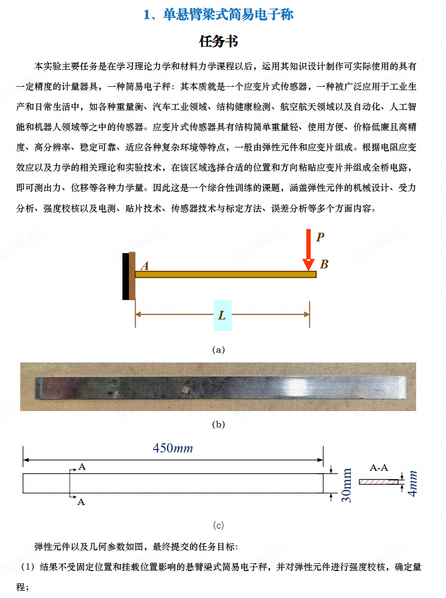

# 单悬臂梁式简易电子秤实验设计方案

**小组成员：韩颂义、姚珂尔、张雨童**

## 题目

## 摘要

本实验拟利用 40CrNiMoA 弹簧钢矩形薄梁作为弹性元件，设计一台单悬臂梁式简易电子秤。方案不采用单一截面弯矩测量，而采用两测量截面的弯矩差来获得剪力，从而建立载荷与电桥输出之间的线性关系。该方法的关键优点是：当载荷作用点位于两个应变测量截面之外时，输出主要取决于载荷大小和两截面间距，理论上不受固定端等效位置、加载点具体位置的影响。实验内容包括弹性元件强度校核、应变片布置与接桥、电测放大与显示、标定、精度等级判定、有效量程确定和误差分析。

## 1. 实验任务与设计目标

根据任务书，实验对象为单悬臂梁式简易电子秤，其弹性元件为矩形截面弹簧钢梁，几何尺寸如下：

| 参数 | 符号 | 数值 |
|---|---:|---:|
| 梁总长 | $L$ | $450\,\mathrm{mm}$ |
| 梁宽 | $b$ | $30\,\mathrm{mm}$ |
| 梁厚 | $h$ | $4\,\mathrm{mm}$ |
| 材料 | - | 40CrNiMoA 弹簧钢 |
| 弹性模量 | $E$ | $210.0\,\mathrm{GPa}$ |
| 屈服强度 | $\sigma_{0.2}$ | $980\,\mathrm{MPa}$ |
| 强度安全系数 | $n$ | 2.5 |

本方案的设计目标为：

1. 任务书未直接给出称量上限，本方案预选名义称量范围为 $0\sim 3.0\,\mathrm{kg}$，对应最大载荷约 $P_\mathrm{N}=30\,\mathrm{N}$。
2. 通过强度校核证明梁在设计量程内处于弹性工作状态。
3. 采用四片电阻应变片组成全桥，使桥路输出与被测质量近似线性相关。
4. 通过贴片与接桥方案，使测量结果尽量不受固定端位置、加载点位置、温度漂移、导线电阻和偏心加载影响。
5. 通过标定数据确定电子秤精度等级和有效量程。

## 2. 总体方案

电子秤由以下部分组成：

1. 弹性元件：矩形截面悬臂梁。
2. 加载结构：自由端加载托盘或加载挂钩，载荷作用线尽量通过梁宽中心线。
3. 敏感元件：四片阻值相同的电阻应变片（阻值为120）。
4. 测量电桥：四片应变片组成全桥，输出两测量截面弯矩差对应的应变差。

本设计的核心思想是用悬臂梁的剪力关系称重。设载荷 $P$ 作用在梁右端附近，两个应变测量截面分别位于 $x_1$ 和 $x_2$，且 $x_2>x_1$，两者均位于固定端与加载点之间。任一截面的弯矩为

$$
M(x)=P(a-x)
$$

其中 $a$ 为实际加载点到固定端的距离。两个截面弯矩差为

$$
M_1-M_2=P(a-x_1)-P(a-x_2)=P(x_2-x_1)
$$

因此

$$
P=\frac{M_1-M_2}{x_2-x_1}
$$

该式中不含固定端等效位置和加载点 $a$。这正是本方案优于单截面弯矩法的主要原因。

## 3. 弹性元件力学分析

### 3.1 截面参数

矩形截面对中性轴的惯性矩为

$$
I=\frac{bh^3}{12}
$$

代入 $b=30\,\mathrm{mm}$、$h=4\,\mathrm{mm}$，得

$$
I=\frac{30\times 4^3}{12}=160\,\mathrm{mm^4}
$$

抗弯截面系数为

$$
W=\frac{I}{h/2}=\frac{bh^2}{6}=80\,\mathrm{mm^3}
$$

### 3.2 名义量程选择依据

任务书要求设计并制作一台具有一定精度的悬臂梁式简易电子秤，但并未直接规定称量上限。因此，量程需要在满足强度安全的基础上，由弹性元件尺寸、电测灵敏度、挠度大小和实验操作条件共同确定。本方案预选 $0\sim 3.0\,\mathrm{kg}$ 作为名义量程，主要理由如下。

首先，从强度角度看，$3.0\,\mathrm{kg}$ 对应的载荷约为

$$
P=mg\approx 3.0\times 9.8=29.4\,\mathrm{N}
$$

工程计算中可近似取 $P_\mathrm{N}=30\,\mathrm{N}$。在该载荷下，梁的最大弯曲正应力明显低于许用应力，说明弹性元件不会接近屈服状态，具有足够安全裕量。

其次，如果只按强度条件反推，理论允许载荷可达到约 $69.7\,\mathrm{N}$，对应质量约 $7.1\,\mathrm{kg}$。但电子秤的量程不能只由强度极限决定。随着载荷增大，悬臂梁自由端挠度会明显增大，梁的几何形状、加载点位置、实际力臂和固定端夹持状态都会偏离小变形梁理论假设，导致输出与质量之间的线性关系变差。挠度过大时，托盘或挂钩还可能与外部构件接触，或者引入附加摩擦和偏心力，使标定误差、滞后误差和重复性误差增大。

从实验实施角度看，$0\sim 3.0\,\mathrm{kg}$ 的砝码配置、加载卸载操作和机械限位设计都比较方便。该量程既能使梁产生足够明显的应变输出，又不会使挠度过大，因此适合作为本实验的初选名义量程。最终有效量程仍应由标定后的线性误差、重复性误差和滞后误差确定，而不是仅由强度计算直接决定。

### 3.3 强度校核

按任务书要求，许用应力取

$$
[\sigma]=\frac{\sigma_{0.2}}{n}=\frac{980}{2.5}=392\,\mathrm{MPa}
$$

若最大设计载荷取 $P_\mathrm{N}=30\,\mathrm{N}$，悬臂梁固定端最大弯矩为

$$
M_\mathrm{max}=P_\mathrm{N}L=30\times 450=13500\,\mathrm{N\cdot mm}
$$

最大正应力为

$$
\sigma_\mathrm{max}=\frac{M_\mathrm{max}}{W}
=\frac{13500}{80}
=168.75\,\mathrm{MPa}
$$

因为

$$
168.75\,\mathrm{MPa}<392\,\mathrm{MPa}
$$

所以在 $0\sim 3.0\,\mathrm{kg}$ 量程内梁满足强度要求。相对于屈服强度的实际安全系数约为

$$
n_\mathrm{actual}=\frac{980}{168.75}=5.81
$$

若仅按许用应力反推理论最大载荷：

$$
P_\mathrm{allow}=\frac{[\sigma]W}{L}
=\frac{392\times 80}{450}
=69.7\,\mathrm{N}
$$

对应质量约为 $7.1\,\mathrm{kg}$。该结果只说明梁在强度上还有余量，并不代表适合将电子秤量程定为 $7.1\,\mathrm{kg}$。考虑到悬臂梁挠度、夹持刚度、加载偏心、贴片可靠性和线性误差，本实验不将理论强度极限作为使用量程，而选取 $3.0\,\mathrm{kg}$ 作为名义量程，并建议设置机械限位，避免超过约 $5\,\mathrm{kg}$ 的意外过载。

### 3.4 挠度估算

自由端挠度近似为

$$
\delta=\frac{PL^3}{3EI}
$$

当 $P=30\,\mathrm{N}$ 时，

$$
\delta=\frac{30\times 450^3}{3\times 210000\times 160}
\approx 27.1\,\mathrm{mm}
$$

该挠度未超过梁长的 10%，但已经不宜继续显著提高量程。实验中应保证加载方向基本竖直，且托盘或挂钩不与外部构件接触，否则会引入附加支承力，使标定曲线产生系统偏差。

## 4. 应变片布置方案

### 4.1 测量截面位置

为避免固定端夹具附近的应力集中和三维效应，第一测量截面不应过于靠近固定端。任务书建议至少离开 $2h$，其中 $h=4\,\mathrm{mm}$，理论最小距离为 $8\,\mathrm{mm}$。实际贴片还要考虑夹具边缘、胶层、导线焊点和贴片操作空间，因此本方案取：

$$
x_1=40\,\mathrm{mm},\qquad x_2=160\,\mathrm{mm}
$$

两截面间距为

$$
d=x_2-x_1=120\,\mathrm{mm}
$$

两个截面均远离固定端和加载点，可减小局部接触、夹紧和加载头三维应力对测量结果的影响。

### 4.2 贴片位置

四片应变片均沿梁轴向粘贴，分别贴在两个截面的上下表面中心线上：

| 应变片 | 位置 | 应变性质 |
|---|---|---|
| R1 | $x_1$ 截面上表面 | 拉/压，记为 $+\varepsilon_1$ |
| R2 | $x_1$ 截面下表面 | 与 R1 符号相反，记为 $-\varepsilon_1$ |
| R3 | $x_2$ 截面下表面 | 与上表面符号相反，记为 $-\varepsilon_2$ |
| R4 | $x_2$ 截面上表面 | 记为 $+\varepsilon_2$ |

上、下表面成对贴片可以增强弯曲应变信号，同时抵消轴向均匀应变和温度漂移。贴片应位于梁宽中心线上，避免靠近边缘，降低扭转和横向弯曲影响。

### 4.3 接桥方式

四片应变片接成全桥，并按下列符号关系接入桥臂：

$$
\frac{\Delta U}{U}
=\frac{1}{4}K(\varepsilon_{R1}-\varepsilon_{R2}+\varepsilon_{R3}-\varepsilon_{R4})
$$

取

$$
\varepsilon_{R1}=+\varepsilon_1,\quad
\varepsilon_{R2}=-\varepsilon_1,\quad
\varepsilon_{R3}=-\varepsilon_2,\quad
\varepsilon_{R4}=+\varepsilon_2
$$

则

$$
\frac{\Delta U}{U}
=\frac{1}{4}K(\varepsilon_1-(-\varepsilon_1)+(-\varepsilon_2)-\varepsilon_2)
=\frac{K}{2}(\varepsilon_1-\varepsilon_2)
$$

弯曲表面应变满足

$$
\varepsilon=\frac{M}{EW}
$$

因此

$$
\varepsilon_1-\varepsilon_2
=\frac{M_1-M_2}{EW}
=\frac{Pd}{EW}
$$

最终有

$$
\frac{\Delta U}{U}
=\frac{K}{2}\frac{Pd}{EW}
$$

该式说明电桥输出与载荷 $P$ 呈线性关系，且与加载点到固定端的距离无关，只与两测量截面的间距 $d$ 有关。

### 4.4 灵敏度估算

取应变片灵敏系数 $K=2.0$，$E=210000\,\mathrm{MPa}$，$W=80\,\mathrm{mm^3}$，$d=120\,\mathrm{mm}$，则在 $P=30\,\mathrm{N}$ 时

$$
\varepsilon_1-\varepsilon_2
=\frac{30\times 120}{210000\times 80}
=214\times 10^{-6}
$$

即应变差约为 $214\,\mu\varepsilon$。电桥相对输出为

$$
\frac{\Delta U}{U}
=\frac{2.0}{2}\times 214\times 10^{-6}
=214\times 10^{-6}
$$

若桥压 $U=5\,\mathrm{V}$，满量程桥路输出约为

$$
\Delta U=5\times 214\times 10^{-6}
=1.07\,\mathrm{mV}
$$

## 5. 实验实施步骤

### 5.1 梁与夹具准备

1. 检查梁表面是否平直，有无明显弯曲、划痕和锈蚀。
2. 在梁上标出 $x_1=40\,\mathrm{mm}$、$x_2=160\,\mathrm{mm}$ 两个测量截面，可以分别用针画上十字定位。
3. 固定端采用刚性夹具夹紧，夹持长度建议不小于 $40\,\mathrm{mm}$，并确保梁轴线水平。
4. 自由端安装托盘或挂钩，加载作用线应通过梁宽中心线。

### 5.2 贴片工艺

1. 用细砂纸沿梁轴向轻磨贴片区域，去除氧化层，斜45度打磨。
2. 用酒精清洁表面，等待完全挥发，记住棉球要先把酒精挤掉。
3. 按轴向定位四片应变片，使敏感栅中心分别位于 $x_1$、$x_2$ 截面的上下表面中心线。
4. 使用502粘贴并固化，粘贴时避免应变片偏斜和气泡。
5. 焊接引线，注意剥线先不要全剥下来，可以拿着末端皮转一圈然后再剪掉，然后上一点锡就行。
6. 用万用表检查每片电阻值和绝缘电阻，确认无短路、断路和明显阻值异常。

### 5.3 接桥与调零

1. 接成全桥，保证两个截面的弯曲信号相减、同一截面上下表面信号相加。

## 6. 标定与数据采集

### 6.1 预加载

正式标定前，应在设计满量程 $3.0\,\mathrm{kg}$ 附近进行 2 到 3 次加载和卸载循环。预加载的目的是消除夹具间隙、胶层初始蠕变和安装残余变形，使零点和灵敏度趋于稳定。

### 6.2 标定点设置

建议取 0 到 3.0 kg 共 11 个标定点：

$$
0,\ 0.3,\ 0.6,\ 0.9,\ 1.2,\ 1.5,\ 1.8,\ 2.1,\ 2.4,\ 2.7,\ 3.0\,\mathrm{kg}
$$

每个点至少读数 3 次，取平均值。为评价滞后误差，应分别进行升载和卸载测试。

### 6.3 数据记录表

| 标准质量 / kg | 升载读数 1 | 升载读数 2 | 升载读数 3 | 升载平均 | 卸载平均 | 拟合质量 / kg | 误差 / kg |
|---:|---:|---:|---:|---:|---:|---:|---:|
| 0.0 | | | | | | | |
| 0.3 | | | | | | | |
| 0.6 | | | | | | | |
| 0.9 | | | | | | | |
| 1.2 | | | | | | | |
| 1.5 | | | | | | | |
| 1.8 | | | | | | | |
| 2.1 | | | | | | | |
| 2.4 | | | | | | | |
| 2.7 | | | | | | | |
| 3.0 | | | | | | | |

## 7. 误差来源与控制措施

### 7.1 固定端影响

固定端附近存在夹持变形、局部压痕和三维应力状态。若只在固定端附近单截面测量弯矩，输出会受夹紧位置和夹具刚度影响。本方案将第一截面布置在 $40\,\mathrm{mm}$ 处，并通过两截面弯矩差测剪力，使理论输出不依赖固定端等效位置。

### 7.2 加载点位置影响

单截面弯矩法有

$$
M=P(a-x)
$$

若加载点 $a$ 改变，即使载荷 $P$ 不变，输出也会改变。本方案采用

$$
M_1-M_2=P(x_2-x_1)
$$

只要加载点位于 $x_2$ 右侧，加载点的小范围移动不会影响理论输出。实验中仍应使托盘载荷尽量居中，以减少扭转和横向弯曲。

### 7.3 温度影响

温度变化会使四片应变片同时产生电阻漂移。全桥中四片型号、阻值、粘贴材料和导线长度应尽量一致，均匀温度变化在桥路中相互抵消。实验时应避免用手长时间触碰贴片区，且应在通电预热后再标定。

### 7.4 偏心加载与扭转

若载荷偏离梁宽中心线，会产生扭矩，使上下表面应变不再只由竖向弯曲决定。控制措施为：

1. 托盘中心与梁宽中心线对齐。
3. 应变片贴在梁宽中心线上。
4. 标定砝码放置位置保持一致，并可进行偏心加载试验评估误差。

### 7.5 非线性与大挠度

悬臂梁挠度较大时，载荷方向、力臂和边界条件会发生变化，产生几何非线性。因此本方案不按理论强度上限选取 7 kg 作为量程，而将名义量程限制为 3 kg。

