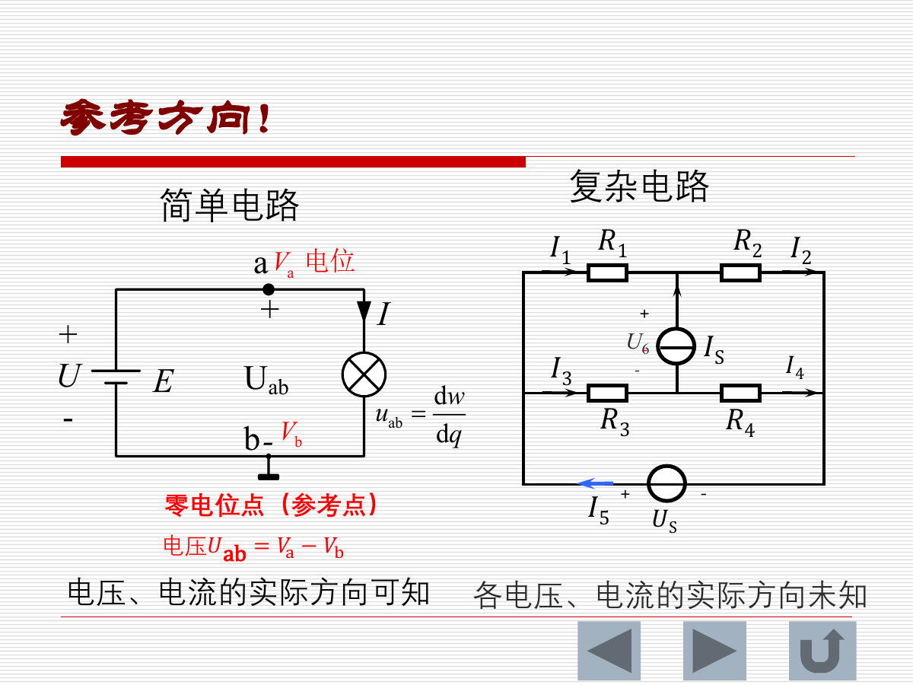
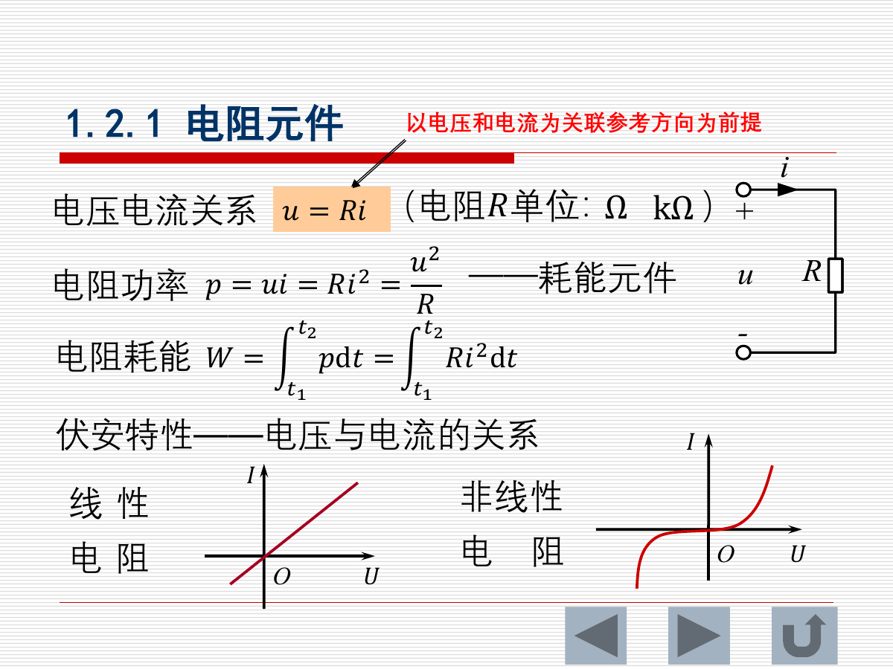
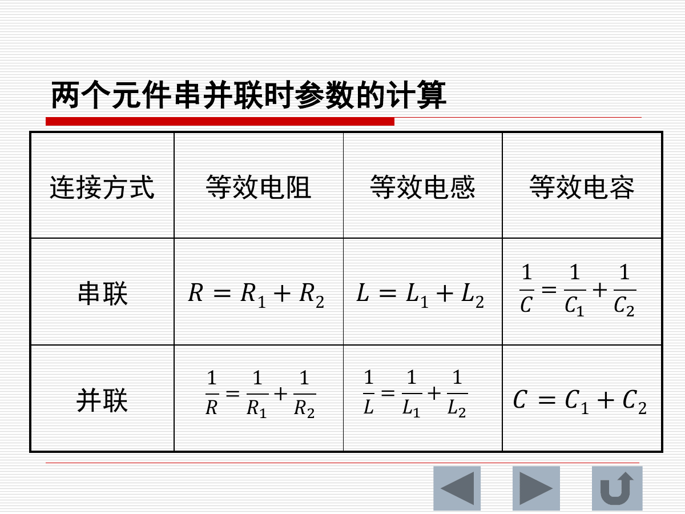
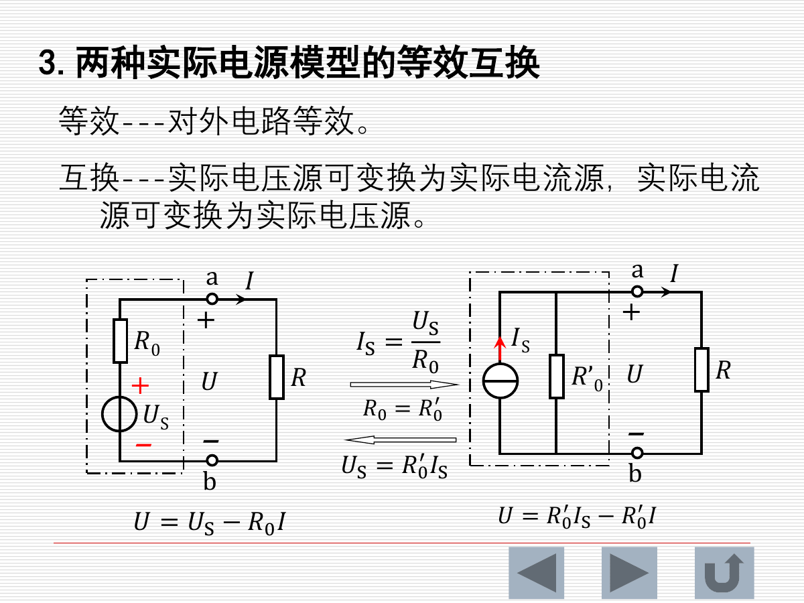
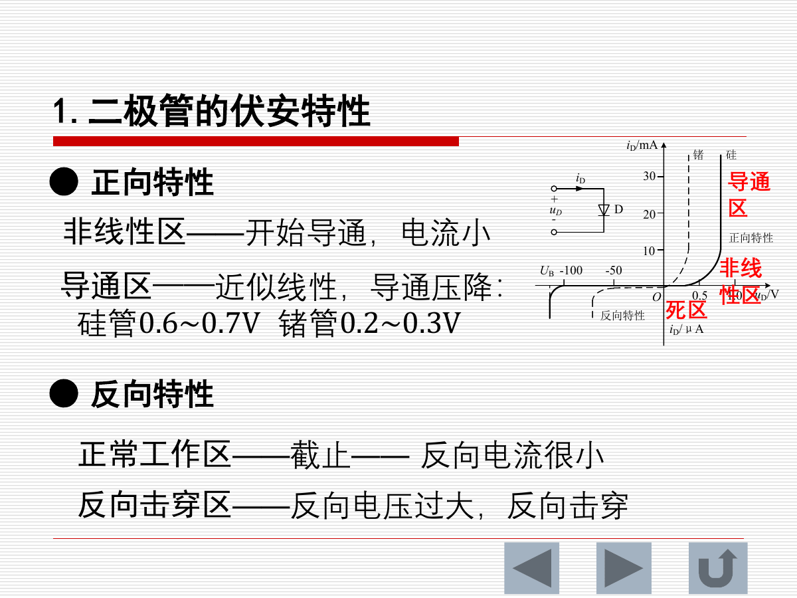
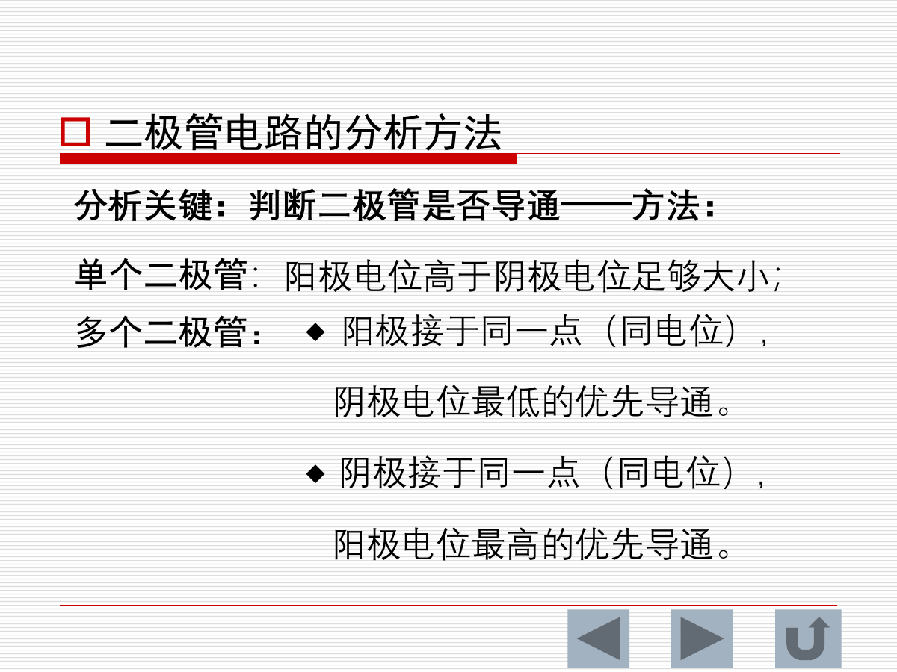
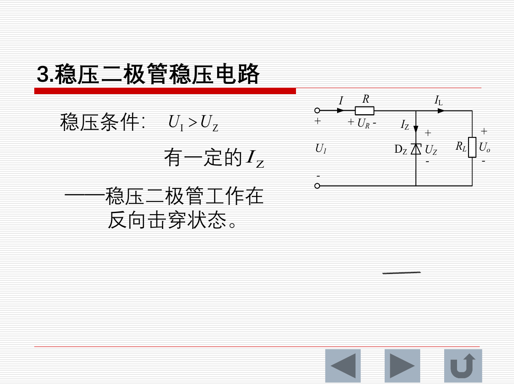
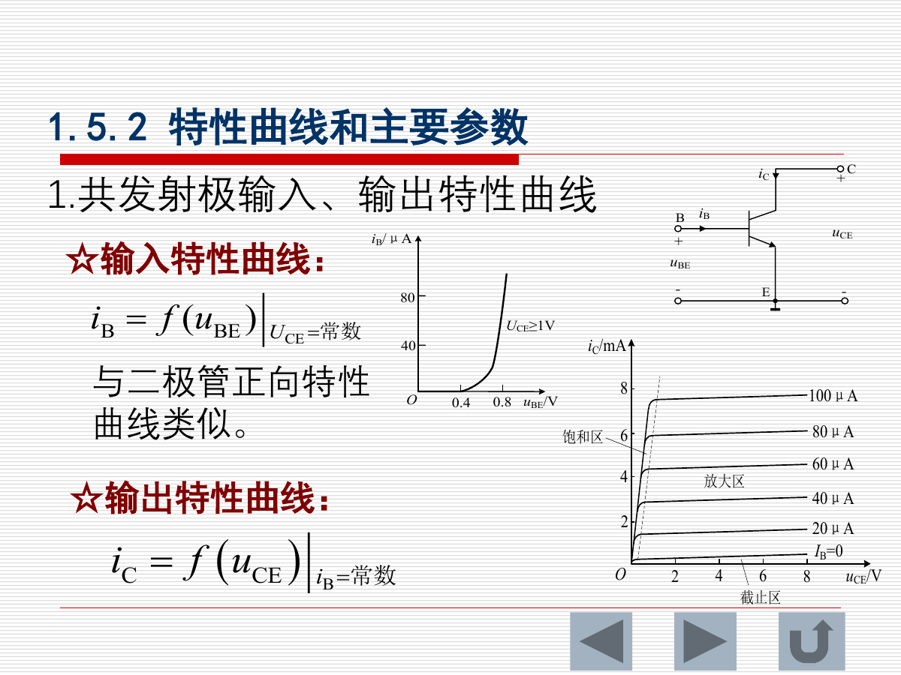
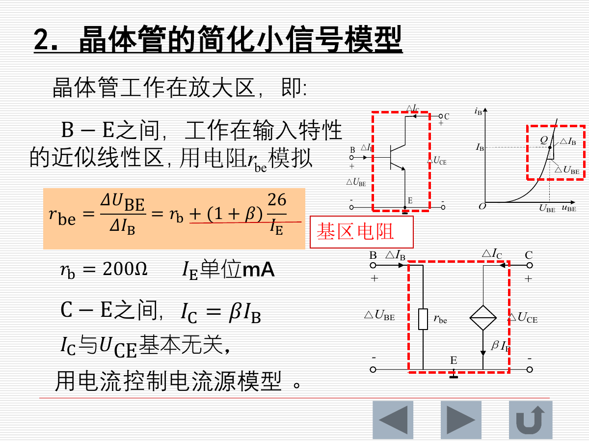
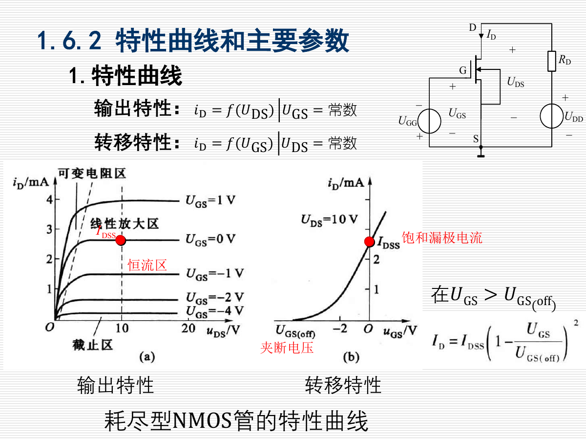

# 第一章 电路和电路元件：核心知识点总结

> 来源：`1-250911-sun-第1章-电路和电路元件-电工电子学.pdf`  
> 复习主线：电路基本量与参考方向 -> R/L/C 元件 -> 独立电源模型 -> 二极管 -> 双极晶体管 -> MOS 管（选学）

## 0. 本章知识框架

| 章节 | 核心内容 | 必须掌握的关键词 |
|---|---|---|
| 1.1 | 电路和基本物理量 | 电路模型、电流、电压、参考方向、关联参考方向、功率、电能 |
| 1.2 | 电阻、电感、电容 | 伏安关系、耗能与储能、直流稳态、串并联等效、额定参数 |
| 1.3 | 独立电源 | 理想电压源、理想电流源、实际电源模型、电源等效互换 |
| 1.4 | 二极管 | PN 结、单向导电性、伏安特性、理想模型、稳压管、LED、光电二极管 |
| 1.5 | 双极晶体管 | NPN/PNP、放大作用、输入/输出特性、截止/放大/饱和、小信号模型 |
| *1.6 | 绝缘栅场效应晶体管 | NMOS/PMOS、耗尽型/增强型、转移特性、跨导、电压控制型器件 |

---

## 1. 电路和电路的基本物理量

### 1.1 电路、电路元件和电路模型

电路由电源、开关、连接导线、负载等组成。按功能和工作电平可分为：

| 类型 | 特点 | 典型用途 |
|---|---|---|
| 强电电路 | 电压、电流、功率较大 | 电能传输与转换，如电力系统、电动机、电灯 |
| 弱电电路 | 电压、电流、功率较小 | 信号传递与处理，如话筒、放大器、扬声器 |

实际元件往往同时具有多种物理效应。例如实际电阻可能有寄生电感、电容，实际电容可能有漏电阻和寄生电感。电路分析时通常用理想电路元件建立电路模型，只保留主要特性，忽略次要影响。复杂实际电路也可以用理想电阻、电感、电容、电源、受控源等组合建模。

### 1.2 电流及其参考方向

电流是电荷量对时间的变化率：

$$
i=\frac{dq}{dt}
$$

单位关系：

$$
1A=1C/s
$$

电流的实际方向规定为正电荷移动方向。分析电路时，很多支路电流的实际方向未知，所以先人为假定一个方向，称为参考方向或正方向。

判断原则：

| 求解结果 | 含义 |
|---|---|
| 电流为正 | 实际方向与参考方向一致 |
| 电流为负 | 实际方向与参考方向相反 |

直流电流大小和方向不随时间变化，通常用大写字母 `I` 表示；交流电流大小或方向随时间变化，通常用小写字母 `i` 表示。

### 1.3 电压及其参考方向

电压是电场力移动单位正电荷所做的功：

$$
u=\frac{dw}{dq}
$$

单位关系：

$$
1V=1J/C
$$

电压的实际方向为高电位指向低电位。电路中常人为规定一个零电位点，称为参考点或接地点。若 a、b 两点电位分别为 `V_a`、`V_b`，则：

$$
U_{ab}=V_a-V_b
$$

电压也需要先指定参考方向。若计算结果为正，实际极性与参考极性一致；若为负，实际极性与参考极性相反。

### 1.4 关联参考方向与功率

当电压参考方向的正端与电流参考方向的流入端一致时，称为关联参考方向。在关联参考方向下：

$$
p=ui
$$

功率判断：

| 条件 | 元件状态 |
|---|---|
| `p=ui>0` | 元件吸收功率、消耗功率 |
| `p=ui<0` | 元件发出功率、输出功率 |

若电压、电流采用非关联参考方向，功率符号判断要反过来。做题时必须先确认电压电流是否关联，否则容易把“吸收”和“输出”判断反。

### 1.5 电能

在 `t_1` 到 `t_2` 时间内电路吸收的电能为：

$$
w=\int_{t_1}^{t_2}pdt=\int_{t_1}^{t_2}ui\,dt
$$

常用单位：

$$
1kW\cdot h=3.6\times10^6J
$$

工程中常说的“1 度电”就是 `1kW·h`。

### 1.6 常用符号和单位

| 物理量 | 直流符号 | 交流符号 | 基本单位 | 常用工程单位 |
|---|---|---|---|---|
| 电流 | `I` | `i` | A | kA、mA、uA、nA |
| 电压 | `U` | `u` | V | kV、MV、mV、uV |
| 功率 | `P` | `p` | W | kW、MW、mW |

---

## 2. 电阻、电感和电容元件

### 2.1 电阻元件

在线性电阻中，电压和电流成正比。关联参考方向下：

$$
u=Ri
$$

电阻功率：

$$
p=ui=Ri^2=\frac{u^2}{R}
$$

电阻消耗电能：

$$
W=\int_{t_1}^{t_2}pdt=\int_{t_1}^{t_2}Ri^2dt
$$

电阻是耗能元件，理想电阻不储能。线性电阻的伏安特性为过原点直线，非线性电阻的伏安关系不是直线。

### 2.2 电感元件

线性电感满足：

$$
N\phi=Li
$$

其中 `Nφ` 为磁链，`L` 为电感。关联参考方向下：

$$
u=L\frac{di}{dt}
$$

在直流稳态中，电流为常数，因此：

$$
\frac{di}{dt}=0,\quad u=0
$$

所以电感在直流稳态中相当于短路。

电感功率：

$$
p=ui=Li\frac{di}{dt}
$$

电感储存的磁场能量：

$$
W_L=\frac{1}{2}LI^2
$$

电感是储能元件，不是耗能元件。实际电感存在绕线电阻、寄生电容和额定电流限制。

### 2.3 电容元件

线性电容满足：

$$
q=Cu
$$

电流电压关系为：

$$
i=C\frac{du}{dt}
$$

在直流稳态中，电压为常数，因此：

$$
\frac{du}{dt}=0,\quad i=0
$$

所以电容在直流稳态中相当于开路。

电容储存的电场能量：

$$
W_C=\frac{1}{2}Cu^2
$$

电容也是储能元件。实际电容有额定电压、漏电阻、等效串联电阻和寄生电感。

### 2.4 R、L、C 串并联等效

| 连接方式 | 电阻等效 | 电感等效 | 电容等效 |
|---|---|---|---|
| 串联 | `R=R_1+R_2` | `L=L_1+L_2` | `1/C=1/C_1+1/C_2` |
| 并联 | `1/R=1/R_1+1/R_2` | `1/L=1/L_1+1/L_2` | `C=C_1+C_2` |

注意电容与电阻、电感的串并联规律相反：电容串联时等效电容变小，并联时等效电容相加。

### 2.5 实际元件参数和模型

常见额定参数：

| 元件 | 主要参数 |
|---|---|
| 电阻器 | 标称电阻值、额定功率 |
| 电感器 | 标称电感值、额定电流 |
| 电容器 | 标称电容值、额定电压 |

实际元件的模型常由多个理想元件组合而成。例如实际电容可用理想电容加漏电阻、串联电阻、寄生电感表示；实际电感可用理想电感加绕线电阻和寄生电容表示。工程选型时不能只看标称值，还必须满足功率、电流或耐压要求。

---

## 3. 独立电源元件

### 3.1 理想电压源

理想电压源输出电压恒等于源电压：

$$
U=U_S
$$

它的端电压与输出电流及外电路无关。理想电压源不允许短路，因为短路时理论电流可能无穷大。

### 3.2 理想电流源

理想电流源输出电流恒等于源电流：

$$
I=I_S
$$

它的输出电流与端电压及外电路无关。理想电流源不允许开路，因为开路时理论端电压可能无穷大。

### 3.3 实际电压源模型

实际电压源可建模为理想电压源 `U_S` 与内阻 `R_0` 串联。端电压为：

$$
U=U_S-R_0I
$$

工作特点：

| 状态 | 条件 | 结果 |
|---|---|---|
| 开路 | `R -> infinity`，`I=0` | `U=U_S`，开路电压等于源电压 |
| 短路 | `R=0`，`U=0` | `I=U_S/R_0`，短路电流受内阻限制 |

实际电压源工作时仍应避免短路。

### 3.4 实际电流源模型

实际电流源可建模为理想电流源 `I_S` 与内阻 `R_0` 并联。端口关系为：

$$
I=I_S-\frac{U}{R_0}
$$

也可写成：

$$
U=R_0I_S-R_0I
$$

端电流会随端电压增大而减小。

### 3.5 两种实际电源模型的等效互换

实际电压源和实际电流源可以对外等效互换：

换算关系：

$$
I_S=\frac{U_S}{R_0},\quad U_S=R_0I_S,\quad R_0'=R_0
$$

这里的“等效”只表示对外端口的电压电流关系相同，不表示内部结构和内部功率分配相同。

---

## 4. 二极管

### 4.1 半导体、P 型和 N 型半导体

本征半导体是纯净半导体，如硅、锗、砷化镓等。其自由电子和空穴数量相等，整体电中性。

掺杂后形成杂质半导体：

| 类型 | 掺杂 | 多数载流子 | 少数载流子 |
|---|---|---|---|
| P 型半导体 | 掺入三价元素，如硼、铝、镓 | 空穴 | 电子 |
| N 型半导体 | 掺入五价元素，如磷、砷、锑 | 电子 | 空穴 |

载流子是运载电荷的粒子，包括自由电子和空穴。

### 4.2 PN 结的形成

在同一块半导体单晶上形成 P 区和 N 区，两者交界处形成 PN 结。P 区空穴向 N 区扩散，N 区电子向 P 区扩散，并在交界处复合，留下不能移动的离子，形成空间电荷区和内电场。

PN 结中同时存在：

| 运动 | 方向与原因 |
|---|---|
| 多子扩散 | 多数载流子因浓度差扩散 |
| 少子漂移 | 少数载流子在内电场作用下漂移 |

当扩散和漂移达到动态平衡时，PN 结稳定存在。

### 4.3 PN 结的单向导电性

| 外加电压 | 空间电荷区 | 主要运动 | 电流 |
|---|---|---|---|
| 正向电压 | 变窄 | 多子扩散增强 | 形成较大正向电流 |
| 反向电压 | 变宽 | 少子漂移 | 只有很小反向电流 |

这就是二极管单向导电性的物理基础。

### 4.4 二极管伏安特性

二极管由一个 PN 结和两个电极组成，阳极接 P 区，阴极接 N 区。

正向特性分为：

| 区域 | 特点 |
|---|---|
| 死区 | 电压较小，基本不导通；硅管死区电压约 0.4~0.5V，锗管约 0.1V |
| 非线性区 | 开始导通但电流较小 |
| 导通区 | 近似线性；硅管导通压降约 0.6~0.7V，锗管约 0.2~0.3V |

反向特性分为：

| 区域 | 特点 |
|---|---|
| 正常反向工作区 | 截止，反向电流很小 |
| 反向击穿区 | 反向电压过大，电流急剧增大 |

主要参数：

| 参数 | 含义 |
|---|---|
| `I_FM` | 最大正向电流 |
| `U_RM` | 最高反向工作电压 |
| `I_R` | 反向电流 |
| `f_M` | 最高工作频率 |

### 4.5 二极管工作点、静态电阻和动态电阻

二极管与电阻串联接电源时，工作点由二极管伏安曲线和负载线共同决定。若电源为 `U_S`，串联电阻为 `R`，则：

$$
U_D=U_S-RI_D
$$

静态电阻：

$$
R_D=\frac{U_D}{I_D}
$$

动态电阻：

$$
r_D=\frac{dU_D}{dI_D}
$$

通常同一工作点下 `R_D != r_D`，不同工作点下两者也会改变。

### 4.6 二极管理想模型与分析方法

理想二极管模型：

| 状态 | 条件 | 等效 |
|---|---|---|
| 正向导通 | 阳极电位高于阴极电位足够大 | 可近似短路，或取固定导通压降 |
| 反向截止 | 阳极电位低于阴极电位 | 开路 |

分析关键是判断哪个二极管导通。

多个二极管时常用优先导通规则：

| 连接形式 | 优先导通者 |
|---|---|
| 阳极接同一点 | 阴极电位最低者 |
| 阴极接同一点 | 阳极电位最高者 |

二极管导通后，其两端电压会被钳位，可能使其他二极管截止。因此做题不能只看初始电位，要在假设导通后验证其余管子的状态。

### 4.7 稳压二极管

稳压二极管利用反向击穿区曲线陡直的特点稳压。正常稳压时它必须工作在反向击穿状态。

主要参数：

| 参数 | 含义 |
|---|---|
| `U_Z` | 稳定电压 |
| `I_Z` | 稳定电流 |
| `I_ZM` | 最大稳定电流 |
| `P_ZM` | 最大耗散功率，约为 `U_Z I_ZM` |
| `r_Z` | 动态电阻 |
| `alpha_UZ` | 电压温度系数 |

稳压电路条件：

| 条件 | 说明 |
|---|---|
| 输入电压 `U_I > U_Z` | 否则不能进入稳压区 |
| 有合适的 `I_Z` | 太小不能稳压，太大可能烧毁 |
| 串联限流电阻 | 限制稳压管和负载电流 |

### 4.8 发光二极管与光电二极管

发光二极管 LED 能把电能转换为光能，正向导通后发光。其导通压降通常大于普通二极管，一般在 1.4V 以上。LED 寿命长、抗冲击、抗振动、可靠性高。

光电二极管把光能转换为电流。光照后导通，导通电流与光照强度有关。使用时通常反向接入电路，即阳极接电源负极，阴极接电源正极。

---

## 5. 双极晶体管

### 5.1 基本结构

双极晶体管简称晶体管或三极管，有 NPN 和 PNP 两种类型。

结构组成：

| 名称 | 内容 |
|---|---|
| 两个 PN 结 | 发射结、集电结 |
| 三个电极 | 发射极 E、基极 B、集电极 C |
| 三个区域 | 发射区、基区、集电区 |

掺杂特点：

| 区域 | 特点 |
|---|---|
| 发射区 | 杂质浓度高，多数载流子最多 |
| 基区 | 很薄，杂质浓度低 |
| 集电区 | 杂质浓度较高，但一般低于发射区 |

### 5.2 电流放大作用

晶体管电流关系：

$$
I_E=I_B+I_C
$$

通常：

$$
I_B \ll I_C \approx I_E
$$

小的基极电流变化 `Delta I_B` 能引起较大的集电极电流变化 `Delta I_C`，所以晶体管是电流控制型器件。

### 5.3 共发射极输入和输出特性

输入特性：

$$
i_B=f(u_{BE})\quad (u_{CE}=常数)
$$

它与二极管正向特性类似。

输出特性：

$$
i_C=f(u_{CE})\quad (i_B=常数)
$$

三个工作区：

| 工作区 | 偏置状态 | 特点 | 用途 |
|---|---|---|---|
| 截止区 | 发射结、集电结均反偏 | `I_B=0`，`I_C≈I_CEO≈0`，C-E 近似断开 | 开关截止 |
| 放大区 | 发射结正偏、集电结反偏 | 有电流放大作用 | 放大电路 |
| 饱和区 | 发射结、集电结均正偏 | `U_CE=U_CES≈0.3V`，C-E 近似接通 | 开关导通 |

### 5.4 晶体管主要参数

直流电流放大系数：

$$
\beta=\frac{I_C-I_{CEO}}{I_B}\approx\frac{I_C}{I_B}
$$

交流电流放大系数：

$$
\beta=\frac{\Delta I_C}{\Delta I_B}
$$

其他重要参数：

| 参数 | 含义 |
|---|---|
| `I_CEO` | 穿透电流 |
| `I_CM` | 集电极最大允许电流 |
| `P_CM` | 集电极最大允许耗散功率，`P_C=I_CU_CE` |
| `U_(BR)CEO` | 集电极-发射极反向击穿电压 |

晶体管选型和工作点判断时，必须同时检查电流、电压和功率是否越限。

### 5.5 工作点和负载线

共射电路中：

$$
U_{CC}=U_{CE}+R_CI_C
$$

即：

$$
R_C=\frac{U_{CC}-U_{CE}}{I_C}
$$

当 `U_CC` 和 `I_B` 一定时，增大 `R_C` 会使工作点沿输出特性曲线移动，可能从放大区进入饱和区；减小 `R_C` 可能使原来饱和的工作点脱离饱和进入放大区。

### 5.6 受控源和晶体管小信号模型

受控源不是独立电源，其输出电压或电流受电路中另一个电压或电流控制。四类受控源包括：

| 类型 | 名称 |
|---|---|
| VCVS | 电压控制电压源 |
| VCCS | 电压控制电流源 |
| CCVS | 电流控制电压源 |
| CCCS | 电流控制电流源 |

晶体管在放大区作小信号分析时，可用简化模型：

B-E 间用输入电阻 `r_be` 表示：

$$
r_{be}=r_b+(1+\beta)\frac{26}{I_E}
$$

其中 `I_E` 的单位为 mA，常取 `r_b=200Ω`。C-E 间用电流控制电流源表示：

$$
I_C=\beta I_B
$$

小信号模型适用于晶体管已经处于放大区、信号变化较小的情况；若晶体管截止或饱和，不能直接套用该线性模型。

---

## 6. 绝缘栅场效应晶体管（选学）

### 6.1 类型和基本结构

绝缘栅场效应晶体管常称 MOS 管，按沟道和工作方式分类：

| 分类角度 | 类型 |
|---|---|
| 沟道载流子 | NMOS、PMOS |
| 沟道形成方式 | 耗尽型、增强型 |

MOS 管有源极 S、栅极 G、漏极 D，衬底 B 常与源极相连作为三端元件使用。栅极通过二氧化硅绝缘层与沟道隔离，所以栅源直流电阻很大。

### 6.2 工作原理

在 D-S 间加电源，改变 G-S 间电压 `U_GS`，漏极电流 `I_D` 随之改变。MOS 管是电压控制电流器件。

| 器件 | `U_GS` 条件 |
|---|---|
| 耗尽型 NMOS | `U_GS` 可正可负，不加 `U_GS` 时已有导电沟道 |
| 增强型 NMOS | 需要足够大的正 `U_GS` 才形成导电沟道 |

### 6.3 特性曲线和参数

MOS 管有两类特性：

| 特性 | 表达 |
|---|---|
| 输出特性 | `i_D=f(U_DS)`，`U_GS` 为常数 |
| 转移特性 | `i_D=f(U_GS)`，`U_DS` 为常数 |

增强型 NMOS 的转移特性课件给出：

$$
i_D=I_{DO}\left(\frac{u_{GS}}{U_{GS(th)}}-1\right)^2
$$

主要参数：

| 参数 | 含义 |
|---|---|
| `U_GS(off)` | 夹断电压，耗尽型 MOS 管参数 |
| `U_GS(th)` | 开启电压，增强型 MOS 管参数 |
| `I_DSS` | 饱和漏极电流，耗尽型 MOS 管参数 |
| `g_m` | 低频跨导，`g_m=Delta I_D / Delta U_GS`，`U_DS` 为常数 |
| `I_DM` | 最大漏极电流 |
| `P_DM` | 最大耗散功率 |
| `U_(BR)DS` | 漏源击穿电压 |
| `R_GS` | 栅源直流电阻 |

### 6.4 MOS 管小信号模型与 BJT 比较

MOS 管栅极电流近似为零：

$$
I_G\approx0
$$

漏极电流由栅源电压控制，小信号模型可看成电压控制电流源：

$$
\Delta I_D=g_m\Delta U_{GS}
$$

MOS 管与晶体管比较：

| 项目 | MOS 管 | 双极晶体管 |
|---|---|---|
| 控制方式 | 电压控制电流 | 电流控制电流 |
| 输入电阻 | 很高 | 相对较低 |
| 噪声 | 较小 | 相对较大 |
| 集成化 | 制造简单、功耗低、易集成 | 集成密度相对受限 |
| 放大能力 | 一般较弱 | 通常较强 |

---

## 7. 本章解题和复习重点

1. 先标参考方向，再列方程。电流、电压的正负号只表示与参考方向是否一致，不表示数值错误。
2. 判断功率时先看电压电流是否为关联参考方向。关联时 `p=ui>0` 表示吸收功率。
3. R、L、C 的本质区别：电阻耗能，电感储磁场能，电容储电场能。
4. 直流稳态下，电感相当于短路，电容相当于开路。
5. 理想电压源不能短路，理想电流源不能开路。
6. 实际电源互换只对外等效，内部结构和内部损耗不等效。
7. 二极管题的核心是判断导通与截止，多管电路要用优先导通规则并回代验证。
8. 稳压二极管要工作在反向击穿区，且电流必须在允许范围内。
9. 晶体管放大区条件是发射结正偏、集电结反偏；开关电路常用截止区和饱和区。
10. 小信号模型只适合在已确定静态工作点附近的小范围线性分析。

