# 第7章 测量和数据采集系统：核心知识点总结

> 来源：`7-sun-第7章 测量和数据采集系统.pdf`  
> 复习主线：传感器把被测量变成电信号，经滤波、放大、隔离等模拟调理后，由取样保持和 A/D 转换送入数字系统；数字系统输出控制量时，再通过 D/A 转换变回模拟量。

## 0. 本章知识框架

本章完整信号链可以理解为：

$$
\text{被测对象}
\rightarrow \text{传感器}
\rightarrow \text{测量/调理电路}
\rightarrow \text{取样保持}
\rightarrow \text{A/D}
\rightarrow \text{数字处理}
$$

如果数字系统还要驱动模拟执行机构，则常见输出链路为：

$$
\text{数字量}
\rightarrow \text{D/A}
\rightarrow \text{模拟输出}
\rightarrow \text{执行机构}
$$

| 章节 | 核心内容 | 关键词 |
|---|---|---|
| 7.1 | 电量测量，自学 | 电压、电流、功率、仪表量程 |
| 7.2 | 非电量电测法和数据采集系统，自学 | 非电量转电量、数据采集链路 |
| 7.3 | 传感器，自学 | 敏感元件、转换元件、灵敏度 |
| 7.4 | 有源滤波和测量放大电路 | 低通、高通、带通、带阻、测量放大、共模干扰 |
| 7.5 | 模拟开关和取样-保持电路，自学 | 采样、保持、采样频率 |
| 7.6 | 数-模 D/A 转换器 | T 型电阻网络、分辨率、转换精度、转换速度 |
| 7.7 | 模-数 A/D 转换器 | 逐次逼近、比较器、D/A、寄存器、时钟 |
| 7.8 | 非电量测量系统举例，自学 | 系统应用 |

PPT 实际展开的重点集中在 **7.4-7.7**，复习时应优先掌握滤波、测量放大、D/A 和 A/D 的结构与公式。

---

## 1. 有源滤波电路

### 1.1 有源滤波器的作用

有源滤波器由 **RC 滤波环节 + 运算放大器** 构成。它既能完成频率选择，又能通过运放提供一定的电压放大。

常见用途：

- 保留有用频率成分。
- 抑制噪声和干扰。
- 在测量系统中作为传感器信号进入后级之前的预处理电路。

### 1.2 一阶低通有源滤波电路

低通滤波器允许低频信号通过，抑制高频信号。典型结构是在同相比例放大器前加入 RC 低通环节。

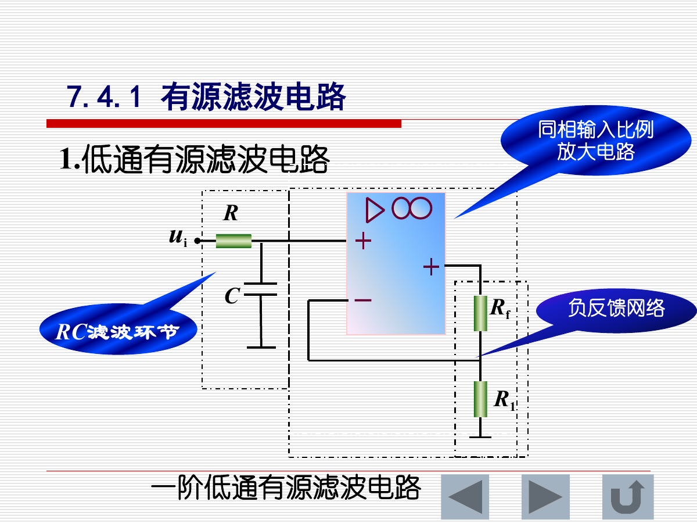

同相比例放大倍数为：

$$
A_f=1+\frac{R_f}{R_1}
$$

截止角频率为：

$$
\omega_c=\frac{1}{RC}
$$

对应截止频率为：

$$
f_c=\frac{1}{2\pi RC}
$$

低通滤波器的传递函数为：

$$
H(j\omega)=\frac{U_o}{U_i}=\frac{A_f}{1+j\frac{\omega}{\omega_c}}
$$

幅频特性：

$$
|H(j\omega)|=\frac{A_f}{\sqrt{1+\left(\frac{\omega}{\omega_c}\right)^2}}
$$

相频特性：

$$
\varphi(\omega)=-\arctan\left(\frac{\omega}{\omega_c}\right)
$$

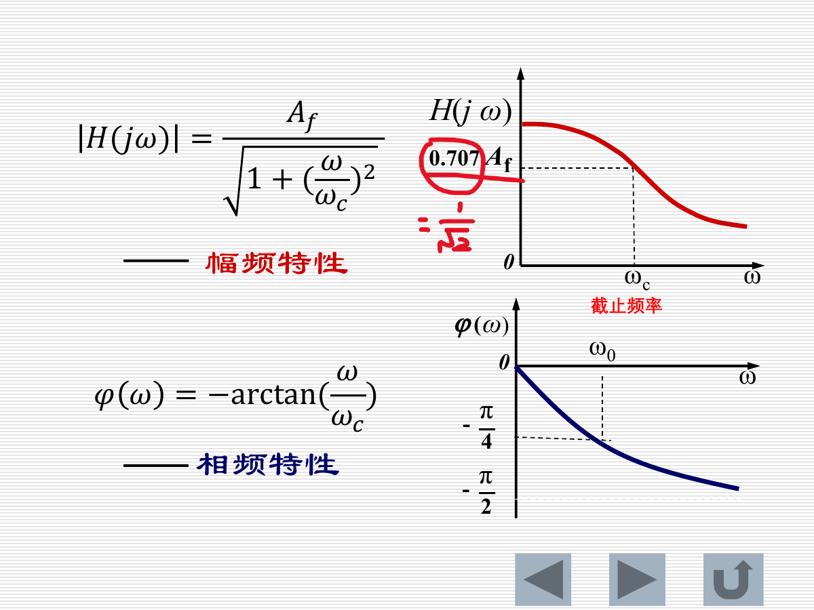

关键结论：

- 当 $\omega \ll \omega_c$ 时，$|H|\approx A_f$，低频基本不衰减。
- 当 $\omega=\omega_c$ 时，$|H|=0.707A_f=A_f/\sqrt{2}$，该点称为截止频率点。
- 当 $\omega \gg \omega_c$ 时，输出迅速减小，高频被抑制。
- 相位从 $0$ 逐渐滞后，趋近于 $-\pi/2$。

### 1.3 一阶高通有源滤波电路

高通滤波器允许高频信号通过，抑制低频信号。它可用于滤除直流分量或低频漂移。

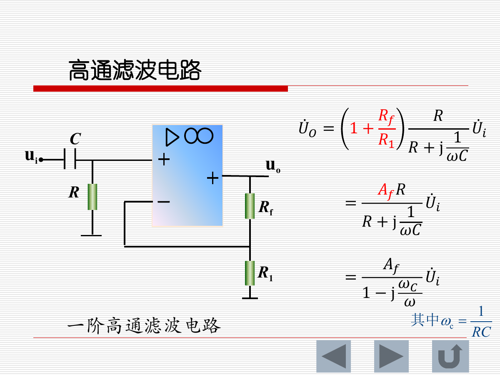

截止角频率同样为：

$$
\omega_c=\frac{1}{RC}
$$

PPT 中给出的传递函数形式为：

$$
H(j\omega)=\frac{A_f}{1-j\frac{\omega_c}{\omega}}
$$

幅频特性为：

$$
|H(j\omega)|=\frac{A_f}{\sqrt{1+\left(\frac{\omega_c}{\omega}\right)^2}}
$$

关键结论：

- 当 $\omega \ll \omega_c$ 时，$|H|\approx 0$，低频被抑制。
- 当 $\omega=\omega_c$ 时，$|H|=0.707A_f$。
- 当 $\omega \gg \omega_c$ 时，$|H|\approx A_f$，高频基本通过。
- 相位从接近 $+\pi/2$ 逐渐趋近于 $0$。

### 1.4 带通和带阻滤波器

带通滤波器只允许某一频带内的信号通过；带阻滤波器则抑制某一频带内的信号。

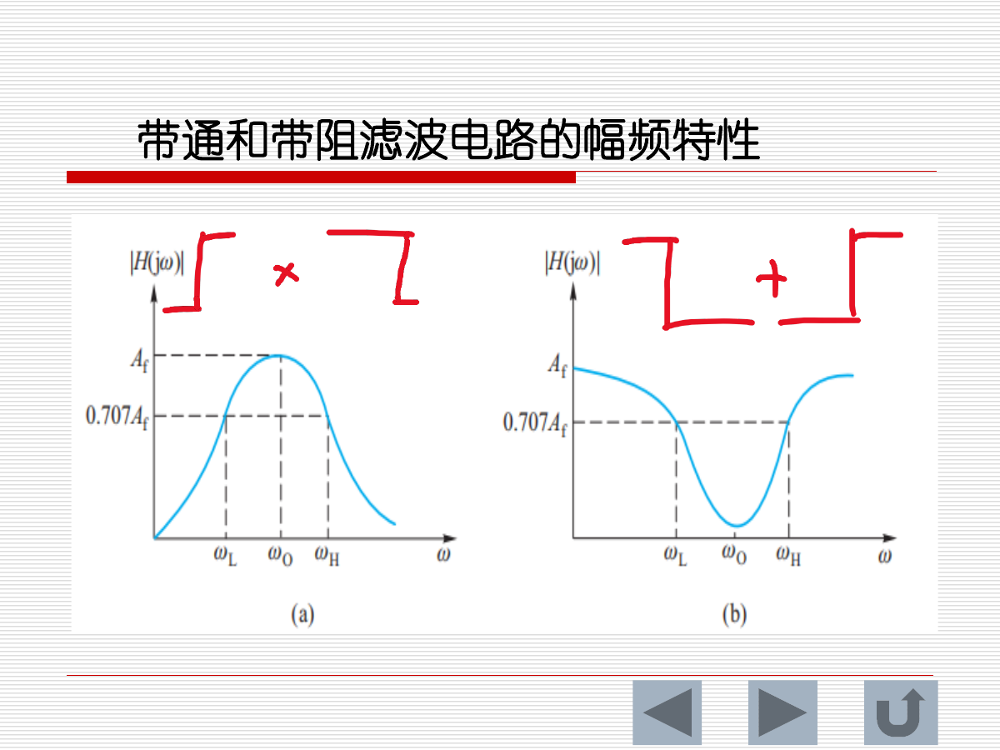

核心概念：

- $\omega_L$：下限截止角频率。
- $\omega_H$：上限截止角频率。
- $\omega_0$：中心角频率。
- 截止点通常按幅值降到 $0.707A_f$ 判断。

应用理解：

- 带通：提取某个频段，例如传感器信号中的目标频率。
- 带阻：抑制某个干扰频段，例如工频干扰附近的陷波处理。

---

## 2. 测量放大电路

### 2.1 测量放大电路的作用和要求

测量放大电路用于把传感器输出的微弱信号放大，再送入后级滤波、采样或 A/D 转换电路。

对测量放大电路的主要要求：

| 要求 | 含义 |
|---|---|
| 输入电阻高 | 减小对传感器输出的负载影响 |
| 噪声低 | 避免把微弱信号淹没 |
| 稳定性好 | 增益和零点不应随环境明显漂移 |
| 精度和可靠性高 | 适合测量系统长期工作 |
| 共模抑制比大 | 抑制共同叠加在两输入端上的干扰 |
| 线性度好 | 输出能准确反映输入变化 |
| 失调小 | 减小零输入时的输出偏差 |
| 抗干扰能力强 | 适合远距离或恶劣环境测量 |

### 2.2 普通同相和反相放大方式的局限

同相输入放大电路的优点是输入电阻高，适合接传感器；缺点是运放两输入端可能叠加共模信号，对环境共模干扰比较敏感。

反相输入放大电路不必重点考虑运放本身的共模抑制问题，但存在两个明显问题：

- 输入电阻较低，不宜直接接高内阻传感器。
- 远距离测量时，地线电阻或传感器现场干扰会被一起放大，影响测量结果。

所以在测量系统中，常采用专门的测量放大电路或隔离放大电路。

### 2.3 三运放测量放大电路

三运放测量放大电路常用于放大差模信号并抑制共模干扰。

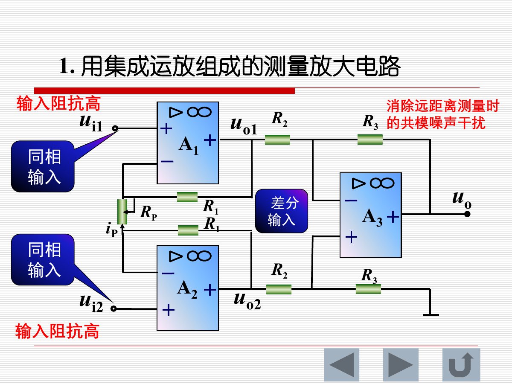

电路结构可以分成两级：

1. 前级由两个同相输入放大器构成，输入阻抗高，分别接收 $u_{i1}$ 和 $u_{i2}$。
2. 后级为差分输入放大器，只放大两路输出的差值，抑制共同变化的共模干扰。

PPT 推导得到：

$$
i_P=\frac{u_{i2}-u_{i1}}{R_P}
$$

前级输出差值为：

$$
u_{o2}-u_{o1}
=\left(1+\frac{2R_1}{R_P}\right)(u_{i2}-u_{i1})
$$

总差模增益为：

$$
A_d=\frac{u_o}{u_{i2}-u_{i1}}
=\frac{R_3}{R_2}\left(1+\frac{2R_1}{R_P}\right)
$$

重要理解：

- $R_P$ 常作为增益调节电阻。
- 前级保证高输入阻抗。
- 后级差分放大用于抑制共模噪声。
- 该结构适合传感器微弱差分信号测量。

### 2.4 隔离放大器

隔离放大器用于输入端和输出端不共地的测量场合，可降低地环路干扰，并提高系统安全性。

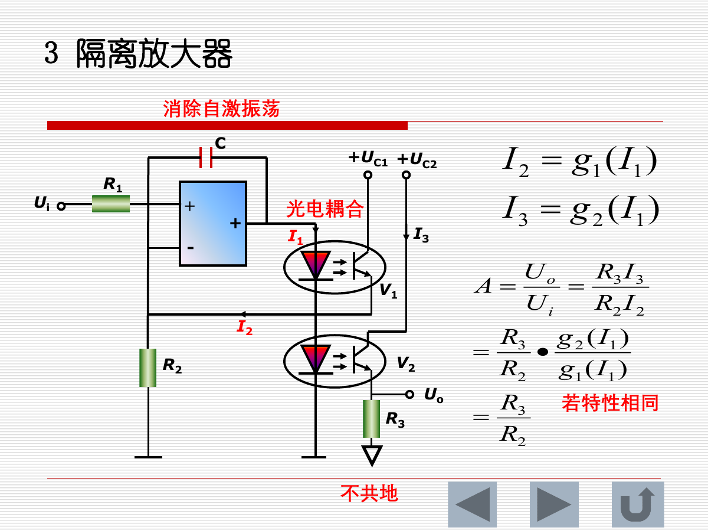

PPT 中的隔离放大器通过光电耦合实现信号传递。若两个光电器件特性分别为：

$$
I_2=g_1(I_1),\quad I_3=g_2(I_1)
$$

则电压增益为：

$$
A=\frac{U_o}{U_i}
=\frac{R_3I_3}{R_2I_2}
=\frac{R_3}{R_2}\cdot \frac{g_2(I_1)}{g_1(I_1)}
$$

若两只光电器件特性相同，则：

$$
A=\frac{R_3}{R_2}
$$

隔离放大器的核心作用不是单纯提高增益，而是实现电气隔离，减少共地带来的干扰和安全风险。

---

## 3. 模拟开关和取样-保持电路

### 3.1 模拟开关

模拟开关用于在数字控制信号作用下接通或断开模拟信号通道。它在数据采集系统中常用于：

- 多路传感器通道选择。
- 采样时刻控制。
- 信号通路切换。

### 3.2 取样-保持 S/H 电路

取样-保持电路用于在 A/D 转换前把某一时刻的模拟电压保持住，使 ADC 在转换期间看到近似不变的输入。

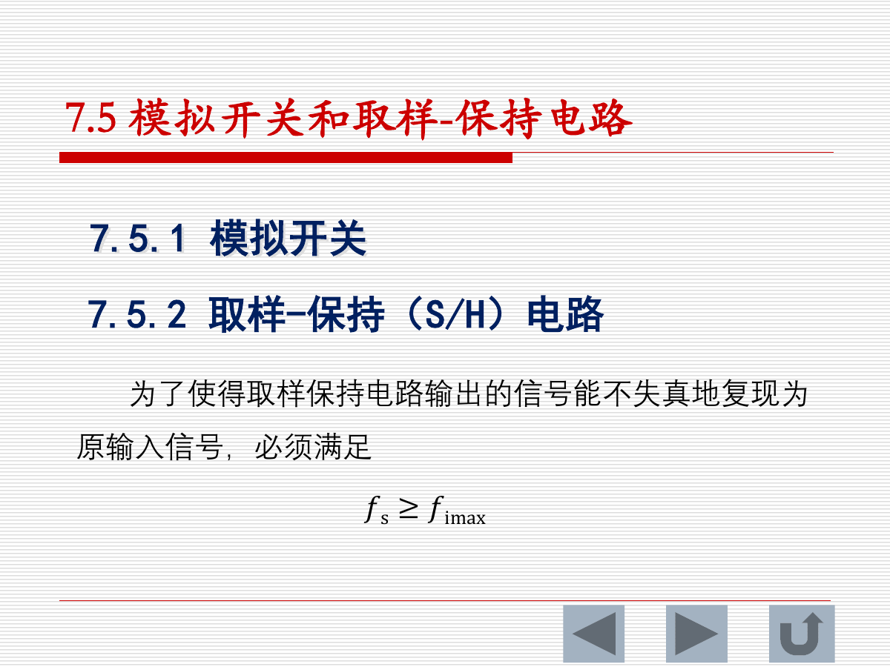

基本过程：

| 状态 | 开关 | 电容电压 | 输出 |
|---|---|---|---|
| 取样 | 闭合 | 跟随输入信号变化 | 跟随输入 |
| 保持 | 断开 | 保持断开瞬间的电压 | 近似恒定 |

为什么 A/D 前常要加 S/H：

- ADC 转换需要时间。
- 如果转换过程中输入持续变化，数字结果就不对应某一个明确时刻的模拟值。
- S/H 让输入在转换时间内保持稳定，提高转换结果的确定性。

PPT 此页给出的条件为：

$$
f_s \ge f_{i\max}
$$

复习时同时要注意：按通常采样定理，为避免频谱混叠，采样频率常要求满足 $f_s \ge 2f_{i\max}$。若考试或作业按本课件出题，应以课堂要求为准。

---

## 4. 数-模 D/A 转换器

### 4.1 D/A 转换器的作用

D/A 转换器把数字量转换成对应的模拟电压或电流。它常用于：

- 数字控制系统输出模拟控制量。
- 函数发生器、音频输出等数字到模拟信号恢复。
- 数据采集系统中的测试和校准输出。

### 4.2 T 型电阻网络 D/A 转换器

PPT 以 4 位 T 型电阻网络 D/A 转换器为例。它由基准电源、T 型电阻网络、模拟开关和电流求和放大器组成。

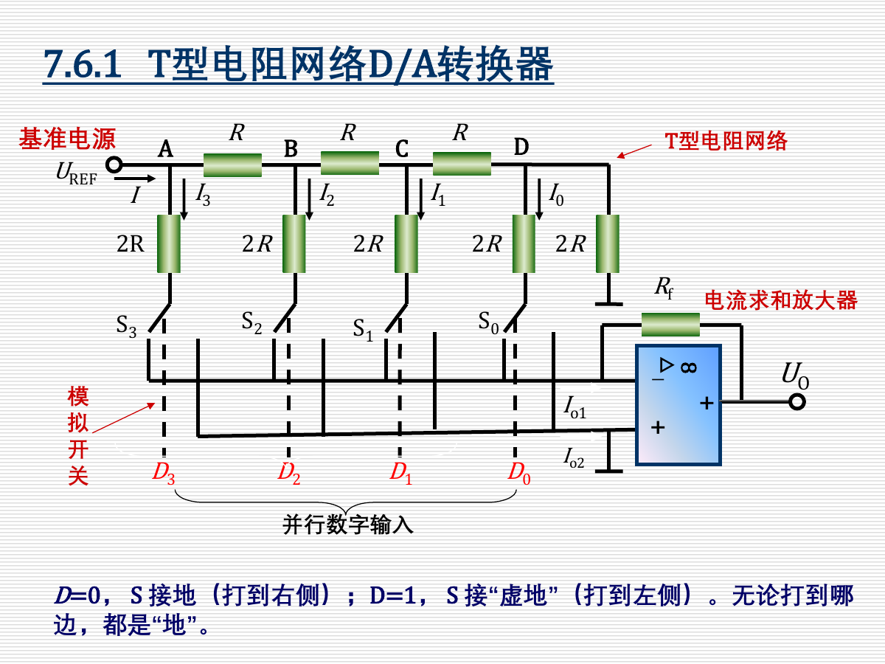

开关规则：

- $D=0$：开关接地。
- $D=1$：开关接运放反相端的“虚地”。
- 无论开关接哪边，对电阻网络看进去都是“地”，所以网络中的分流关系保持稳定。

设：

$$
I=\frac{U_{REF}}{R}
$$

对于 4 位输入 $D_3D_2D_1D_0$，进入求和放大器的电流为：

$$
I_{out1}
=\frac{I}{2^4}
\left(D_3 2^3+D_2 2^2+D_1 2^1+D_0 2^0\right)
$$

输出电压为：

$$
U_o=-R_f I_{out1}
$$

即：

$$
U_o
=-\frac{U_{REF}R_f}{2^4R}
\left(D_3 2^3+D_2 2^2+D_1 2^1+D_0 2^0\right)
$$

对 $n$ 位 D/A 转换器：

$$
U_o
=-\frac{U_{REF}R_f}{2^nR}
\left(D_{n-1}2^{n-1}+D_{n-2}2^{n-2}+\cdots+D_0 2^0\right)
$$

若只关心输出电压大小，可忽略反相求和带来的负号。

### 4.3 最大输出、最小非零输出和分辨率

所有位全为 1 时：

$$
|U_{omax}|
=\frac{U_{REF}R_f}{R}\cdot \frac{2^n-1}{2^n}
$$

最低位为 1、其余位为 0 时：

$$
|U_{omin}|
=\frac{U_{REF}R_f}{R}\cdot \frac{1}{2^n}
$$

PPT 定义分辨率为最小输出电压与最大输出电压之比：

$$
\text{分辨率}
=\frac{U_{omin}}{U_{omax}}
=\frac{1}{2^n-1}
$$

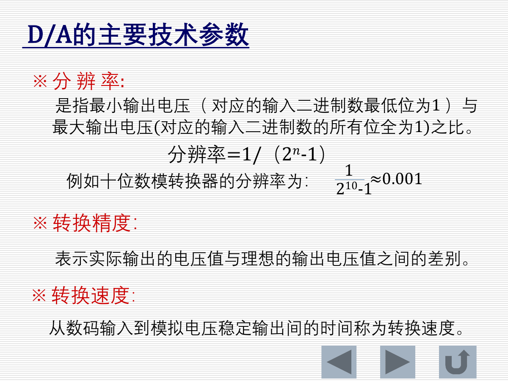

D/A 的主要技术参数：

| 参数 | 含义 |
|---|---|
| 分辨率 | 能分辨的最小输出变化能力，$n$ 越大分辨率越高 |
| 转换精度 | 实际输出值与理想输出值之间的差别 |
| 转换速度 | 数字输入变化到模拟输出稳定所需时间 |

### 4.4 D/A 典型计算方法

例：8 位 D/A 转换器最大输出电压为 $9.945V$，输入为 `10100101`，求输出电压。

第一步，把二进制转为十进制：

$$
10100101_2=2^7+2^5+2^2+2^0=128+32+4+1=165
$$

第二步，8 位全 1 对应十进制：

$$
2^8-1=255
$$

第三步，按比例求输出：

$$
U_o=165\cdot \frac{9.945}{255}=6.435V
$$

这类题的通用思路是：

$$
U_o=N\cdot \frac{U_{omax}}{2^n-1}
$$

其中 $N$ 为输入二进制数对应的十进制值。

---

## 5. 模-数 A/D 转换器

### 5.1 A/D 转换器的作用和分类

A/D 转换器把输入模拟电压数字化，是数据采集系统进入数字处理环节的关键部件。

PPT 给出的分类：

| 类型 | 例子 | 特点 |
|---|---|---|
| 直接转换器 | 逐次逼近型、并联比较型 | 直接把电压与基准量比较得到数字量 |
| 间接转换器 | 单积分型、双积分型 | 先把电压转换成时间、频率等中间量，再数字化 |

本章重点是逐次逼近型 A/D 转换器。

### 5.2 逐次逼近型 A/D 转换器

逐次逼近型 ADC 的基本思想类似“二分查找”：从最高位开始试探，每次决定该位保留还是舍去，逐步逼近输入电压。

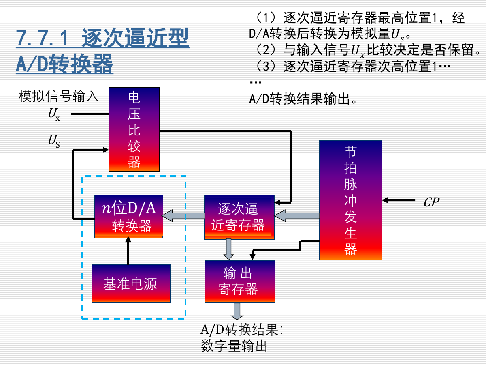

主要组成：

| 模块 | 作用 |
|---|---|
| 电压比较器 | 比较输入模拟电压 $U_x$ 和 D/A 输出 $U_s$ |
| $n$ 位 D/A 转换器 | 把当前试探数字量转换为模拟电压 $U_s$ |
| 逐次逼近寄存器 | 从高位到低位生成试探码 |
| 节拍脉冲发生器 | 提供转换过程所需时钟 |
| 输出寄存器 | 保存最终 A/D 转换结果 |
| 基准电源 | 提供转换参考 |

逐次逼近过程：

1. 最高位置 1，其余位暂为 0，经 D/A 转换得到 $U_s$。
2. 比较 $U_s$ 与输入电压 $U_x$。
3. 若 $U_s\le U_x$，该位保留；若 $U_s>U_x$，该位清 0。
4. 次高位置 1，重复比较和保留/舍去过程。
5. 直到最低位判断完成，输出寄存器保存转换结果。

### 5.3 四位逐次逼近 ADC 示例

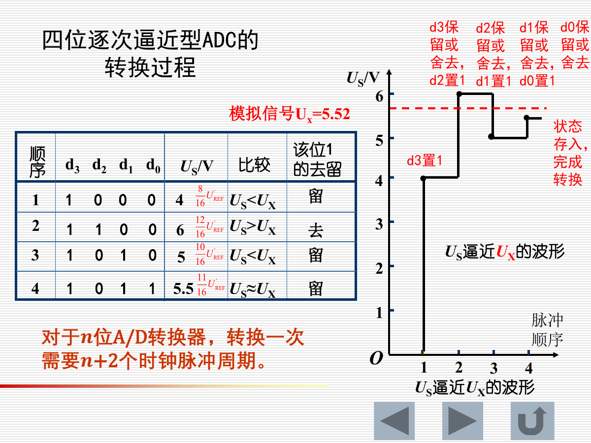

PPT 示例中，输入模拟电压为：

$$
U_x=5.52V
$$

逐次逼近过程可概括为：

| 顺序 | 试探码 | $U_s$ | 比较 | 结果 |
|---|---|---|---|---|
| 1 | 1000 | 4V | $U_s<U_x$ | 最高位保留 |
| 2 | 1100 | 6V | $U_s>U_x$ | 次高位舍去 |
| 3 | 1010 | 5V | $U_s<U_x$ | 该位保留 |
| 4 | 1011 | 5.5V | $U_s\approx U_x$ | 最低位保留 |

最终输出为：

$$
1011_2
$$

PPT 给出的时钟关系：

$$
n\text{ 位 A/D 转换器转换一次需要 }n+2\text{ 个时钟脉冲周期}
$$

逐次逼近型 ADC 的特点：

- 精度较高。
- 转换速度较快。
- 转换时间固定。
- 容易和微机接口。
- 是应用最广泛的一类 A/D 转换器。

---

## 6. 复习速记和易错点

### 6.1 滤波器速记

| 类型 | 低频 | 高频 | 截止点 |
|---|---|---|---|
| 低通 | 通过 | 衰减 | $|H|=0.707A_f$ |
| 高通 | 衰减 | 通过 | $|H|=0.707A_f$ |
| 带通 | 衰减 | 衰减 | $\omega_L,\omega_H$ 之间通过 |
| 带阻 | 通过 | 通过 | $\omega_L,\omega_H$ 之间抑制 |

注意：

- $\omega_c=1/RC$ 是角频率，单位 rad/s。
- $f_c=1/(2\pi RC)$ 是普通频率，单位 Hz。
- 不要把 $\omega_c$ 和 $f_c$ 混用。

### 6.2 测量放大速记

测量放大电路的核心不是“放大倍数越大越好”，而是：

$$
\text{高输入阻抗}+\text{低噪声}+\text{高共模抑制}+\text{稳定可靠}
$$

三运放测量放大器要记住：

$$
A_d=\frac{R_3}{R_2}\left(1+\frac{2R_1}{R_P}\right)
$$

其中 $R_P$ 是调增益的关键电阻。

### 6.3 D/A 速记

D/A 输出与输入数字量成比例：

$$
U_o\propto D_{n-1}2^{n-1}+D_{n-2}2^{n-2}+\cdots+D_0
$$

常见计算：

$$
N=(\text{二进制输入})_{10}
$$

$$
U_o=N\cdot \frac{U_{omax}}{2^n-1}
$$

易错点：

- 理论推导式里常出现 $2^n$。
- 用“最大输出电压”做比例计算时，分母通常是 $2^n-1$，因为最大输出对应全 1。
- 反相求和 D/A 输出可能带负号，题目若给的是最大输出电压大小，通常按绝对值计算。

### 6.4 A/D 速记

逐次逼近型 ADC 的核心流程：

$$
\text{置 1 试探}
\rightarrow \text{D/A 转模拟}
\rightarrow \text{与 }U_x\text{ 比较}
\rightarrow \text{保留或清零}
\rightarrow \text{下一位}
$$

判断规则：

- $U_s\le U_x$：该位保留。
- $U_s>U_x$：该位舍去。

对 $n$ 位逐次逼近 ADC，PPT 给出的转换时间为 $n+2$ 个时钟脉冲周期。
