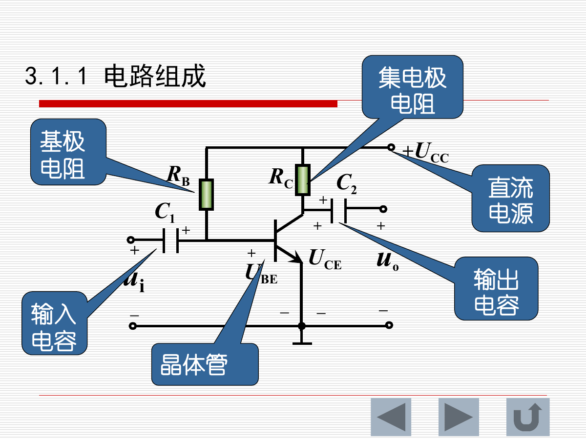
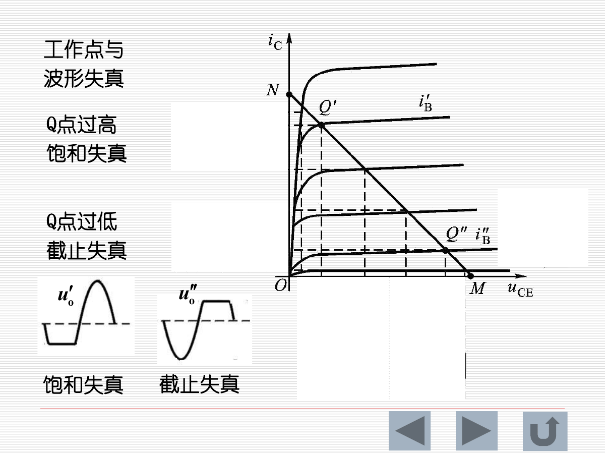
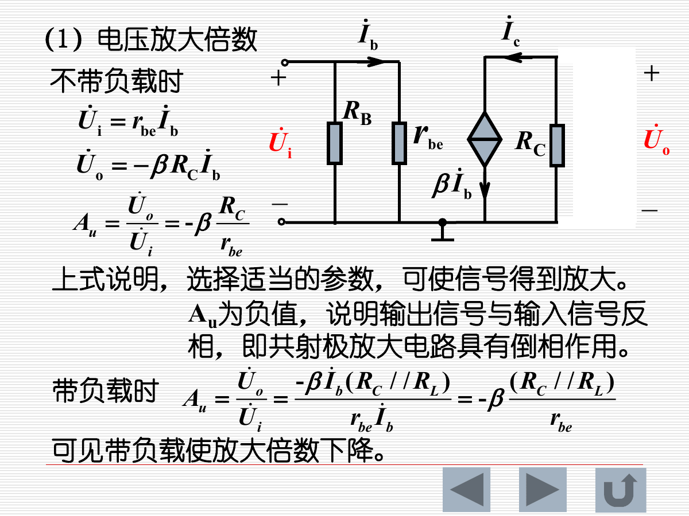
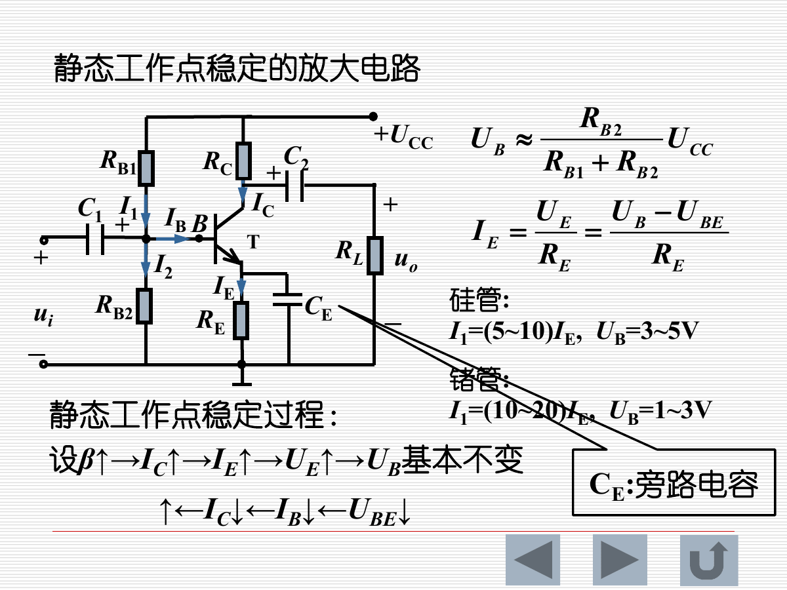
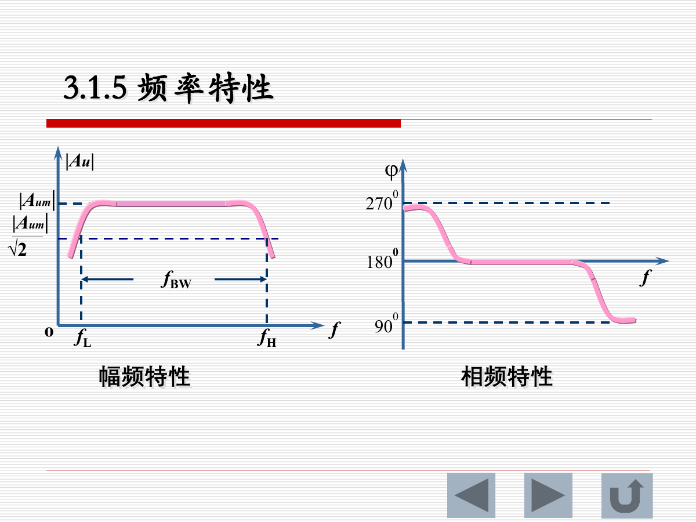
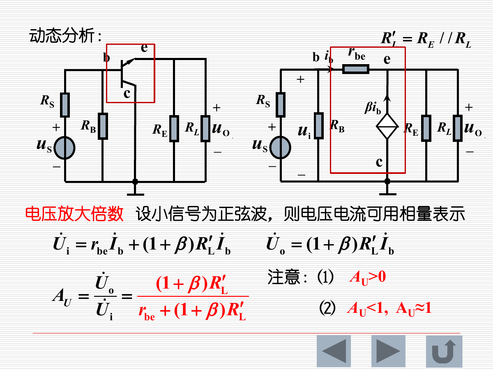
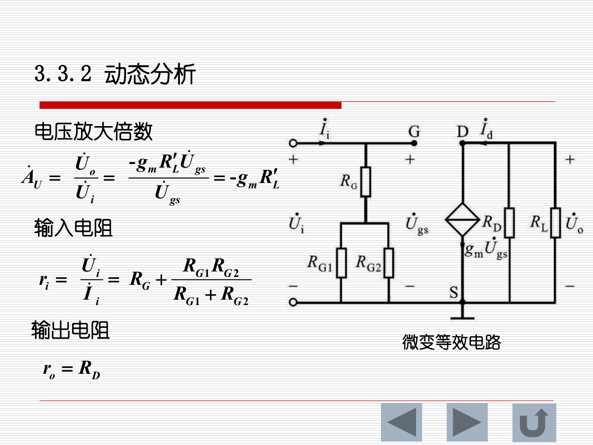
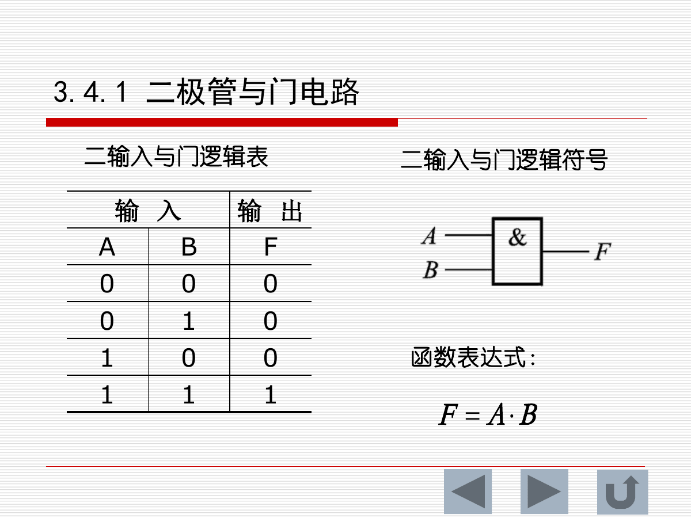
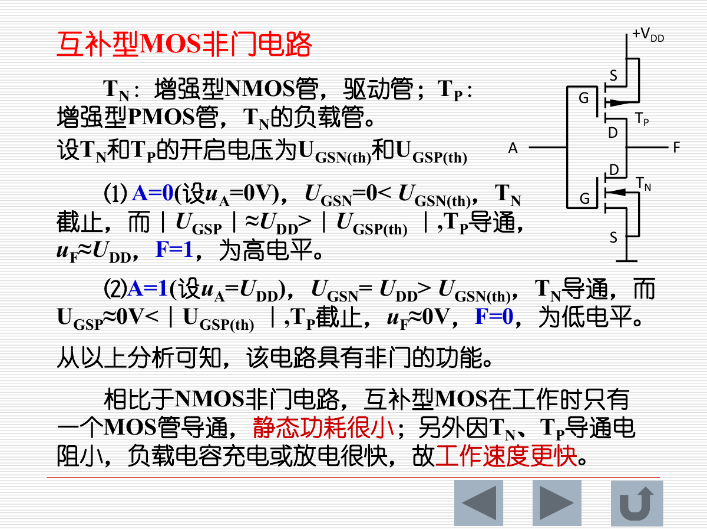

# 第三章 分立元件基本电路：核心知识点总结

> 来源：`3-200401-sun-第3章  分立元件基本电路.pdf`  
> 复习主线：共射放大电路 -> 静态工作点 -> 微变等效动态分析 -> 工作点稳定 -> 共集/共基放大电路 -> 共源放大电路（选学） -> 分立门电路

## 0. 本章知识框架

| 章节 | 核心内容 | 关键词 |
|---|---|---|
| 3.1 | 共发射极放大电路 | 电路组成、静态分析、动态分析、微变等效、失真、频率特性 |
| 3.1.4 | 静态工作点稳定 | 分压式偏置、发射极电阻负反馈、温度稳定 |
| 3.2 | 共集电极放大电路 | 射极输出器、电压跟随、高输入电阻、低输出电阻 |
| 补充页 | 共基极放大电路 | 电压放大、不能放大电流、同相、输入电阻小、输出电阻大 |
| *3.3 | 共源极放大电路 | MOS 管偏置、跨导、电压放大倍数、输入/输出电阻 |
| 3.4 | 分立元件基本门电路 | 二极管与门、二极管或门、晶体管非门、MOS 非门、CMOS 非门 |

---

## 1. 共发射极放大电路

### 1.1 电路组成

共发射极放大电路由晶体管、直流电源、偏置电阻、集电极电阻、输入/输出耦合电容等组成。

各元件作用：

| 元件 | 作用 |
|---|---|
| 晶体管 | 利用电流放大作用实现信号放大，要求发射结正偏、集电结反偏 |
| `U_CC` | 提供放大所需直流能量 |
| `R_B` | 提供和调节基极偏置电流 |
| `R_C` | 将集电极电流变化转换为输出电压变化 |
| `C_1`、`C_2` | 耦合电容，隔直通交；不适用于低频电路 |

共射电路的重要特征是输出信号与输入信号反相。

### 1.2 静态分析

静态是指没有输入信号时，即 `u_i=0`，电路中各处电压电流为直流恒定值，也称直流工作状态。

静态分析目的：

1. 判断晶体管是否处于合适的工作状态。
2. 确定静态工作点 Q 是否合理。

静态分析内容：

| 量 | 含义 |
|---|---|
| `I_B` | 基极静态电流 |
| `I_C` | 集电极静态电流 |
| `U_CE` | 集电极与发射极之间的静态电压 |

静态分析方法有图解法和估算法。

### 1.3 图解法静态分析

输入回路方程：

$$
U_{BE}=U_{CC}-R_BI_B
$$

该直线与晶体管输入特性曲线相交，得到静态基极电流 `I_BQ` 和 `U_BEQ`。

输出回路方程：

$$
U_{CE}=U_{CC}-R_CI_C
$$

这是一条直流负载线。它与对应 `I_B=I_BQ` 的输出特性曲线相交，得到静态工作点 Q，即 `I_CQ` 和 `U_CEQ`。

### 1.4 估算法静态分析

对固定偏置共射电路，直流通路中电容开路。近似公式：

$$
U_{CC}=R_BI_B+U_{BE}
$$

$$
I_B=\frac{U_{CC}-U_{BE}}{R_B}\approx\frac{U_{CC}}{R_B}
$$

$$
I_C=\beta I_B
$$

$$
U_{CE}=U_{CC}-R_CI_C
$$

估算法快速，但要注意 `U_BE` 不能在所有精度要求下都忽略。硅管常取 `U_BE≈0.7V`。

### 1.5 动态分析

动态是指放大电路有输入信号时，电路中电压电流在静态值附近变化。

动态分析主要指标：

| 指标 | 含义 |
|---|---|
| `A_U` | 电压放大倍数 |
| `r_i` | 输入电阻 |
| `r_o` | 输出电阻 |

动态分析方法有图解法和微变等效电路法。

### 1.6 动态图解法与失真

输入信号使：

$$
u_{BE}=U_{BE}+u_i
$$

$$
i_B=I_B+i_b
$$

输出端：

$$
i_C=I_C+i_c
$$

$$
u_{CE}=U_{CE}+u_{ce}
$$

经输出耦合电容隔直后：

$$
u_o=u_{CE}-U_{CE}=u_{ce}
$$

工作点位置会影响波形失真。

| 工作点位置 | 结果 |
|---|---|
| Q 点过高 | 容易出现饱和失真 |
| Q 点过低 | 容易出现截止失真 |
| Q 点居中合适 | 能获得较大的不失真输出范围 |

### 1.7 微变等效电路分析法

交流通路规则：

1. 耦合电容在中频交流分析中视为短路。
2. 直流电源对交流信号视为短路。
3. 晶体管用小信号模型代替。

晶体管小信号模型：

| 部分 | 等效 |
|---|---|
| B-E 间 | 输入电阻 `r_be` |
| C-E 间 | 受控电流源 `βi_b` |

课件中使用：

$$
r_{be}=200+(1+\beta)\frac{26}{I_E}
$$

其中 `I_E` 单位为 mA。

### 1.8 共射电压放大倍数

不带负载时：

$$
U_i=r_{be}I_b
$$

$$
U_o=-\beta R_CI_b
$$

所以：

$$
A_U=\frac{U_o}{U_i}=-\beta\frac{R_C}{r_{be}}
$$

带负载 `R_L` 时：

$$
A_U=-\beta\frac{R_C//R_L}{r_{be}}
$$

结论：

1. `A_U` 为负，说明共射电路输出与输入反相。
2. 负载接入后，等效集电极负载变为 `R_C//R_L`，放大倍数下降。
3. 放大倍数大小与 `β`、负载电阻和 `r_be` 有关。

### 1.9 共射输入电阻

输入电阻是从信号源端看进去的等效电阻。固定偏置共射电路中：

$$
r_i=R_B//r_{be}
$$

输入电阻越大，对信号源分压越小，信号损失越少。若信号源有内阻 `R_S`，实际加到放大器输入端的电压为：

$$
U_i=\frac{r_i}{R_S+r_i}U_S
$$

### 1.10 共射输出电阻

输出电阻表示放大电路带负载能力。对基本共射电路，忽略晶体管输出电阻时：

$$
r_o\approx R_C
$$

实验法可通过测空载输出电压 `U_o'` 和接已知负载后的输出电压 `U_o` 求输出电阻：

$$
r_o=\left(\frac{U_o'}{U_o}-1\right)R_L
$$

输出电阻越小，带负载能力越强。

---

## 2. 静态工作点稳定

### 2.1 为什么要稳定 Q 点

晶体管参数受温度影响明显。温度升高可能导致 `I_C` 增大，工作点上移，从而引起饱和失真甚至热失控。固定偏置电路对温度和 `β` 的变化比较敏感，因此需要采用稳定工作点的偏置电路。

### 2.2 分压式偏置共射电路

分压式偏置通过 `R_B1`、`R_B2` 给基极提供稳定电位，并在发射极串入 `R_E` 形成负反馈。

近似分析：

$$
U_B\approx\frac{R_{B2}}{R_{B1}+R_{B2}}U_{CC}
$$

$$
U_E=U_B-U_{BE}
$$

$$
I_E\approx\frac{U_E}{R_E}
$$

$$
I_C\approx I_E
$$

$$
U_{CE}=U_{CC}-I_CR_C-I_ER_E
$$

稳定原理：

1. 若温度升高使 `I_C` 增大，则 `I_E` 增大。
2. `I_E` 增大会使 `U_E=I_ER_E` 增大。
3. 基极电位 `U_B` 基本不变，所以 `U_BE=U_B-U_E` 减小。
4. `U_BE` 减小使 `I_B`、`I_C` 减小，抵消原来的上升趋势。

这就是发射极电阻引入的直流负反馈。

### 2.3 稳定偏置电路的动态分析

若发射极旁路电容存在并在中频下近似短路，则交流信号中 `R_E` 被旁路，共射放大倍数较高。

若没有旁路电容，`R_E` 参与交流通路，会引入交流负反馈，使放大倍数下降，但线性度和稳定性提高。

---

## 3. 频率特性

实际放大电路的电压放大倍数与频率有关：

| 频段 | 原因 | 表现 |
|---|---|---|
| 低频段 | 耦合电容、旁路电容容抗较大 | 放大倍数下降，相移变化 |
| 中频段 | 电容影响较小 | 放大倍数基本稳定 |
| 高频段 | 晶体管结电容、分布电容影响增强 | 放大倍数下降，相移变化 |

共射电路通常在中频段用微变等效电路公式分析；低频和高频时需考虑电容效应。

---

## 4. 共集电极放大电路

### 4.1 静态分析

共集电极放大电路又称射极输出器，输出从发射极取出。

静态回路：

$$
U_{CC}=R_BI_B+U_{BE}+R_EI_E
$$

且：

$$
I_E=(1+\beta)I_B
$$

所以：

$$
I_B=\frac{U_{CC}-U_{BE}}{R_B+(1+\beta)R_E}
$$

$$
U_{CE}=U_{CC}-R_EI_E
$$

### 4.2 动态分析

交流负载：

$$
R_L'=R_E//R_L
$$

输入电压：

$$
U_i=r_{be}I_b+(1+\beta)R_L'I_b
$$

输出电压：

$$
U_o=(1+\beta)R_L'I_b
$$

电压放大倍数：

$$
A_U=\frac{U_o}{U_i}=
\frac{(1+\beta)R_L'}{r_{be}+(1+\beta)R_L'}
$$

特点：

1. `A_U>0`，输出与输入同相。
2. `A_U<1`，但通常接近 1。
3. 因此共集电路常作电压跟随器。

### 4.3 输入电阻

从基极看进去：

$$
r_i'=r_{be}+(1+\beta)R_L'
$$

考虑偏置电阻：

$$
r_i=R_B//[r_{be}+(1+\beta)R_L']
$$

共集电路输入电阻较大，对前级信号源负载效应小，常用于多级放大电路的输入级或缓冲级。

### 4.4 输出电阻

采用外施电压法，令：

$$
R_S'=R_S//R_B
$$

输出电阻：

$$
r_o=R_E//\frac{r_{be}+R_S'}{1+\beta}
$$

共集电路输出电阻较小，带负载能力强，常用于小功率多级放大电路的输出级。

### 4.5 共集电路总结

| 指标 | 特点 |
|---|---|
| 电压放大倍数 | 略小于 1，近似电压跟随 |
| 相位 | 输出与输入同相 |
| 输入电阻 | 大 |
| 输出电阻 | 小 |
| 主要用途 | 阻抗变换、缓冲、提高带负载能力 |

---

## 5. 共基极放大电路

课件补充了共基极放大电路的基本特点：

| 项目 | 特点 |
|---|---|
| 电压放大 | 能放大电压信号 |
| 电流放大 | 不能放大电流 |
| 相位 | 输出与输入同相 |
| 输入电阻 | 小 |
| 输出电阻 | 大 |

共基极电路常用于高频场合，因为其输入端为发射极，结电容反馈影响较小。

---

## 6. 共源极放大电路（选学）

### 6.1 自给式偏置共源电路

自给式偏置共源极放大电路中：

$$
U_G=0
$$

$$
U_{GS}=-R_SI_D
$$

该方式仅适用于耗尽型场效应管，因为耗尽型 MOS 在 `U_GS=0` 附近已有导电沟道。

### 6.2 分压式自偏置共源电路

分压式偏置中：

$$
U_G=\frac{R_{G2}}{R_{G1}+R_{G2}}U_{DD}
$$

$$
U_{GS}=U_G-U_S=\frac{R_{G2}}{R_{G1}+R_{G2}}U_{DD}-R_SI_D
$$

耗尽型 MOS 管转移特性：

$$
I_D=I_{DSS}\left(1-\frac{U_{GS}}{U_{GS(off)}}\right)^2
$$

联立上述方程即可求静态工作点 `I_D`、`U_GS` 和 `U_DS`。

### 6.3 动态分析

电压放大倍数：

$$
A_U=\frac{U_o}{U_i}=-g_mR_L'
$$

输入电阻：

$$
r_i=R_G+\frac{R_{G1}R_{G2}}{R_{G1}+R_{G2}}
$$

输出电阻：

$$
r_o=R_D
$$

共源电路与共射电路类似，电压放大倍数为负，输出与输入反相。MOS 管输入电阻很高，因此共源电路对前级负载较小。

---

## 7. 分立元件组成的基本门电路

### 7.1 门电路基本概念

门电路是一种开关电路，输入与输出之间存在确定的逻辑关系。逻辑电路中常用高、低电平表示两种状态。

逻辑约定：

| 逻辑 | 规定 |
|---|---|
| 正逻辑 | 1 表示高电平，0 表示低电平 |
| 负逻辑 | 0 表示高电平，1 表示低电平 |

基本逻辑关系：

| 逻辑 | 对应门电路 |
|---|---|
| 与逻辑 | 与门 |
| 或逻辑 | 或门 |
| 非逻辑 | 非门 |

### 7.2 二极管与门

二极管与门的逻辑功能是：只有所有输入均为高电平时，输出才为高电平。

二输入与门真值表：

| A | B | F |
|---|---|---|
| 0 | 0 | 0 |
| 0 | 1 | 0 |
| 1 | 0 | 0 |
| 1 | 1 | 1 |

逻辑表达式：

$$
F=A\cdot B
$$

### 7.3 二极管或门

二极管或门的逻辑功能是：只要有一个输入为高电平，输出就是高电平。

二输入或门真值表：

| A | B | F |
|---|---|---|
| 0 | 0 | 0 |
| 0 | 1 | 1 |
| 1 | 0 | 1 |
| 1 | 1 | 1 |

逻辑表达式：

$$
F=A+B
$$

### 7.4 晶体管非门

晶体管非门利用晶体管截止和饱和两种开关状态实现反相。

工作过程：

| 输入 | 晶体管状态 | 输出 |
|---|---|---|
| 低电平 0 | 发射结反偏，晶体管截止 | 输出高电平 1 |
| 高电平 1 | 晶体管饱和导通 | 输出低电平 0 |

非门真值表：

| A | F |
|---|---|
| 0 | 1 |
| 1 | 0 |

逻辑表达式：

$$
F=\overline{A}
$$

晶体管饱和条件：

$$
I_{CS}\approx\frac{U_{CC}}{R_C}
$$

临界饱和基极电流：

$$
I_{BS}=\frac{I_{CS}}{\beta}
$$

要保证晶体管饱和：

$$
I_B\ge I_{BS}
$$

### 7.5 NMOS 非门

NMOS 非门工作过程：

| 输入 | 条件 | NMOS 状态 | 输出 |
|---|---|---|---|
| 低电平 0 | `U_GS<U_GS(th)` | 截止，`I_D=0` | `U_F=U_DD`，高电平 1 |
| 高电平 1 | `U_GS>U_GS(th)` | 饱和导通 | `U_F≈0`，低电平 0 |

因此 NMOS 电路满足非逻辑。

### 7.6 CMOS 非门

CMOS 非门由增强型 NMOS 和增强型 PMOS 互补组成。

工作过程：

| 输入 A | NMOS `T_N` | PMOS `T_P` | 输出 F |
|---|---|---|---|
| 0 | 截止 | 导通 | 1，高电平 |
| 1 | 导通 | 截止 | 0，低电平 |

CMOS 非门优点：

1. 静态时通常只有一个 MOS 管导通，静态功耗很小。
2. NMOS 和 PMOS 导通电阻小，负载电容充放电快。
3. 工作速度较快，适合集成电路。

---

## 8. 本章解题重点

1. 放大电路先做静态分析，确认晶体管处于放大区，再做动态分析。
2. 静态分析中电容开路；中频动态分析中耦合电容和旁路电容通常短路，直流电源对交流短路。
3. 共射电路输出与输入反相，电压放大倍数为负。
4. 负载接入会使共射电路放大倍数下降。
5. Q 点过高易饱和失真，Q 点过低易截止失真。
6. 分压式偏置利用发射极电阻形成直流负反馈，提高静态工作点稳定性。
7. 共集电路 `A_U≈1`，输入电阻大、输出电阻小，常用于缓冲和阻抗变换。
8. 共源电路用跨导 `g_m` 描述电压对漏极电流的控制，电压放大倍数 `A_U=-g_mR_L'`。
9. 门电路本质是开关电路，要用截止、导通、饱和等状态判断逻辑输出。
10. CMOS 非门静态功耗小、速度快，是集成数字电路的重要基础。

