# 第9章 变压器和电动机：核心知识点总结

> 来源：`9-200521-sun-第9章_变压器和电动机.pdf`  
> 复习主线：磁路基础 -> 变压器变换关系 -> 三相异步电动机结构、原理、特性和使用。

## 0. 本章知识框架

| 章节 | 核心内容 | 关键词 |
|---|---|---|
| 9.1 | 磁路 | 铁磁材料、磁化曲线、磁滞回线、磁阻、交流磁路 |
| 9.2 | 变压器 | 变电压、变电流、变阻抗、损耗、效率、额定值 |
| 9.3 | 异步电动机 | 旋转磁场、同步转速、转差率、机械特性、起动、调速、制动 |
| *9.4/*9.5 | 直流电动机和控制电机 | 了解性内容 |

---

## 1. 磁路

### 1.1 磁路的概念

变压器、电动机和许多电器仪表都以**电磁感应**为工作基础。

磁路是磁通经过的闭合路径。为了把磁场集中在一定空间范围内，通常用高磁导率铁磁材料制成铁心，使绝大部分磁通沿铁心闭合。

可以把磁路类比为电路：

| 电路 | 磁路 |
|---|---|
| 电动势 $E$ | 磁动势 $NI$ |
| 电流 $I$ | 磁通 $\Phi$ |
| 电阻 $R$ | 磁阻 $R_m$ |
| 欧姆定律 $I=E/R$ | 磁路欧姆定律 $\Phi=NI/\sum R_m$ |

### 1.2 铁磁材料的磁性能

铁磁材料包括钢、铁、镍、钴及其合金，是制造变压器、电机和电器铁心的主要材料。

磁导率：

$$
\mu=\frac{B}{H}
$$

其中：

- $B$：磁感应强度
- $H$：磁场强度
- $\mu$：磁导率

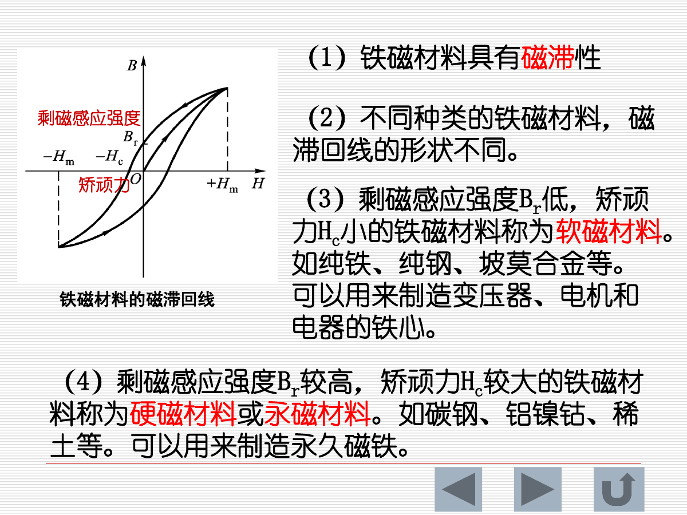

铁磁材料的重要特性：

- **磁饱和性**：$H$ 增大到一定程度后，$B$ 增加变慢。
- **磁滞性**：$B$ 的变化滞后于 $H$，形成磁滞回线。
- **剩磁 $B_r$**：外磁场撤去后材料仍保留的磁感应强度。
- **矫顽力 $H_c$**：使剩磁消失所需的反向磁场强度。

材料分类：

| 类型 | 特点 | 用途 |
|---|---|---|
| 软磁材料 | 剩磁低、矫顽力小、磁滞回线窄 | 变压器、电机、电器铁心 |
| 硬磁材料 | 剩磁高、矫顽力大、磁滞回线宽 | 永久磁铁 |

### 1.3 铁损耗：磁滞损耗和涡流损耗

铁心在交变磁场中会产生铁损耗，主要包括：

| 损耗 | 原因 | 减小方法 |
|---|---|---|
| 磁滞损耗 | 磁畴反复取向，材料反复磁化 | 选用软磁材料，减小磁滞回线面积 |
| 涡流损耗 | 交变磁通在铁心中感应环流 | 用硅钢片叠压、片间绝缘，减小涡流通路 |

课件强调：涡流损耗与铁心厚度的平方成正比，因此电机和变压器铁心常用薄硅钢片叠成。

### 1.4 简单磁路分析

安培环路定律：

$$
\oint H\,dl=\sum I
$$

对于匝数为 $N$、电流为 $I$ 的线圈，磁动势为：

$$
F=NI
$$

磁路欧姆定律：

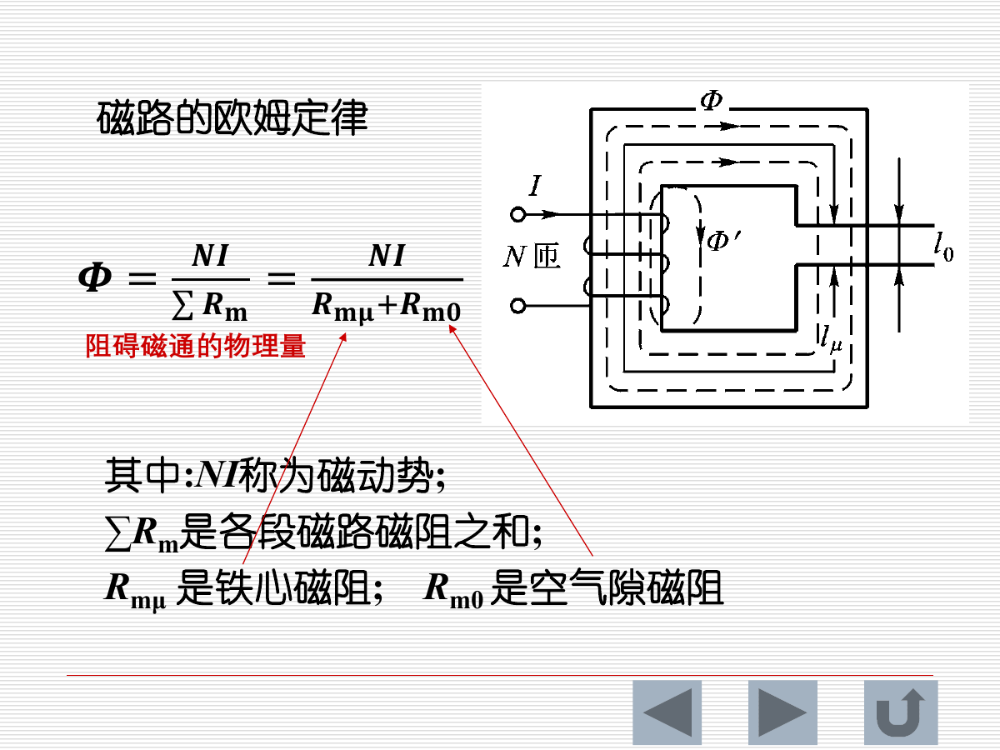

$$
\Phi=\frac{NI}{\sum R_m}
=\frac{NI}{R_{m\mu}+R_{m0}}
$$

其中：

- $NI$：磁动势
- $\sum R_m$：各段磁路磁阻之和
- $R_{m\mu}$：铁心磁阻
- $R_{m0}$：空气隙磁阻

磁阻可类比电阻：

$$
R_m=\frac{l}{\mu S}
$$

空气隙的磁导率远小于铁磁材料，所以**空气隙磁阻很大**。有气隙时，为产生同样磁通，励磁电流明显增大。

### 1.5 交流磁路

若磁通为：

$$
\Phi=\Phi_m\sin\omega t
$$

线圈感应电动势：

$$
e=-N\frac{d\Phi}{dt}
$$

有效值关系：

$$
E=4.44fN\Phi_m
$$

实际交流磁路中：

$$
U\approx E=4.44fN\Phi_m
$$

重要结论：

- 当 $f$、$N$ 不变时，主磁通 $\Phi_m$ 基本与外加电压 $U$ 成正比。
- 若 $U$ 不变，则 $\Phi_m$ 基本不变。
- 若空气隙变化导致磁阻变化，为保持 $\Phi_m$ 基本不变，线圈电流会变化。

---

## 2. 变压器

### 2.1 变压器的用途和结构

变压器具有三种功能：

1. **变电压**
2. **变电流**
3. **变阻抗**

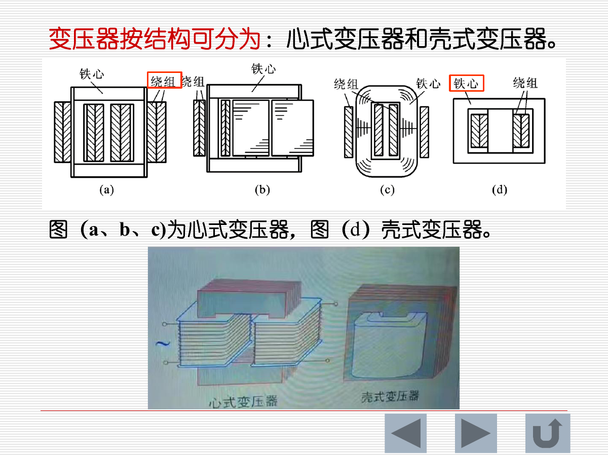

基本结构：

- **铁心**：提供磁通路径。
- **一次绕组**：接电源。
- **二次绕组**：接负载。

按结构可分为：

| 类型 | 特点 |
|---|---|
| 心式变压器 | 绕组包围铁心柱 |
| 壳式变压器 | 铁心包围绕组，漏磁较小 |

### 2.2 电压变换作用

理想变压器中，电压比等于匝数比：

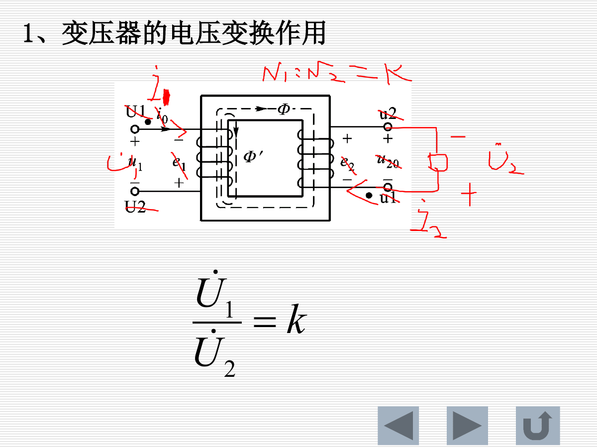

$$
\frac{U_1}{U_2}=k=\frac{N_1}{N_2}
$$

其中 $k$ 称为变比。

判断升压/降压：

| 条件 | 结果 |
|---|---|
| $N_1>N_2$，$k>1$ | 降压变压器 |
| $N_1<N_2$，$k<1$ | 升压变压器 |

### 2.3 电流变换作用

理想变压器忽略损耗时，输入功率约等于输出功率：

$$
U_1I_1\approx U_2I_2
$$

因此：

$$
\frac{I_1}{I_2}\approx\frac{1}{k}
$$

电压升高时电流降低；电压降低时电流升高。

### 2.4 阻抗变换作用

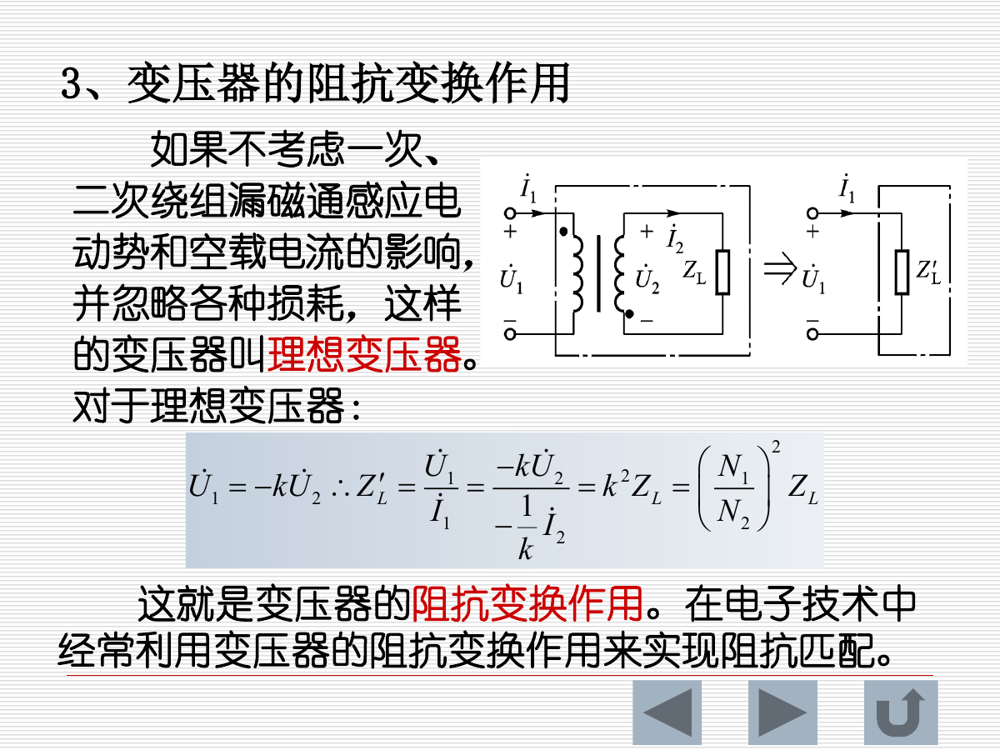

二次侧负载 $Z_L$ 折算到一次侧：

$$
Z_L'=k^2Z_L
$$

这是变压器的阻抗变换作用。电子技术中常用它实现阻抗匹配，使信号源向负载传输最大功率。

例：若信号源内阻为 $R_S$，负载为 $R_L$，希望匹配：

$$
k=\sqrt{\frac{R_S}{R_L}}
$$

### 2.5 三相变压器连接

三相变压器的一次绕组和二次绕组均可接成：

- 星形 $Y$
- 三角形 $\Delta$

常见连接方式有：

$$
Y/Y,\quad Y/\Delta,\quad \Delta/Y,\quad \Delta/\Delta
$$

课件中提到：星形用 $Y$ 表示，带中性线的四线制用 $YN$ 表示。

### 2.6 变压器特性、损耗和效率

变压器外特性：在一次电压 $U_1$ 为额定值、负载功率因数一定时，二次电压 $U_2$ 随二次电流 $I_2$ 变化的关系曲线。

电压变化率：

$$
\Delta U\%=\frac{U_{20}-U_2}{U_2}\times100\%
$$

变压器损耗：

| 损耗 | 也称 | 主要来源 |
|---|---|---|
| 铁损耗 $P_{Fe}$ | 空载损耗 | 磁滞损耗和涡流损耗 |
| 铜损耗 $P_{Cu}$ | 负载损耗 | 绕组电阻发热 |

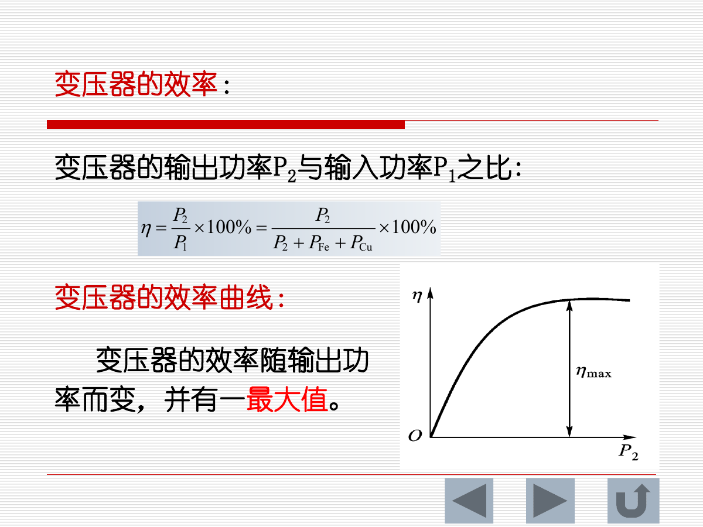

变压器效率：

$$
\eta=\frac{P_2}{P_1}\times100\%
=\frac{P_2}{P_2+P_{Fe}+P_{Cu}}\times100\%
$$

效率随输出功率变化，并存在最大值。

### 2.7 变压器额定值

变压器铭牌常列出：

| 参数 | 含义 |
|---|---|
| 额定电压 $U_{1N}/U_{2N}$ | 一次/二次额定电压 |
| 额定电流 $I_{1N}/I_{2N}$ | 允许长期运行电流 |
| 额定容量 $S_N$ | 额定视在功率 |
| 额定频率 $f_N$ | 我国标准工业频率为 50Hz |
| 相数 | 单相或三相 |
| 温升 | 允许超过环境温度的数值 |

单相变压器：

$$
S_N=U_{2N}I_{2N}
$$

三相变压器：

$$
S_N=\sqrt{3}U_{2N}I_{2N}
$$

注意：课件文本抽取中三相公式的根号可能丢失，按三相视在功率标准公式应为 $\sqrt{3}UI$。

---

## 3. 三相异步电动机

### 3.1 电机分类

电机是利用电磁原理实现电能与机械能相互转换的装置。

| 类型 | 能量转换 |
|---|---|
| 发电机 | 机械能 -> 电能 |
| 电动机 | 电能 -> 机械能 |

交流电动机分为：

- 同步电动机
- 异步电动机

本章重点是**三相异步电动机**。

### 3.2 三相异步电动机结构

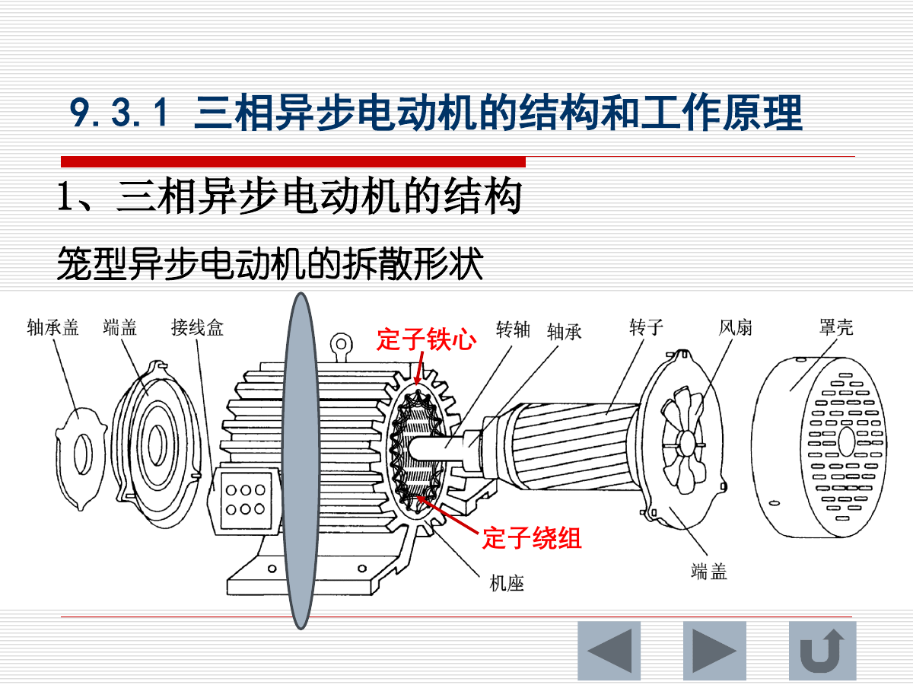

基本组成：

| 部分 | 作用 |
|---|---|
| 定子 | 固定部分，产生旋转磁场 |
| 转子 | 旋转部分，在感应电流作用下产生转矩 |

定子主要由：

- 定子铁心
- 定子绕组
- 机座

转子主要由：

- 转子铁心
- 转子绕组
- 转轴

转子类型：

| 类型 | 特点 |
|---|---|
| 笼型转子 | 结构简单、坚固、应用广 |
| 绕线型转子 | 转子绕组可外接电阻，适合重载起动 |

### 3.3 旋转磁场

三相对称绕组接入三相对称交流电后，定子中会产生旋转磁场。

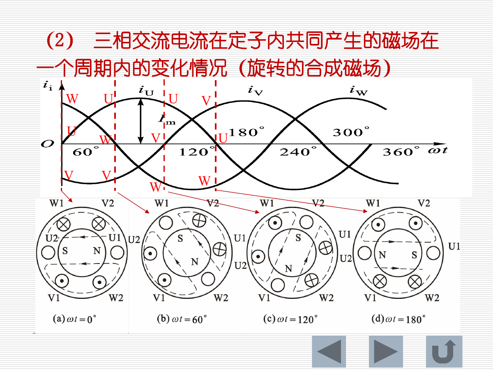

结论：

- 三相正弦交流电流通过三相对称绕组，合成磁场是旋转的。
- 改变任意两根电源线的相序，旋转磁场方向反向，电动机转向也反向。

同步转速：

$$
n_1=\frac{60f_1}{p}
$$

其中：

- $n_1$：同步转速，单位 r/min
- $f_1$：电源频率
- $p$：磁极对数

当 $f_1=50Hz$ 时：

| 磁极对数 $p$ | 同步转速 $n_1$ |
|---|---|
| 1 | 3000 r/min |
| 2 | 1500 r/min |
| 3 | 1000 r/min |
| 4 | 750 r/min |

### 3.4 异步电动机工作原理

工作过程：

1. 定子三相电流产生旋转磁场。
2. 旋转磁场切割转子导体，转子中产生感应电动势和感应电流。
3. 转子电流与旋转磁场相互作用，产生电磁转矩。
4. 转子沿旋转磁场方向转动。

关键点：转子转速 $n$ 必须小于旋转磁场同步转速 $n_1$。如果 $n=n_1$，转子导体与磁场没有相对运动，就没有感应电动势和转矩。

### 3.5 转差和转差率

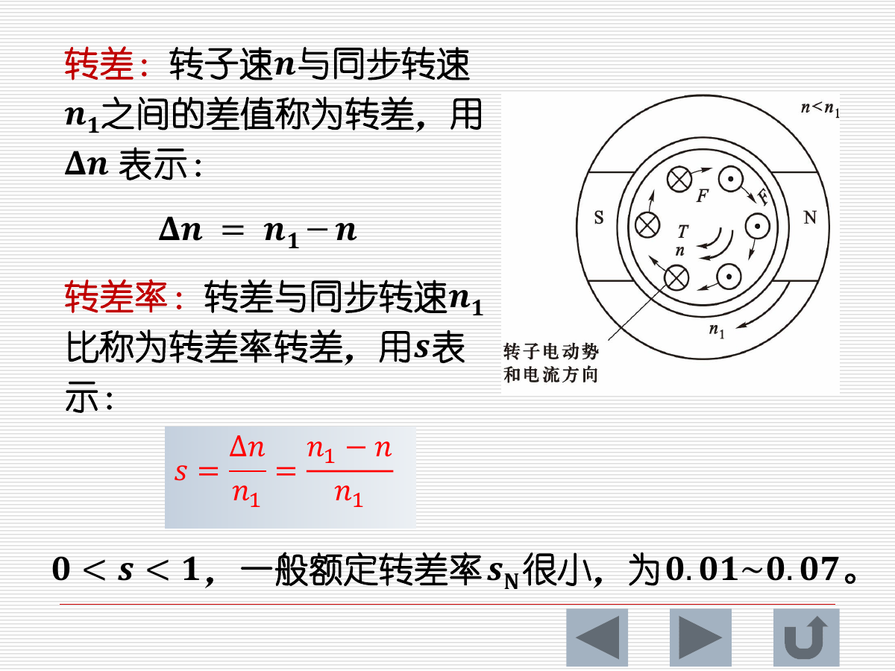

转差：

$$
\Delta n=n_1-n
$$

转差率：

$$
s=\frac{\Delta n}{n_1}=\frac{n_1-n}{n_1}
$$

正常电动状态：

$$
0<s<1
$$

额定转差率一般较小：

$$
s_N\approx0.01\sim0.07
$$

电动机实际转速：

$$
n=(1-s)n_1=(1-s)\frac{60f_1}{p}
$$

### 3.6 电磁转矩和机械特性

三相异步电动机电磁转矩由定子旋转磁场与转子感应电流相互作用形成。

课件给出的转矩表达式：

$$
T=C_T'U_1^2\frac{sR_2}{R_2^2+(sX_{20})^2}
$$

其中：

- $U_1$：定子电压
- $R_2$：转子每相电阻
- $X_{20}$：转子静止时每相感抗
- $s$：转差率
- $C_T'$：与电机结构有关的常数

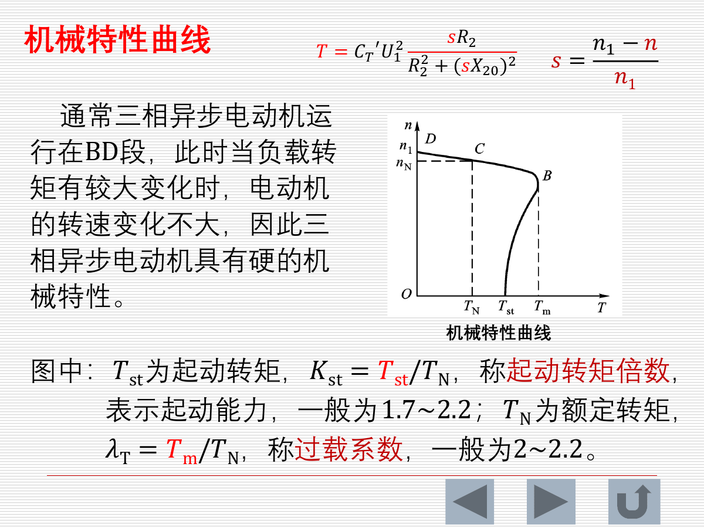

重要结论：

- 转矩与电压平方成正比，电压降低会使转矩明显下降。
- 通常三相异步电动机运行在机械特性 BD 段。
- 在该段负载转矩变化较大时，电动机转速变化不大，所以称为**硬机械特性**。

常用指标：

| 指标 | 含义 |
|---|---|
| 起动转矩 $T_{st}$ | 起动瞬间的转矩 |
| 起动转矩倍数 $K_{st}=T_{st}/T_N$ | 表示起动能力，常为 1.7~2.2 |
| 最大转矩 $T_m$ | 电机可产生的最大电磁转矩 |
| 过载系数 $\lambda_T=T_m/T_N$ | 常为 2~2.2 |

### 3.7 三相异步电动机额定值

| 参数 | 含义 |
|---|---|
| 额定功率 $P_N$ | 额定运行时轴上输出机械功率 |
| 额定电压 $U_N$ | 额定运行时线电压 |
| 额定电流 $I_N$ | 额定运行时线电流 |
| 额定频率 $f_N$ | 电源频率，通常 50Hz |
| 额定转速 $n_N$ | 额定运行转速 |
| 额定功率因数 $\cos\varphi_N$ | 一般 0.70~0.90 |
| 额定效率 $\eta_N$ | 一般约 75%~92% |

三相异步电动机额定效率：

$$
\eta_N=\frac{P_N}{\sqrt{3}U_NI_N\cos\varphi_N}\times100\%
$$

### 3.8 三相异步电动机的起动

起动条件：起动转矩必须大于负载反转矩。

常见起动方法：

| 起动方法 | 适用对象 | 特点 |
|---|---|---|
| 直接起动 | 中小型笼型电动机 | 简单、经济，但起动电流大 |
| 降压起动 | 笼型电动机 | 降低起动电流，但起动转矩也降低 |
| 转子串电阻起动 | 绕线型电动机 | 限制起动电流并提高起动转矩 |

#### 星形-三角形换接起动

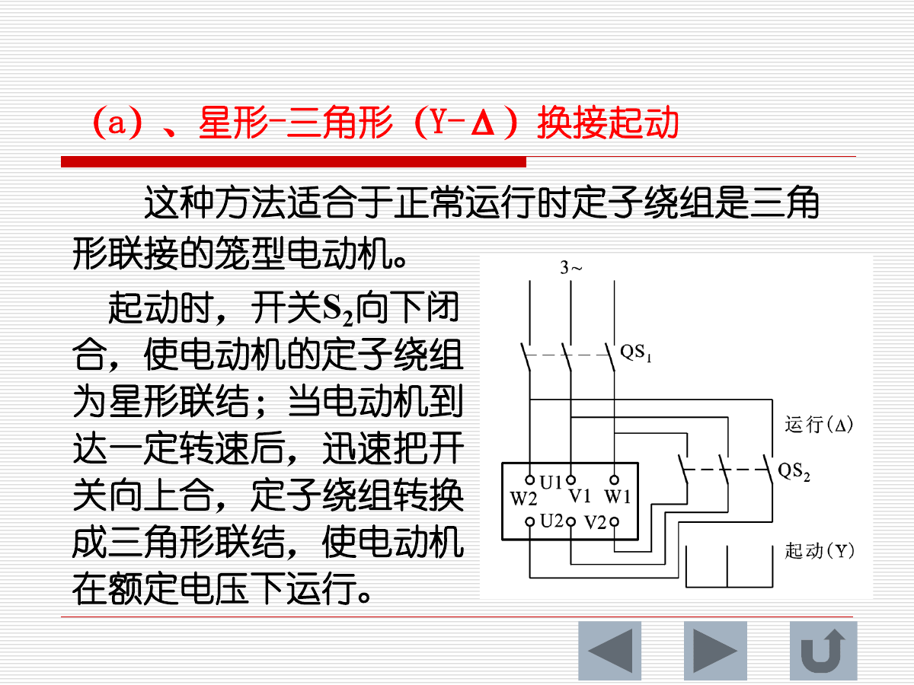

适用条件：

- 电动机正常运行时定子绕组为三角形连接。
- 起动时先接成星形，待转速升高后再换成三角形运行。

特点：

- 起动相电压降低。
- 起动电流约为三角形直接起动时的 $1/3$。
- 起动转矩也约降为 $1/3$，所以不适合重载起动。

#### 转子串电阻起动

适用于绕线转子电动机。

特点：

- 限制起动电流。
- 可增加起动转矩。
- 起动过程中逐步短接外接电阻。
- 适合功率较大、重载起动场合，如起重机、卷扬机。

### 3.9 反转、调速和制动

#### 反转

将三相电源任意两根相线对调，旋转磁场方向反向，电动机反转。

#### 调速

由：

$$
n=(1-s)\frac{60f_1}{p}
$$

可知调速方法有三类：

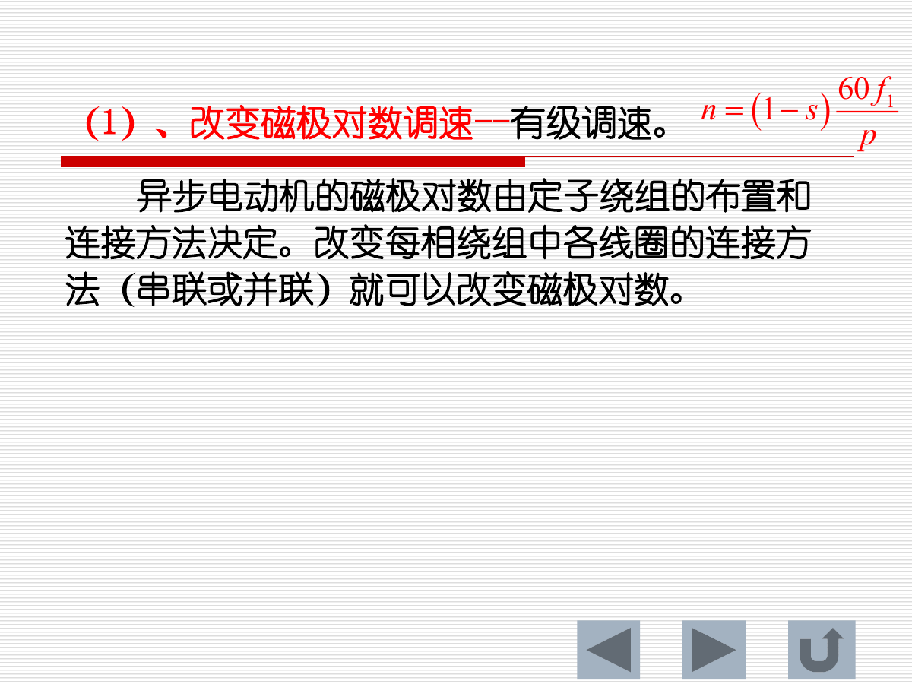

| 方法 | 改变量 | 特点 |
|---|---|---|
| 改变磁极对数调速 | $p$ | 有级调速 |
| 改变转差率调速 | $s$ | 常用于绕线型电动机 |
| 改变电源频率调速 | $f_1$ | 无级调速，范围宽，性能好 |

变频调速：

- 连续改变 $f_1$。
- 电压有效值也按规律变化。
- 恒转矩调速时常保持 $U_1/f_1$ 为常数。

#### 制动

制动是使电动机断电后迅速停车。

制动类型：

- 机械制动
- 电气制动

电气制动包括：

| 类型 | 原理 | 特点 |
|---|---|---|
| 反接制动 | 停车时加反相序三相电源 | 制动快，电流大，常串限流电阻 |
| 能耗制动 | 断开交流电源后给定子加直流 | 形成静止磁场，转子切割磁场产生制动转矩 |

---

## 4. 公式速查

| 场景 | 公式 | 备注 |
|---|---|---|
| 磁导率 | $\mu=B/H$ | 铁磁材料磁性能 |
| 磁路欧姆定律 | $\Phi=NI/\sum R_m$ | 类比电路欧姆定律 |
| 磁阻 | $R_m=l/(\mu S)$ | 空气隙磁阻大 |
| 交流磁路感应电动势 | $E=4.44fN\Phi_m$ | 正弦磁通 |
| 变压器电压比 | $U_1/U_2=N_1/N_2=k$ | 理想变压器 |
| 变压器电流比 | $I_1/I_2\approx1/k$ | 忽略损耗 |
| 阻抗变换 | $Z_L'=k^2Z_L$ | 折算到一次侧 |
| 变压器效率 | $\eta=P_2/(P_2+P_{Fe}+P_{Cu})$ | 输出功率/输入功率 |
| 同步转速 | $n_1=60f_1/p$ | $p$ 为磁极对数 |
| 转差率 | $s=(n_1-n)/n_1$ | 异步电机核心量 |
| 电机转速 | $n=(1-s)60f_1/p$ | 调速依据 |
| 电磁转矩 | $T=C_T'U_1^2\frac{sR_2}{R_2^2+(sX_{20})^2}$ | 转矩与电压平方成正比 |
| 额定效率 | $\eta_N=P_N/(\sqrt{3}U_NI_N\cos\varphi_N)$ | 三相电动机 |

---

## 5. 易错点与复习提醒

1. 软磁材料用于变压器和电机铁心；硬磁材料用于永久磁铁。
2. 涡流损耗可用叠片铁心减小，磁滞损耗应选磁滞回线窄的材料减小。
3. 空气隙磁阻很大，气隙变化会明显影响励磁电流。
4. 变压器电压比等于匝数比，电流比与匝数比相反。
5. 阻抗变换是平方关系：$Z_L'=k^2Z_L$。
6. 异步电动机转子转速一定小于同步转速，否则没有感应电流和转矩。
7. 三相异步电动机反转只需对调任意两根相线。
8. 电磁转矩与电压平方成正比，电压略降会使起动能力明显下降。
9. Y-Δ 起动只能用于正常运行作三角形连接的笼型电动机，且不适合重载起动。
10. 变频调速的理论依据是 $n=(1-s)60f_1/p$。

---

## 6. 建议复习顺序

1. 先掌握磁路类比电路：磁动势、磁通、磁阻。
2. 背熟交流磁路公式 $E=4.44fN\Phi_m$。
3. 熟练使用变压器三大关系：变电压、变电流、变阻抗。
4. 理解旋转磁场如何产生，以及为什么叫“异步”。
5. 重点掌握 $n_1=60f_1/p$、$s=(n_1-n)/n_1$、$n=(1-s)60f_1/p$。
6. 把起动、反转、调速、制动按“改什么量、达到什么效果”整理记忆。
