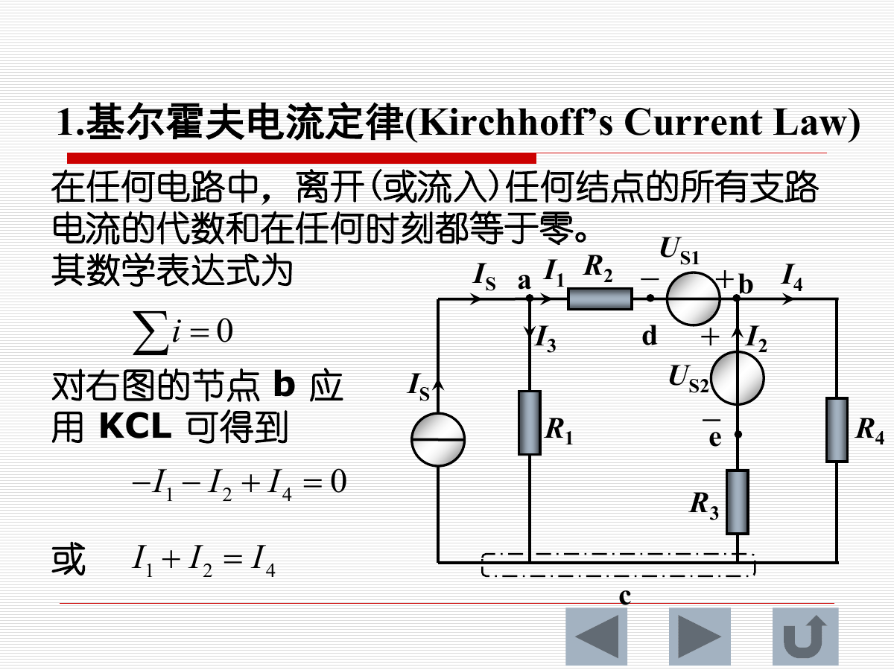
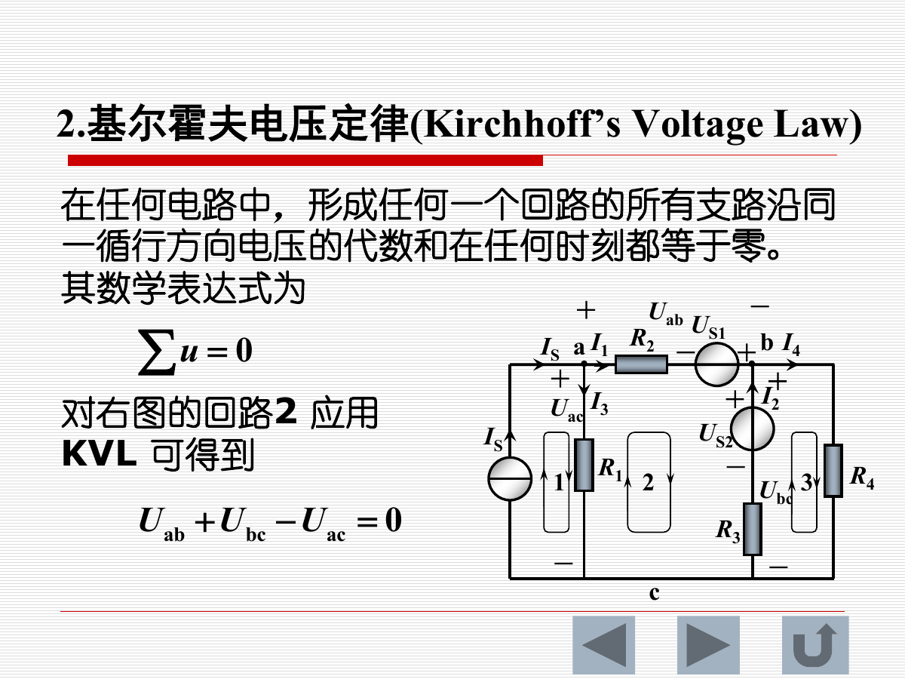
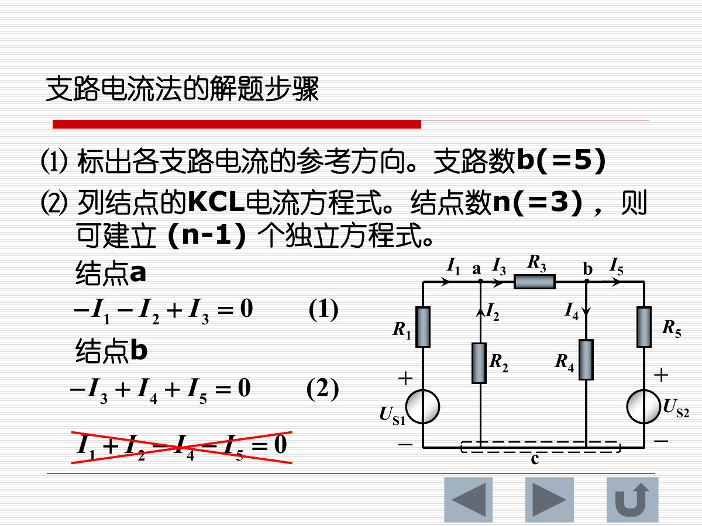
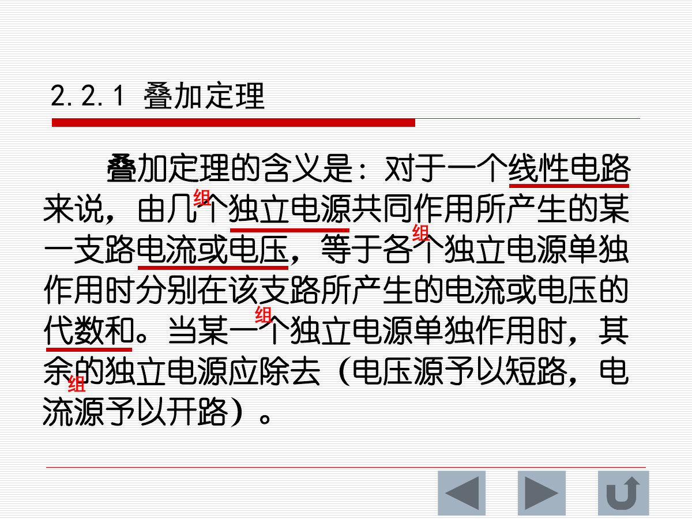
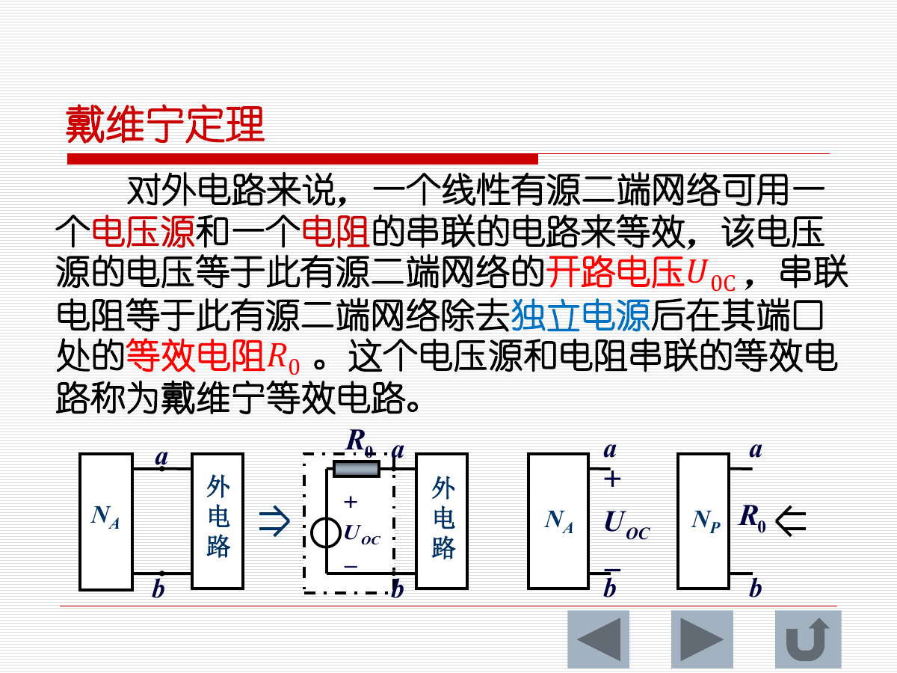
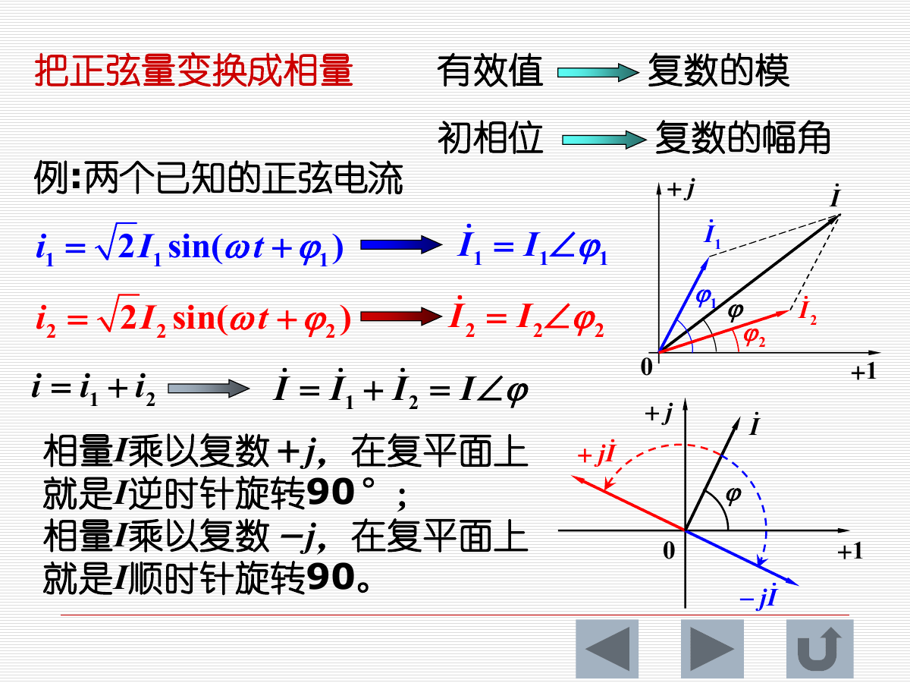
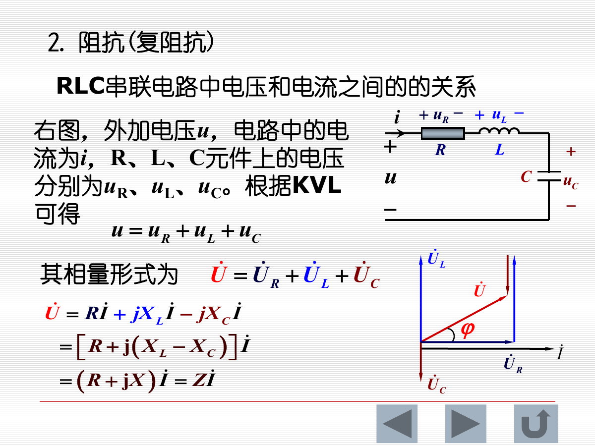
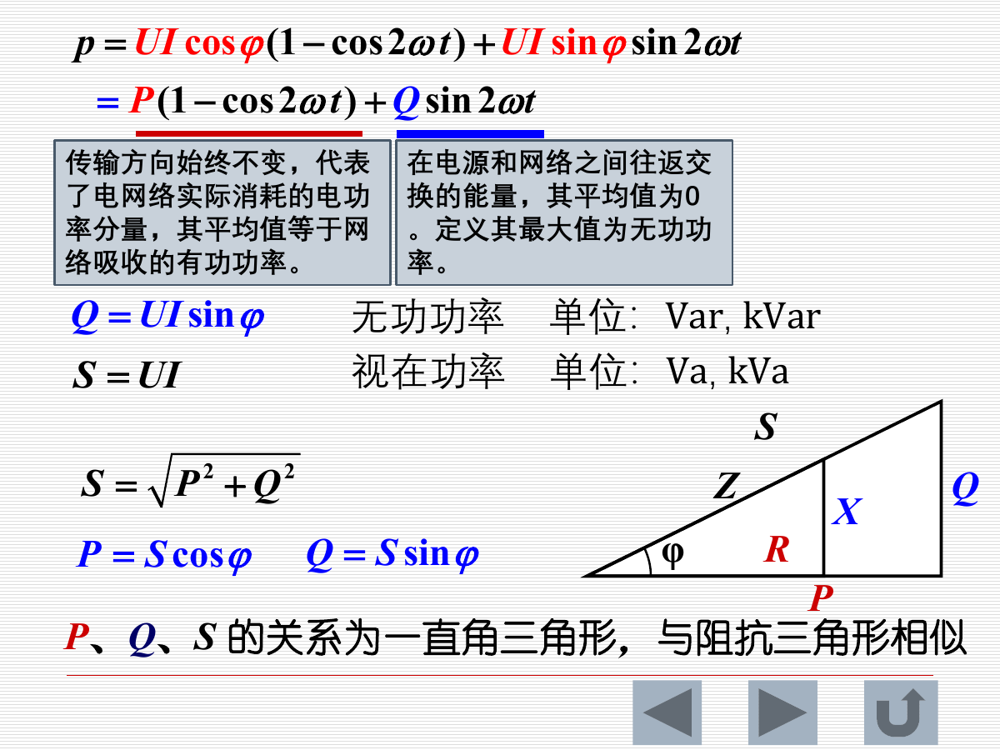
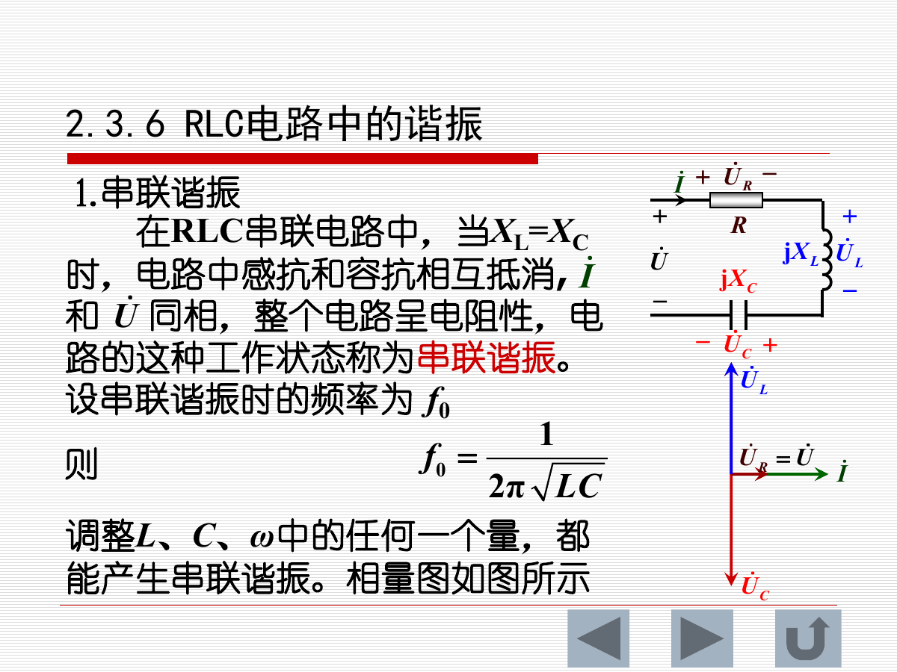
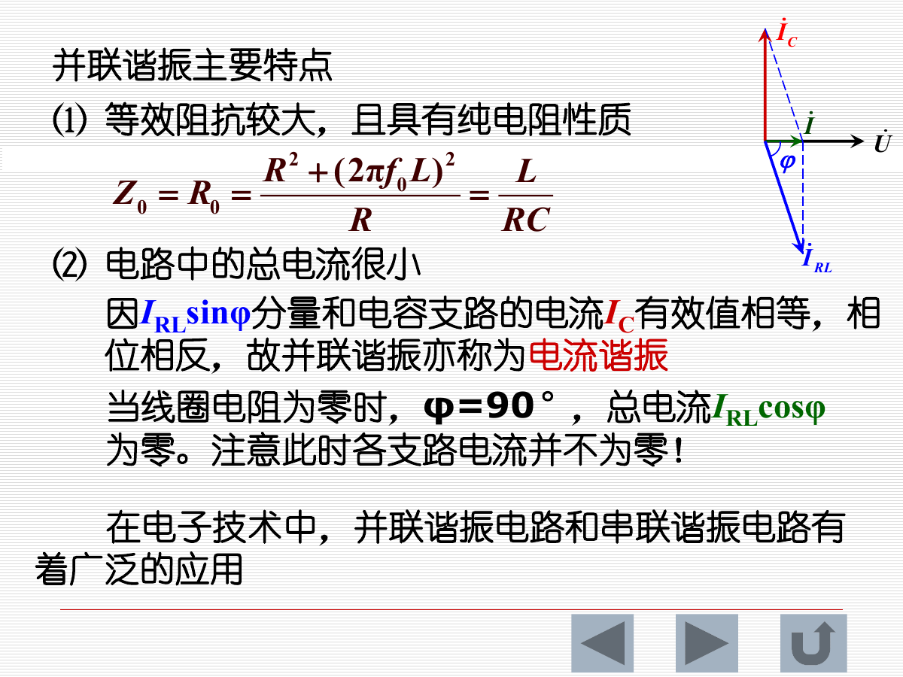

# 第二章 电路分析基础：核心知识点总结

> 来源：`2-I-200227-sun-第2章-电路分析基础.pdf`  
> 复习主线：基尔霍夫定律 -> 支路电流法 -> 叠加定理 -> 戴维宁/诺顿等效 -> 正弦交流相量法 -> 功率 -> RLC 谐振  
> 说明：该 PDF 首页列出 2.4 三相交流电路、2.5 非正弦交流电路、2.6 一阶电路瞬态分析，但当前文件实际内容到 2.3.6 RLC 电路中的谐振。本总结覆盖本文件出现的全部内容。

## 0. 本章知识框架

| 章节 | 核心内容 | 关键词 |
|---|---|---|
| 2.1 | 基尔霍夫定律 | 结点、支路、回路、网孔、KCL、KVL、支路电流法 |
| 2.2 | 叠加定理与等效源定理 | 线性电路、独立源单独作用、戴维宁、诺顿、等效电阻 |
| 2.3.1 | 正弦量三要素 | 最大值、角频率、初相位、周期、频率、相位差、有效值 |
| 2.3.2 | 相量表示法 | 复数、相量、有效值相量、相量加减、相位旋转 |
| 2.3.3 | R/L/C 相量关系 | 电阻同相、电感电压超前、电容电流超前、感抗、容抗 |
| 2.3.4 | 简单交流电路计算 | 相量 KCL/KVL、复阻抗、串并联阻抗 |
| 2.3.5 | 交流功率 | 瞬时功率、有功功率、无功功率、视在功率、功率因数补偿 |
| 2.3.6 | RLC 谐振 | 串联谐振、并联谐振、品质因数、通频带、选择性 |

---

## 1. 基尔霍夫定律

### 1.1 基本名词

| 名词 | 定义 |
|---|---|
| 结点 | 三个或三个以上电路元件的连接点 |
| 支路 | 连接两个结点之间的电路 |
| 回路 | 电路中任一闭合路径 |
| 网孔 | 电路中最简单的单孔回路 |

这些概念是列写 KCL 和 KVL 方程的基础。支路数常记为 `b`，结点数常记为 `n`。

### 1.2 基尔霍夫电流定律 KCL

KCL 表述：在任何电路中，离开或流入任意结点的所有支路电流的代数和在任何时刻都等于零。

$$
\sum i=0
$$

也可理解为：

$$
\sum i_{\text{流入}}=\sum i_{\text{流出}}
$$

KCL 不只适用于实际结点，还可以扩展到任意封闭面，这种封闭面称为广义结点。只要把穿过封闭面的电流按同一符号规则计入，代数和仍为零。

### 1.3 基尔霍夫电压定律 KVL

KVL 表述：在任何电路中，形成任一回路的所有支路沿同一循行方向电压的代数和在任何时刻都等于零。

$$
\sum u=0
$$

若支路由电阻和电压源构成，可用欧姆定律把支路电压写成 `RI`，再列 KVL。例如沿某回路：

$$
R_2I_1-U_{S1}+U_{S2}-R_3I_2-R_1I_3=0
$$

列 KVL 时必须提前规定回路绕行方向。若某支路电压参考方向与绕行方向一致取正，相反取负；也可采用相反约定，但全题必须一致。

### 1.4 支路电流法

支路电流法以各支路电流为未知量，应用 KCL 和 KVL 列方程求解，是最基本的电路分析方法之一。

解题步骤：

1. 标出各支路电流的参考方向。
2. 对结点列 KCL。若结点数为 `n`，独立 KCL 方程数为 `n-1`。
3. 对回路列 KVL。若支路数为 `b`，所需独立 KVL 方程数为 `b-(n-1)`。
4. 联立求解各支路电流。
5. 由支路电流进一步求支路电压和功率。

如果电路含电流源，电流源所在支路电流已知，可少列一个方程。若含受控源，受控源不能像独立源那样简单“除去”，而应保留受控源并补充控制量与受控量之间的关系式。

---

## 2. 叠加定理与等效源定理

### 2.1 叠加定理

叠加定理适用于线性电路。由几个独立电源共同作用产生的某一支路电流或电压，等于各独立电源单独作用时分别在该支路产生的电流或电压的代数和。

某一独立源单独作用时，其余独立源处理方法：

| 不作用的独立源 | 处理 |
|---|---|
| 理想电压源 | 短路 |
| 理想电流源 | 开路 |

使用注意事项：

1. 叠加定理只适用于线性电路。
2. 只有电压和电流可以叠加，功率不能叠加。
3. 功率与电压、电流是平方关系，例如 `P=I^2R=U^2/R`，所以不能把各分电路功率直接相加。
4. 受控源不是独立电源，不能单独作用，分析时应保留。
5. 叠加是代数相加，要特别注意各分量与原参考方向是否一致。

### 2.2 二端网络

凡具有两个接线端的部分电路称为二端网络。按内部是否含电源分为：

| 类型 | 特点 |
|---|---|
| 无源二端网络 | 内部不含独立电源 |
| 有源二端网络 | 内部含独立电源 |

无源二端网络常可化为等效电阻。有源二端网络对外可用等效电源模型表示。

### 2.3 戴维宁定理

戴维宁定理：对外电路来说，一个线性有源二端网络可用一个电压源和一个电阻串联的电路等效。

戴维宁等效参数：

| 参数 | 求法 |
|---|---|
| `U_OC` | 有源二端网络端口开路电压 |
| `R_0` | 除去独立电源后从端口看进去的等效电阻 |

等效电路为开路电压 `U_OC` 与等效电阻 `R_0` 串联。

### 2.4 诺顿定理

诺顿定理：对外电路来说，一个线性有源二端网络可用一个电流源和一个电阻并联的电路等效。

诺顿等效参数：

| 参数 | 求法 |
|---|---|
| `I_SC` | 端口短路电流 |
| `R_0` | 除去独立电源后从端口看进去的等效电阻 |

等效电路为短路电流源 `I_SC` 与等效电阻 `R_0` 并联。

### 2.5 戴维宁与诺顿互换

两种模型满足：

$$
I_{SC}=\frac{U_{OC}}{R_0},\quad U_{OC}=R_0I_{SC}
$$

它与第一章实际电源模型互换本质相同，都是对端口外部电路等效。

### 2.6 等效电阻 `R_0` 的求法

课件总结了四种方法：

| 方法 | 适用情况 |
|---|---|
| 串并联化简 | 除源后无受控源，结构能直接化简 |
| 开路电压/短路电流法 | 可求 `U_OC` 与 `I_SC`，则 `R_0=U_OC/I_SC` |
| 外施电压法 | 除去独立源后，在端口外加电压 `U`，求输入电流 `I`，`R_0=U/I` |
| 负载实验法 | 已知接负载前后的端口电压，可反求 `R_0` |

当网络中含受控源时，独立源除去后受控源仍保留。此时通常不能只用普通串并联化简，应优先用开路短路法或外施电压法。

---

## 3. 正弦交流电路基础

### 3.1 正弦交流电路概述

随时间按正弦规律变化的电压和电流称为正弦量。实际电力系统中，发电厂提供的电压和电流通常是正弦量；模拟电子电路中也常用正弦信号作为信号源。

线性非正弦电路也可把非正弦信号分解成若干正弦信号，分别计算后再叠加。

交流电路中，正弦量的参考方向是指正半周时的方向。

### 3.2 正弦量的三要素

正弦电压和电流可表示为：

$$
u=U_m\sin(\omega t+\varphi_u)
$$

$$
i=I_m\sin(\omega t+\varphi_i)
$$

三要素：

| 要素 | 含义 |
|---|---|
| 最大值 | `U_m` 或 `I_m`，正弦量峰值 |
| 角频率 | `omega`，表示变化快慢 |
| 初相位 | `varphi_u` 或 `varphi_i`，`t=0` 时相位 |

周期、频率、角频率关系：

$$
T=\frac{1}{f},\quad \omega=\frac{2\pi}{T}=2\pi f
$$

### 3.3 相位、初相位和相位差

两个同频率正弦量的相位差：

$$
\varphi=(\omega t+\varphi_u)-(\omega t+\varphi_i)=\varphi_u-\varphi_i
$$

相位差不随时间变化，只等于初相位之差。

| 相位差 | 关系 |
|---|---|
| `φ=0` | `u` 与 `i` 同相 |
| `φ>0` | `u` 超前于 `i`，或 `i` 滞后于 `u` |
| `φ=180°` | 反相 |
| `φ=90°` | 正交 |

### 3.4 瞬时值、最大值和有效值

有效值从电流热效应角度定义。交流电流 `i` 和直流电流 `I` 分别通过同一电阻 `R`，若一个周期内发热相等，则该直流电流 `I` 称为交流电流的有效值。

正弦量有效值与最大值关系：

$$
I=\frac{I_m}{\sqrt{2}},\quad U=\frac{U_m}{\sqrt{2}}
$$

因此：

$$
u=\sqrt{2}U\sin(\omega t+\varphi_u)
$$

$$
i=\sqrt{2}I\sin(\omega t+\varphi_i)
$$

---

## 4. 正弦量的相量表示法

### 4.1 复数表示

复数可写为：

$$
A=a+jb=Ae^{j\varphi}=A\angle\varphi
$$

其中：

| 符号 | 含义 |
|---|---|
| `a` | 实部 |
| `b` | 虚部 |
| `A` | 模 |
| `φ` | 幅角 |
| `j` | 虚数单位，`j^2=-1` |

欧拉公式：

$$
e^{jx}=\cos x+j\sin x
$$

复数运算规律：

| 运算 | 规律 |
|---|---|
| 加减 | 实部与实部、虚部与虚部分别加减 |
| 乘法 | 模相乘，幅角相加 |
| 除法 | 模相除，幅角相减 |

### 4.2 相量

相量法用复数描述同频率正弦量。对于：

$$
u=U_m\sin(\omega t+\varphi)
$$

其有效值相量为：

$$
\dot U=U\angle\varphi
$$

相量的模是有效值，相量的幅角是初相位。

重要旋转关系：

| 操作 | 几何意义 |
|---|---|
| 乘以 `+j` | 相量逆时针旋转 90° |
| 乘以 `-j` | 相量顺时针旋转 90° |

相量法只适用于同频率正弦量的线性计算。不同频率正弦量不能直接用一个相量图相加。

---

## 5. R、L、C 元件的相量关系

### 5.1 电阻元件

电阻上电压和电流同频率、同相位。

瞬时值：

$$
u=Ri
$$

有效值：

$$
U=RI
$$

相量形式：

$$
\dot U=R\dot I
$$

### 5.2 电感元件

电感电压：

$$
u=L\frac{di}{dt}
$$

若电流为正弦量，则电感电压超前电流 90°，或电流滞后电压 90°。

感抗：

$$
X_L=\omega L=2\pi fL
$$

相量形式：

$$
\dot U=jX_L\dot I
$$

感抗与频率成正比。直流时 `f=0`，`X_L=0`，所以电感在直流稳态相当于短路。

### 5.3 电容元件

电容电流：

$$
i=C\frac{du}{dt}
$$

若电压为正弦量，则电容电流超前电压 90°，或电压滞后电流 90°。

容抗：

$$
X_C=\frac{1}{\omega C}=\frac{1}{2\pi fC}
$$

相量形式：

$$
\dot U=-jX_C\dot I
$$

容抗与频率成反比。频率越高，电容越容易通过交流信号；直流稳态时电容相当于开路。

---

## 6. 简单正弦交流电路计算

### 6.1 KCL 和 KVL 的相量形式

对同频率正弦量，KCL 和 KVL 可写成相量形式：

$$
\sum \dot I=0
$$

$$
\sum \dot U=0
$$

这说明直流电路的基本分析方法可以迁移到线性交流电路，只是电阻要推广为复阻抗，电压电流要用相量。

### 6.2 复阻抗

RLC 串联电路中：

$$
\dot U=\dot U_R+\dot U_L+\dot U_C
$$

$$
\dot U=R\dot I+jX_L\dot I-jX_C\dot I
$$

所以：

$$
\dot U=[R+j(X_L-X_C)]\dot I=Z\dot I
$$

复阻抗：

$$
Z=R+jX
$$

其中：

$$
X=X_L-X_C
$$

阻抗模：

$$
|Z|=\sqrt{R^2+X^2}
$$

阻抗角：

$$
\varphi=\arctan\frac{X}{R}=\arctan\frac{X_L-X_C}{R}
$$

电路性质判断：

| 条件 | 阻抗角 | 电路性质 | 电流与电压关系 |
|---|---|---|---|
| `X>0` | `φ>0` | 电感性 | 电流滞后电压 |
| `X<0` | `φ<0` | 电容性 | 电流超前电压 |
| `X=0` | `φ=0` | 电阻性 | 电流与电压同相 |

### 6.3 阻抗串联和并联

串联阻抗：

$$
Z=\sum_{k=1}^{n}Z_k
$$

并联阻抗：

$$
\frac{1}{Z}=\sum_{k=1}^{n}\frac{1}{Z_k}
$$

交流电路的串并联化简形式与直流电阻类似，但必须用复数运算。

---

## 7. 交流电路的功率

### 7.1 瞬时功率

设：

$$
i=\sqrt{2}I\sin\omega t
$$

$$
u=\sqrt{2}U\sin(\omega t+\varphi)
$$

瞬时功率：

$$
p=ui
$$

化简得：

$$
p=UI\cos\varphi(1-\cos2\omega t)+UI\sin\varphi\sin2\omega t
$$

瞬时功率大于零表示吸收功率，小于零表示向电源送回功率。

### 7.2 有功功率、无功功率、视在功率

有功功率是一个周期内负载吸收功率的平均值：

$$
P=UI\cos\varphi
$$

功率因数：

$$
\lambda=\cos\varphi
$$

无功功率：

$$
Q=UI\sin\varphi
$$

视在功率：

$$
S=UI
$$

三者关系：

$$
S=\sqrt{P^2+Q^2}
$$

$$
P=S\cos\varphi,\quad Q=S\sin\varphi
$$

单位：

| 功率 | 单位 |
|---|---|
| 有功功率 `P` | W、kW |
| 无功功率 `Q` | var、kvar |
| 视在功率 `S` | VA、kVA |

功率守恒：

| 类型 | 是否守恒 |
|---|---|
| 有功功率 | 守恒 |
| 无功功率 | 守恒 |
| 视在功率 | 不守恒 |

### 7.3 功率因数提高

电源设备容量：

$$
S=UI
$$

负载有功功率：

$$
P=UI\cos\varphi=S\lambda
$$

若功率因数低，同样容量的电源设备能输出的有功功率较小；当负载 `P` 和电压 `U` 一定时，功率因数提高会使线路电流减小，从而降低线路损耗：

$$
\Delta p=R_LI^2
$$

工业负载多为感性，常用并联电容补偿无功，提高功率因数。

并联电容补偿公式：

$$
C=\frac{P}{2\pi fU^2}(\tan\varphi_1-\tan\varphi_2)
$$

其中 `φ_1` 为补偿前功率因数角，`φ_2` 为补偿后功率因数角。

---

## 8. RLC 电路中的谐振

### 8.1 串联谐振

RLC 串联电路中，当：

$$
X_L=X_C
$$

即：

$$
\omega_0L=\frac{1}{\omega_0C}
$$

电路发生串联谐振。谐振频率：

$$
f_0=\frac{1}{2\pi\sqrt{LC}}
$$

串联谐振特点：

1. 复阻抗最小：`Z=R`。
2. 电源电压一定时，电流最大：`I_0=U/R`。
3. 电压与电流同相，电路呈电阻性。
4. `U_L` 与 `U_C` 有效值相等、相位相反，彼此抵消。
5. 串联谐振又称电压谐振。

特性阻抗：

$$
\rho=\omega_0L=\frac{1}{\omega_0C}=\sqrt{\frac{L}{C}}
$$

品质因数：

$$
Q=\frac{U_L}{U}=\frac{U_C}{U}=\frac{\omega_0L}{R}=\frac{1}{\omega_0CR}=\frac{\rho}{R}
$$

若 `X_L=X_C >> R`，则谐振时 `U_L=U_C >> U`，可能出现很高的电感或电容端电压。

### 8.2 串联谐振的频率特性和通频带

串联谐振电流随频率变化：

$$
I=\frac{U}{\sqrt{R^2+(\omega L-\frac{1}{\omega C})^2}}
$$

当 `f=f_0` 时，电流最大；无论频率升高或降低，电流都会减小。

当：

$$
I=\frac{I_0}{\sqrt{2}}
$$

对应两个频率 `f_L` 和 `f_H`。通频带：

$$
f_{BW}=f_H-f_L
$$

与品质因数关系：

$$
f_{BW}=\frac{f_0}{Q}
$$

相对通频带：

$$
\frac{f_{BW}}{f_0}=\frac{1}{Q}
$$

`Q` 越高，通频带越窄，选择性越好。

### 8.3 并联谐振

电感线圈与电容并联，当端电压 `U` 与总电流 `I` 同相时，电路发生并联谐振。

考虑线圈电阻 `R` 时，并联谐振频率：

$$
f_0=\frac{1}{2\pi\sqrt{LC}}\sqrt{1-\frac{CR^2}{L}}
$$

当 `R << 2πf_0L` 时，近似：

$$
f_0\approx\frac{1}{2\pi\sqrt{LC}}
$$

并联谐振主要特点：

1. 等效阻抗较大，且具有纯电阻性质。
2. 电路总电流很小。
3. 电感支路无功分量与电容支路电流大小相等、相位相反。
4. 并联谐振又称电流谐振。
5. 即使总电流很小，各支路电流也不一定小。

理想无电阻的 LC 并联时：

$$
I=I_L+I_C=-j\left(\frac{1}{\omega L}-\omega C\right)U
$$

当：

$$
f_0=\frac{1}{2\pi\sqrt{LC}}
$$

`I_L` 和 `I_C` 大小相等、方向相反，总电流为零。

---

## 9. 本章解题重点

1. KCL 看结点或封闭面电流代数和，KVL 看闭合回路电压代数和。
2. 支路电流法先数支路和结点，再确定 KCL、KVL 方程数，避免方程不独立。
3. 叠加定理只叠加电压和电流，不能叠加功率。
4. 受控源在叠加、求等效电阻时都不能随意除去。
5. 戴维宁等效先求开路电压和等效电阻；诺顿等效先求短路电流和等效电阻。
6. 相量的模用有效值，幅角用初相位；不要把最大值误当相量模。
7. 电感：电压超前电流 90°；电容：电流超前电压 90°。
8. 交流电路中用复阻抗列方程，最后再根据需要转回瞬时值。
9. 有功功率消耗能量，无功功率表示电源与电场/磁场之间往返交换能量。
10. 串联谐振电流最大、阻抗最小；并联谐振总电流最小、阻抗最大。

