# 第5章 集成运算放大器：核心知识点总结

> 来源：`5-201127-sun-第5章-集成运算放大器(1).pdf`  
> 复习主线：运放结构与理想模型 -> 负反馈 -> 运算电路 -> 比较器。

## 0. 本章知识框架

| 章节 | 核心内容 | 关键词 |
|---|---|---|
| 5.1 | 集成运放基本组成 | 差分输入级、中间级、互补输出级、偏置电路 |
| 5.2 | 集成运放基本特性 | 开环增益、传输特性、理想运放、虚短、虚断 |
| 5.3 | 放大电路中的负反馈 | 反馈系数、闭环增益、四种反馈类型、性能改善 |
| 5.4 | 模拟信号运算 | 反相、同相、加法、减法、积分、微分 |
| 5.5 | 幅值比较 | 开环比较器、过零比较器、滞回比较器 |
| *5.6 | 应用举例 | 温度监测控制 |

---

## 1. 集成运放的基本组成

### 1.1 集成运放是什么

集成运放是一种具有很高电压放大倍数、性能优越、集成化的多级放大器。

基本组成：

| 部分 | 作用 |
|---|---|
| 输入级 | 常用差分放大电路，提高抗干扰和抑制零点漂移能力 |
| 中间级 | 提供主要电压放大 |
| 输出级 | 提供带负载能力，常用互补对称电路 |
| 偏置电路 | 为各级提供合适静态工作点 |

### 1.2 差分放大输入级

差分放大器是运放输入级的核心。

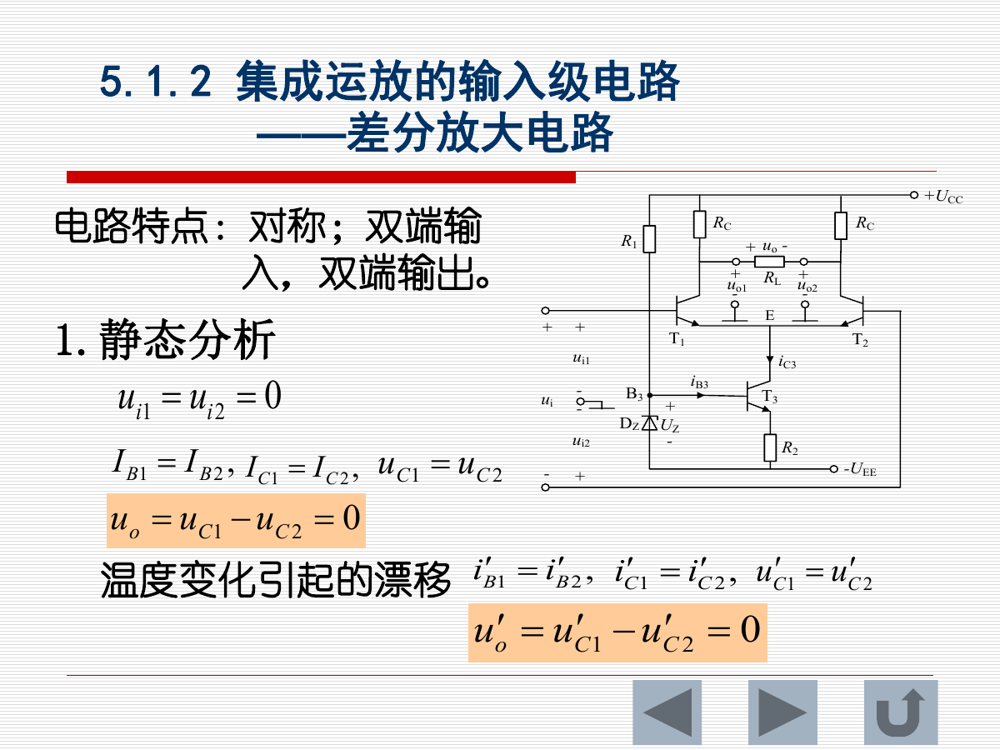

差模输入：

$$
u_{i1}=-u_{i2}
$$

两个输入大小相等、极性相反，输出有放大作用。差模放大倍数记为 $A_d$。

共模输入：

$$
u_{i1}=u_{i2}
$$

两个输入大小和极性均相同，理想对称时输出为 0。实际电路输出很小，共模放大倍数记为 $A_c$。

共模抑制比：

$$
K_{CMR}=\frac{A_d}{A_c}
$$

意义：$K_{CMR}$ 越大，运放抑制共模干扰和温漂的能力越强。

### 1.3 运放符号和输入方式

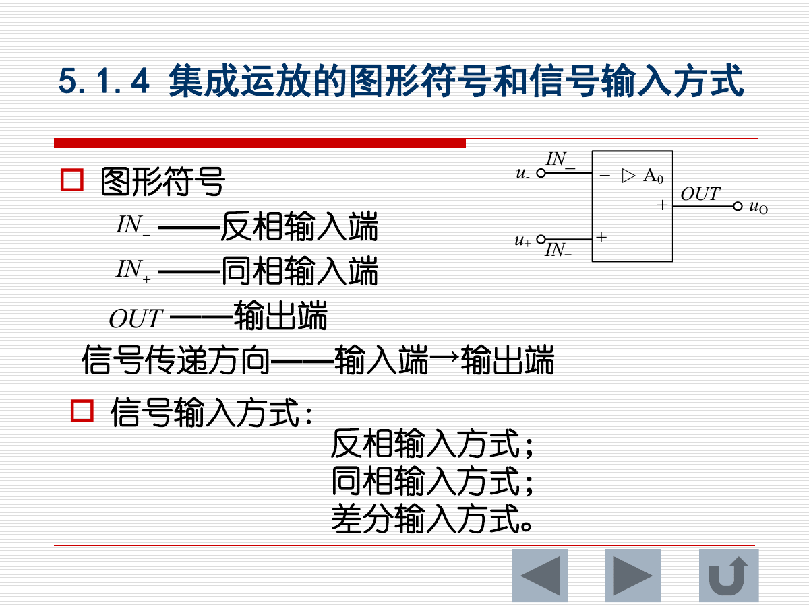

端子：

| 符号 | 含义 |
|---|---|
| $u_-$ | 反相输入端 |
| $u_+$ | 同相输入端 |
| $u_o$ | 输出端 |

输入方式：

- 反相输入
- 同相输入
- 差分输入

---

## 2. 运放基本特性和理想模型

### 2.1 电压传输特性

运放输出：

$$
u_o=A_0(u_+-u_-)
$$

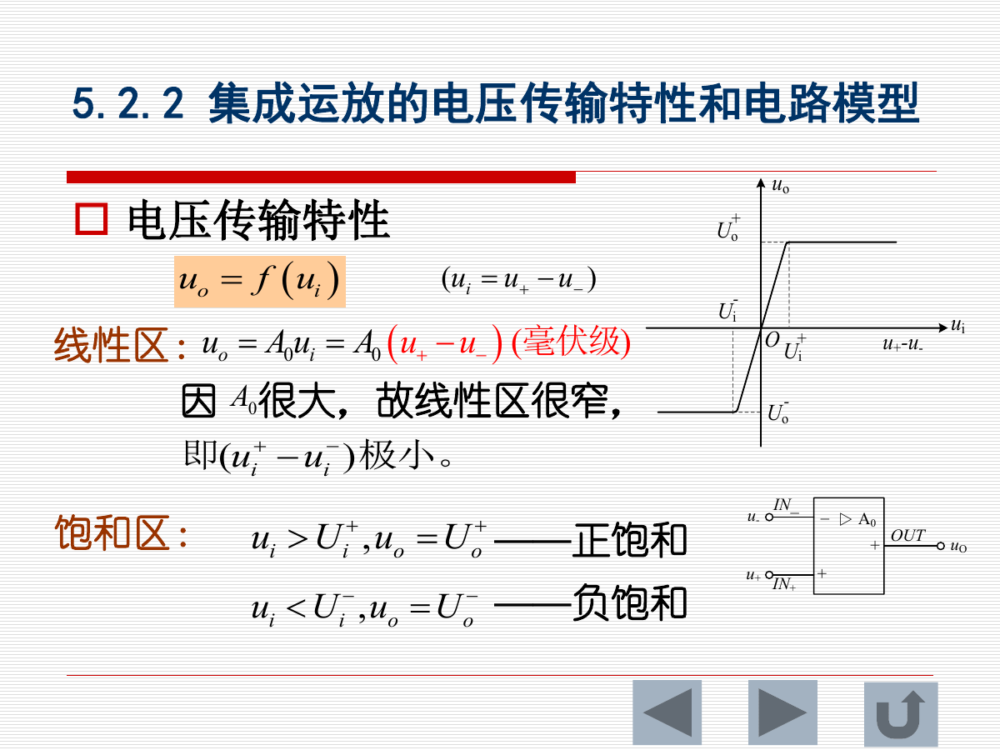

工作区：

| 工作区 | 特点 |
|---|---|
| 线性区 | $u_o=A_0(u_+-u_-)$，输入差值极小 |
| 正饱和 | $u_+>u_-$ 且开环/正反馈时，$u_o=U_{OH}$ |
| 负饱和 | $u_+<u_-$ 且开环/正反馈时，$u_o=U_{OL}$ |

由于 $A_0$ 很大，线性区很窄。

### 2.2 理想运放

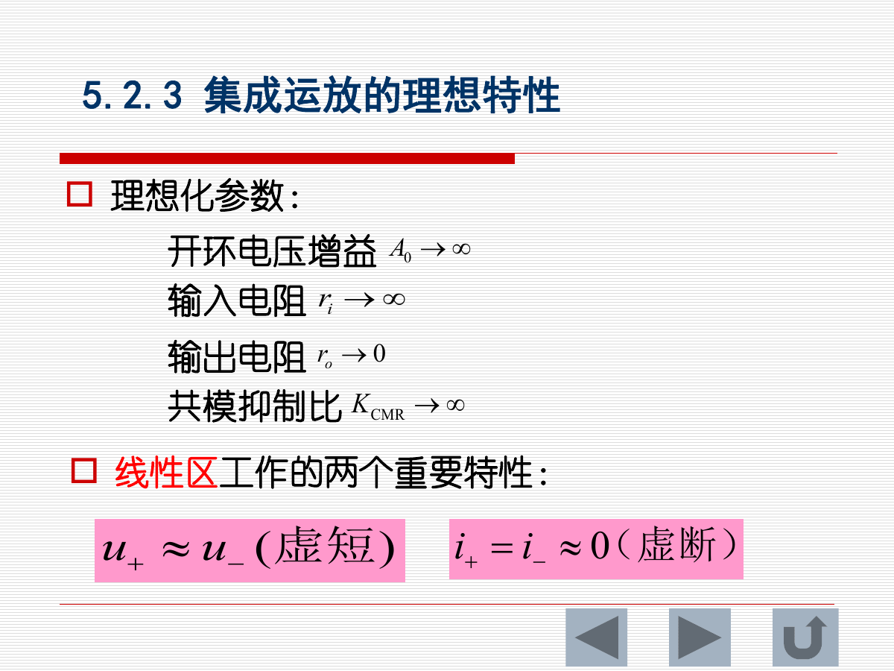

理想化参数：

| 参数 | 理想值 |
|---|---|
| 开环电压增益 $A_0$ | $\infty$ |
| 输入电阻 $r_i$ | $\infty$ |
| 输出电阻 $r_o$ | $0$ |
| 共模抑制比 $K_{CMR}$ | $\infty$ |

线性区两条核心规则：

$$
u_+\approx u_-
$$

称为**虚短**。

$$
i_+\approx i_-\approx0
$$

称为**虚断**。

注意：虚短、虚断通常用于**闭环负反馈且运放在线性区**的分析。开环比较器和正反馈比较器不能直接套用虚短。

### 2.3 运放工作状态判断

| 电路状态 | 工作区 |
|---|---|
| 开环工作 | 饱和区 |
| 闭环正反馈 | 饱和区 |
| 闭环负反馈 | 线性区 |

---

## 3. 负反馈

### 3.1 反馈基本概念

反馈是将输出信号的一部分送回输入端。

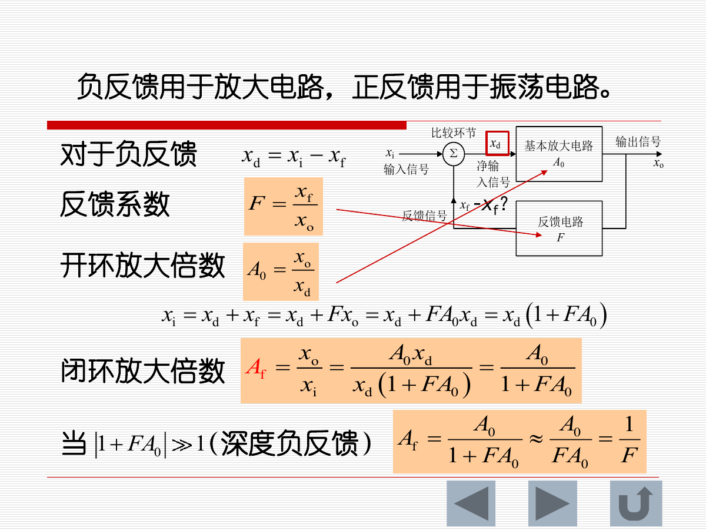

| 类型 | 判据 | 用途 |
|---|---|---|
| 负反馈 | 反馈信号与输入信号极性相反 | 放大电路 |
| 正反馈 | 反馈信号与输入信号极性相同 | 振荡、滞回比较 |

负反馈中：

$$
x_d=x_i-x_f
$$

反馈系数：

$$
F=\frac{x_f}{x_o}
$$

开环放大倍数：

$$
A_0=\frac{x_o}{x_d}
$$

闭环放大倍数：

$$
A_f=\frac{x_o}{x_i}=\frac{A_0}{1+FA_0}
$$

深度负反馈时：

$$
FA_0\gg1,\quad A_f\approx\frac{1}{F}
$$

这说明闭环增益主要由反馈网络决定，而不是由运放开环增益决定。

### 3.2 负反馈的四种类型

按输入端连接方式：

| 类型 | 比较方式 | 影响 |
|---|---|---|
| 串联反馈 | 以电压形式比较 | 输入电阻增大 |
| 并联反馈 | 以电流形式比较 | 输入电阻减小 |

按输出端取样方式：

| 类型 | 取样对象 | 影响 |
|---|---|---|
| 电压反馈 | 反馈量取决于输出电压 | 输出电阻减小 |
| 电流反馈 | 反馈量取决于输出电流 | 输出电阻增大 |

四种组合：

- 电压串联负反馈
- 电压并联负反馈
- 电流串联负反馈
- 电流并联负反馈

### 3.3 负反馈对性能的影响

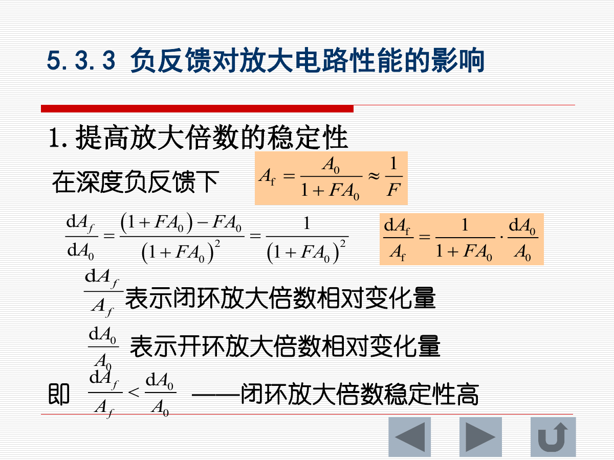

主要作用：

1. 提高闭环放大倍数稳定性。
2. 减小非线性失真。
3. 扩展通频带。
4. 改变输入电阻和输出电阻。

记忆口诀：

| 反馈形式 | 输入/输出电阻影响 |
|---|---|
| 串联反馈 | 输入电阻增大 |
| 并联反馈 | 输入电阻减小 |
| 电压反馈 | 输出电阻减小 |
| 电流反馈 | 输出电阻增大 |

---

## 4. 运放模拟信号运算电路

### 4.1 分析运算电路的基本方法

对负反馈运放电路：

1. 判断运放工作在线性区。
2. 使用虚短：$u_+=u_-$。
3. 使用虚断：$i_+=i_-=0$。
4. 对关键节点列 KCL。

### 4.2 反相比例运算电路

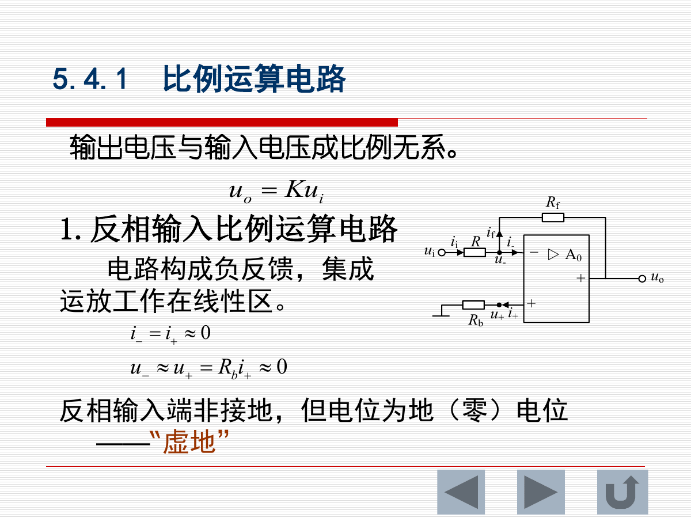

反相端为虚地：

$$
u_-\approx u_+\approx0
$$

输出：

$$
u_o=-\frac{R_f}{R}u_i
$$

闭环增益：

$$
A_f=-\frac{R_f}{R}
$$

特点：

- 输出与输入反相。
- 输入电阻约为 $R$。
- 平衡电阻常取：

$$
R_b\approx R\parallel R_f
$$

当 $R_f=R$：

$$
u_o=-u_i
$$

为反相器。

### 4.3 同相比例运算电路

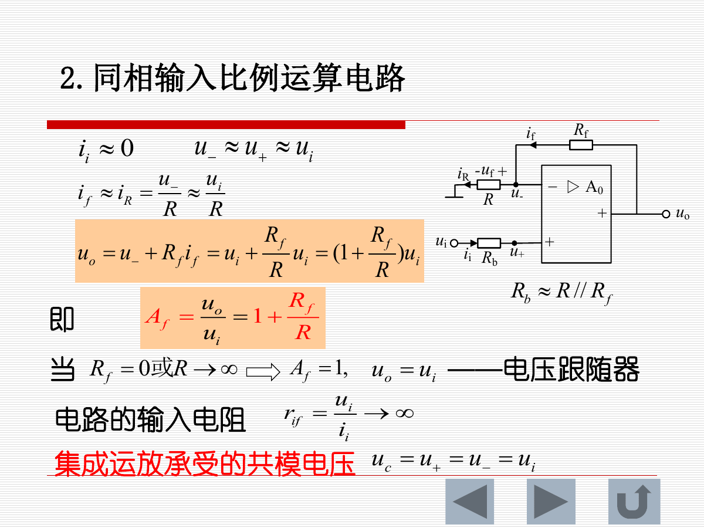

输出：

$$
u_o=\left(1+\frac{R_f}{R}\right)u_i
$$

闭环增益：

$$
A_f=1+\frac{R_f}{R}
$$

特点：

- 输出与输入同相。
- 输入电阻很高。
- 当 $R_f=0$ 或 $R\to\infty$ 时：

$$
A_f=1,\quad u_o=u_i
$$

称为电压跟随器。

### 4.4 加法运算电路

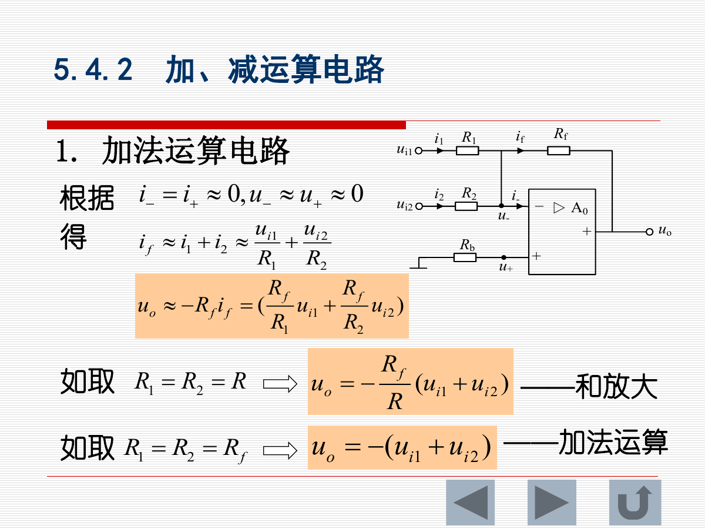

反相加法器：

$$
u_o=-R_f\left(\frac{u_{i1}}{R_1}+\frac{u_{i2}}{R_2}\right)
$$

若：

$$
R_1=R_2=R
$$

则：

$$
u_o=-\frac{R_f}{R}(u_{i1}+u_{i2})
$$

若：

$$
R_1=R_2=R_f
$$

则：

$$
u_o=-(u_{i1}+u_{i2})
$$

### 4.5 减法运算电路

常用匹配条件：

$$
R_1=R_2,\quad R_3=R_f
$$

则：

$$
u_o=\frac{R_f}{R_1}(u_{i2}-u_{i1})
$$

若 $R_f=R_1$：

$$
u_o=u_{i2}-u_{i1}
$$

### 4.6 积分运算电路

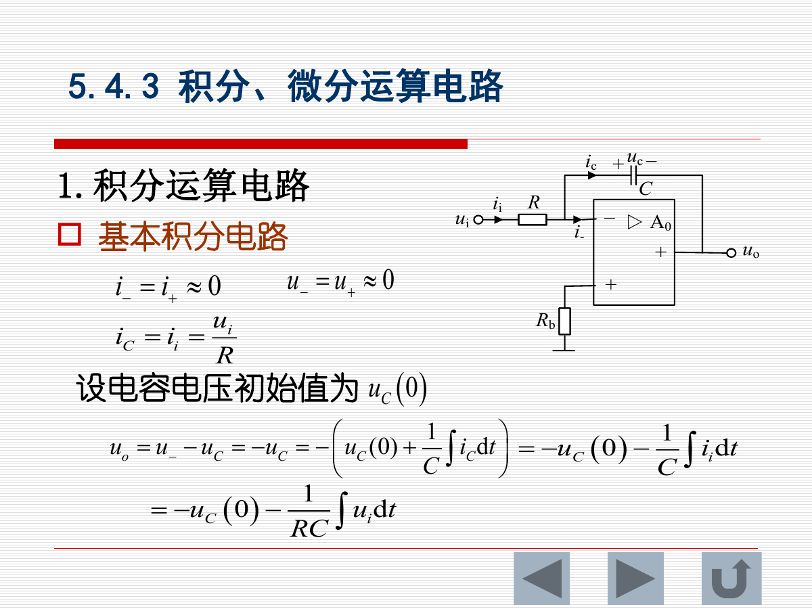

基本积分电路：

$$
u_o=-u_C(0)-\frac{1}{RC}\int u_i\,dt
$$

若电容初始电压为 0：

$$
u_o=-\frac{1}{RC}\int u_i\,dt
$$

当输入为直流 $u_i=U_i$：

$$
u_o=-\frac{U_i}{RC}t
$$

作用：

- 可将矩形波转换为三角波。
- 可实现积分、延时、波形变换。

### 4.7 微分运算电路

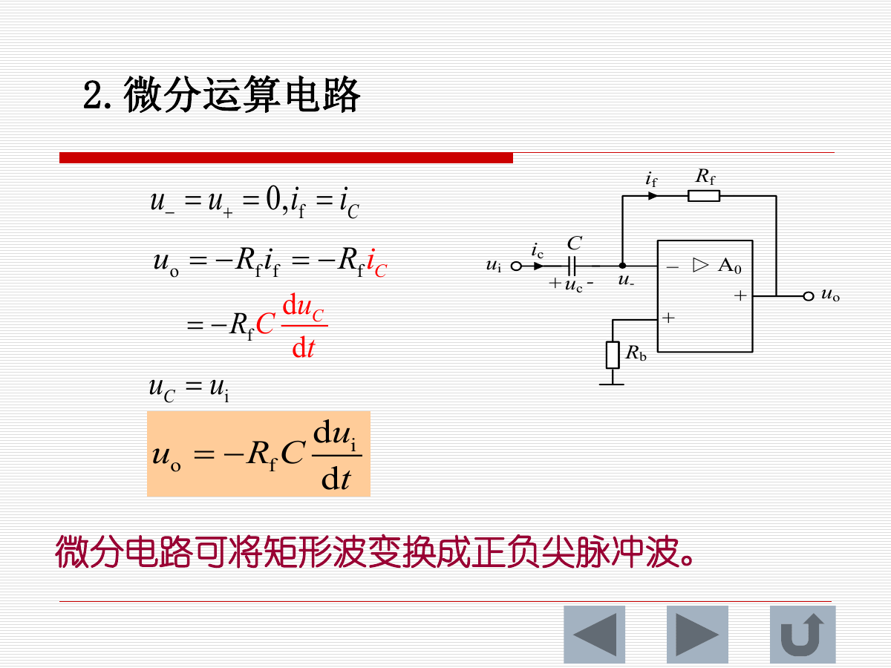

微分电路：

$$
u_o=-R_fC\frac{du_i}{dt}
$$

作用：

- 可将矩形波转换成正、负尖脉冲。
- 对输入变化率敏感。

---

## 5. 幅值比较器

### 5.1 开环比较器

比较器工作在开环状态，运放处于非线性区，输出为饱和值。

反相输入比较器：

| 条件 | 输出 |
|---|---|
| $u_i<U_R$ | $u_o=U_{OH}$ |
| $u_i>U_R$ | $u_o=U_{OL}$ |

同相输入比较器：

| 条件 | 输出 |
|---|---|
| $u_i<U_R$ | $u_o=U_{OL}$ |
| $u_i>U_R$ | $u_o=U_{OH}$ |

当参考电压 $U_R=0$ 时，称为过零比较器。

### 5.2 滞回比较器

滞回比较器引入正反馈，运放工作在非线性区。

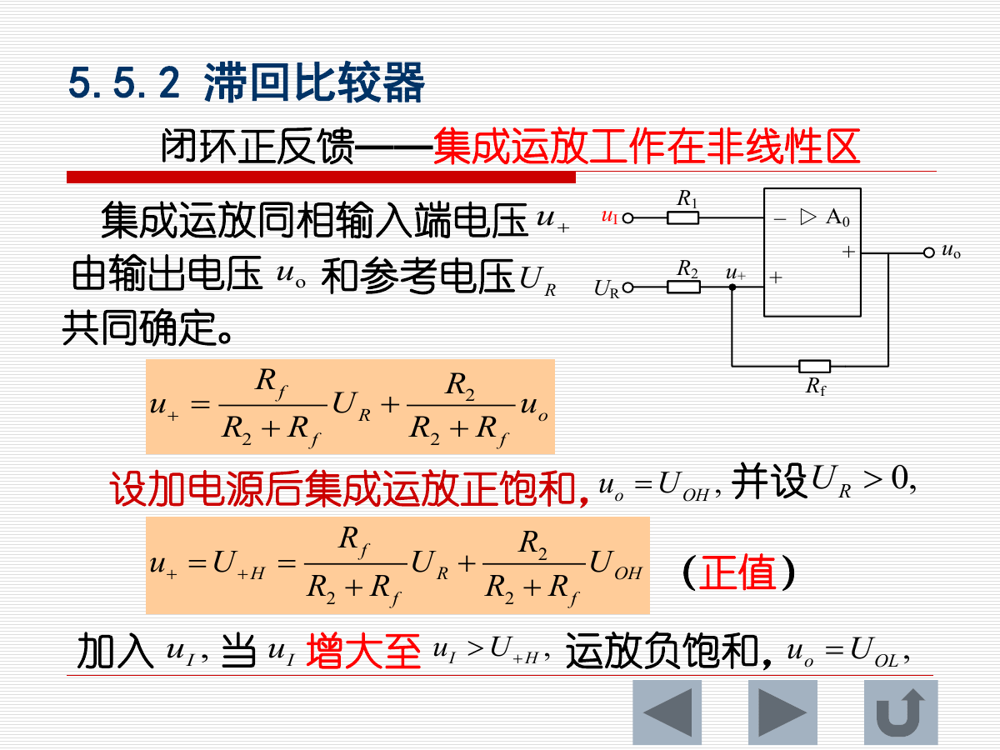

同相端电压由输出电压和参考电压共同决定：

$$
u_+=\frac{R_f}{R_2+R_f}U_R+\frac{R_2}{R_2+R_f}u_o
$$

正向阈值：

$$
U_{TH}=\frac{R_f}{R_2+R_f}U_R+\frac{R_2}{R_2+R_f}U_{OH}
$$

负向阈值：

$$
U_{TL}=\frac{R_f}{R_2+R_f}U_R+\frac{R_2}{R_2+R_f}U_{OL}
$$

滞回电压：

$$
\Delta U_T=U_{TH}-U_{TL}
=\frac{R_2}{R_2+R_f}(U_{OH}-U_{OL})
$$

作用：

- 抗干扰能力强。
- 输入信号在阈值附近有噪声时，输出不会频繁翻转。

---

## 6. 公式速查

| 电路/概念 | 公式 |
|---|---|
| 差模/共模抑制比 | $K_{CMR}=A_d/A_c$ |
| 运放输出 | $u_o=A_0(u_+-u_-)$ |
| 负反馈闭环增益 | $A_f=A_0/(1+FA_0)$ |
| 深度负反馈 | $A_f\approx1/F$ |
| 反相比例 | $u_o=-(R_f/R)u_i$ |
| 同相比例 | $u_o=(1+R_f/R)u_i$ |
| 电压跟随器 | $u_o=u_i$ |
| 反相加法 | $u_o=-R_f(u_{i1}/R_1+u_{i2}/R_2)$ |
| 减法 | $u_o=(R_f/R_1)(u_{i2}-u_{i1})$ |
| 积分 | $u_o=-\frac{1}{RC}\int u_i\,dt$ |
| 微分 | $u_o=-R_fC\frac{du_i}{dt}$ |
| 滞回电压 | $\Delta U_T=\frac{R_2}{R_2+R_f}(U_{OH}-U_{OL})$ |

---

## 7. 易错点与复习提醒

1. 虚短不是实际短路，虚断不是实际断线。
2. 虚短、虚断只适用于线性区负反馈运放。
3. 开环比较器和滞回比较器不能用虚短分析。
4. 反相比例电路的反相端是“虚地”，不是直接接地。
5. 反相比例输入电阻约为 $R$，同相比例输入电阻很高。
6. 同相比例最小增益为 1，不能小于 1。
7. 积分电路对直流输入输出斜坡，微分电路对突变信号输出尖脉冲。
8. 负反馈用于稳定放大；正反馈常用于振荡和滞回比较。
9. 滞回比较器有两个阈值，输入上升和下降时翻转点不同。

---

## 8. 建议复习顺序

1. 先掌握理想运放四个理想参数和虚短、虚断。
2. 再掌握负反馈闭环增益公式。
3. 熟练推导反相、同相、加法、减法电路。
4. 记住积分和微分电路的波形变换作用。
5. 最后区分开环比较器和滞回比较器。
