# 第8章 功率电子电路：核心知识点总结

> 来源：`8-200521-sun-第8章_功率电子电路(1).pdf`  
> 复习主线：先理解“功率放大”，再理解“直流稳压电源”，最后理解“功率半导体器件如何完成变流控制”。

## 0. 本章知识框架

功率电子电路主要解决两类问题：

1. **信号功率放大**：把输入信号放大，使负载获得足够的信号功率，例如音频功率放大。
2. **电源与电能变换**：实现交流/直流之间的变换与控制，例如整流、滤波、稳压、逆变、斩波调压等。

本章分为三块：

| 章节 | 核心内容 | 关键词 |
|---|---|---|
| 8.1 | 低频功率放大电路 | 甲类、乙类、甲乙类、OCL、OTL、交越失真、效率 |
| 8.2 | 直流稳压电源 | 整流、滤波、串联稳压、三端稳压器、开关稳压 |
| 8.3 | 功率半导体器件和变流电路 | 晶闸管、IGBT、可控整流、交流调压、变频、DC-DC |

---

## 1. 低频功率放大电路

### 1.1 功率放大电路的基本要求

功放电路不是只追求电压放大，更重要的是让负载得到足够大的**输出功率**。

核心要求：

- **输出功率尽可能大**：输出电压和输出电流都要足够大，功率管常接近极限状态工作。
- **非线性失真尽可能小**：常用负反馈改善失真。
- **效率尽可能高**：减少功率管自身损耗。

常用关系：

$$
\eta=\frac{P_O}{P_S}\times 100\%
$$

其中：

- $P_O$：负载获得的输出功率
- $P_S$：直流电源提供的功率
- $\eta$：效率

功率管集电极平均功耗：

$$
P_C=\frac{1}{T}\int_0^T u_{CE}i_Cdt
$$

### 1.2 晶体管功放的三种工作状态

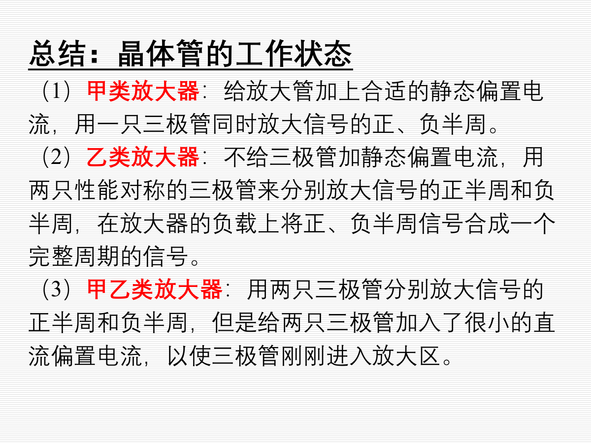

| 类型 | 导通特点 | 优点 | 缺点 | 常见用途 |
|---|---|---|---|---|
| 甲类 | 一个管子在整个周期都导通 | 波形好，失真小 | 静态功耗大，效率低 | 小信号、高保真场合 |
| 乙类 | 两个互补管分别放大正、负半周 | 静态功耗小，效率高 | 小信号处有交越失真 | 推挽功放基础 |
| 甲乙类 | 两个管子各带很小偏置，刚进入放大区 | 兼顾效率和失真 | 电路比乙类复杂 | 功率放大常用 |

重点理解：

- **甲类**：一只管放大完整周期，线性好但效率低。
- **乙类**：两只管各放大半个周期，效率高但容易出现**交越失真**。
- **甲乙类**：给两只管加入小的直流偏置，使其避开截止区，是实际功放常用状态。

### 1.3 OCL 功率放大电路

OCL 即 **Output Capacitorless**，意思是输出端不使用隔直电容。它通常采用双电源供电。

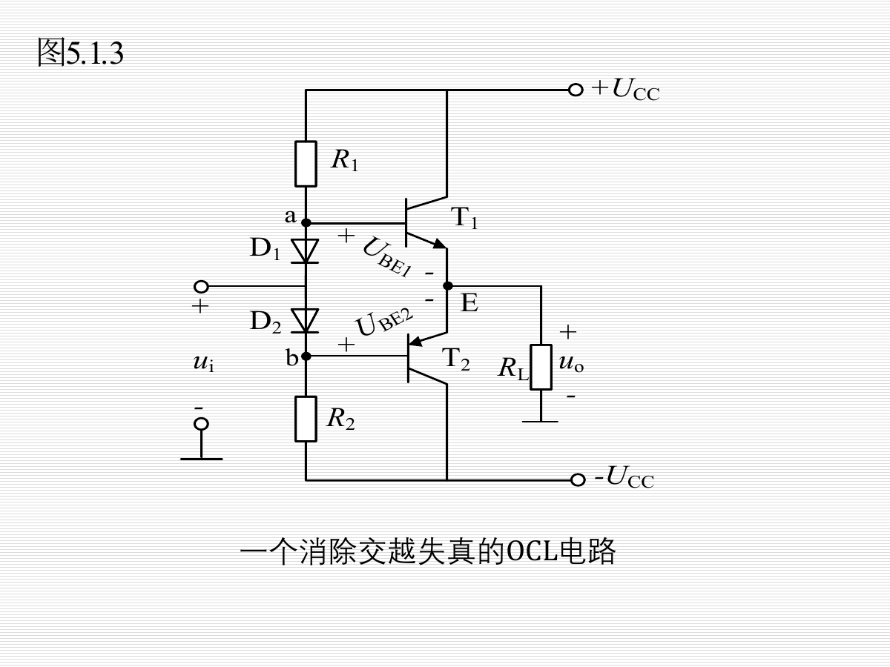

基本特点：

- **双电源供电**：通常有 $+U_{CC}$ 和 $-U_{CC}$。
- **互补推挽输出**：正半周由一个管放大，负半周由另一个管放大。
- **输出功率较大**：正、负半周分别处理，负载获得的功率更高。
- **乙类时无输入信号几乎不耗直流功率**。
- **小信号附近会有交越失真**，需改进为甲乙类。

OCL 最大输出功率：

$$
P_{Omax}=\frac{(U_{CC}-U_{CES})^2}{2R_L}
$$

直流电源功率：

$$
P_S=\frac{2U_{CC}(U_{CC}-U_{CES})}{\pi R_L}
$$

最大效率：

$$
\eta_{max}=\frac{\pi}{4}\cdot\frac{U_{CC}-U_{CES}}{U_{CC}}\times 100\%
$$

若忽略饱和压降 $U_{CES}$：

$$
\eta_{max}\approx 78.5\%
$$

改进方法：

- 用二极管 $D_1,D_2$ 提供约 $0.6V+0.6V$ 的偏置，使输出管进入甲乙类状态。
- 引入负反馈，稳定放大倍数和静态工作点。
- 电压串联负反馈下，闭环电压放大倍数近似为：

$$
A_f\approx 1+\frac{R_2}{R_1}
$$

### 1.4 OTL 功率放大电路

OTL 即 **Output Transformerless**，意思是无输出变压器。它通常采用**单电源供电**。

核心特点：

- 单电源供电。
- 输出电容起到隔直和等效负电源作用。
- 静态时输出中点电位一般设计为：

$$
U_B=\frac{U_{CC}}{2}
$$

- 只能放大交流信号，不能放大直流信号。
- 理想情况下最大效率也可接近 $78.5\%$。

OCL 与 OTL 对比：

| 项目 | OCL | OTL |
|---|---|---|
| 电源 | 双电源 | 单电源 |
| 输出电容 | 不需要 | 需要 |
| 是否能放大直流 | 可用于直流耦合场合 | 不能放大直流 |
| 电路特点 | 输出对称性好 | 电源简单，但电容影响低频特性 |

### 1.5 集成功率放大器

课件以 **TDA2030** 为例。复习时掌握它的用途即可：

- 是集成功率放大器。
- 外围电路通常包含耦合电容、反馈电阻、旁路/滤波电容。
- 通过反馈网络设定电压增益，常用于音频功率放大。

---

## 2. 直流稳压电源

### 2.1 直流稳压电源的组成

直流稳压电源通常包括：

$$
\text{交流输入}\rightarrow\text{变压}\rightarrow\text{整流}\rightarrow\text{滤波}\rightarrow\text{稳压}\rightarrow\text{直流输出}
$$

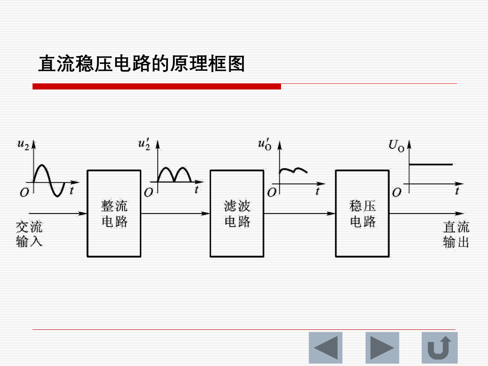

各环节作用：

| 环节 | 作用 |
|---|---|
| 变压 | 改变交流电压大小，并起隔离作用 |
| 整流 | 把交流电变成方向不变的脉动直流 |
| 滤波 | 降低脉动成分，提高平均值 |
| 稳压 | 当输入或负载变化时，使输出电压基本稳定 |

### 2.2 单相桥式整流电路

单相桥式整流使用四个二极管。交流输入正、负半周时分别有两只二极管导通，但负载电流方向始终不变。

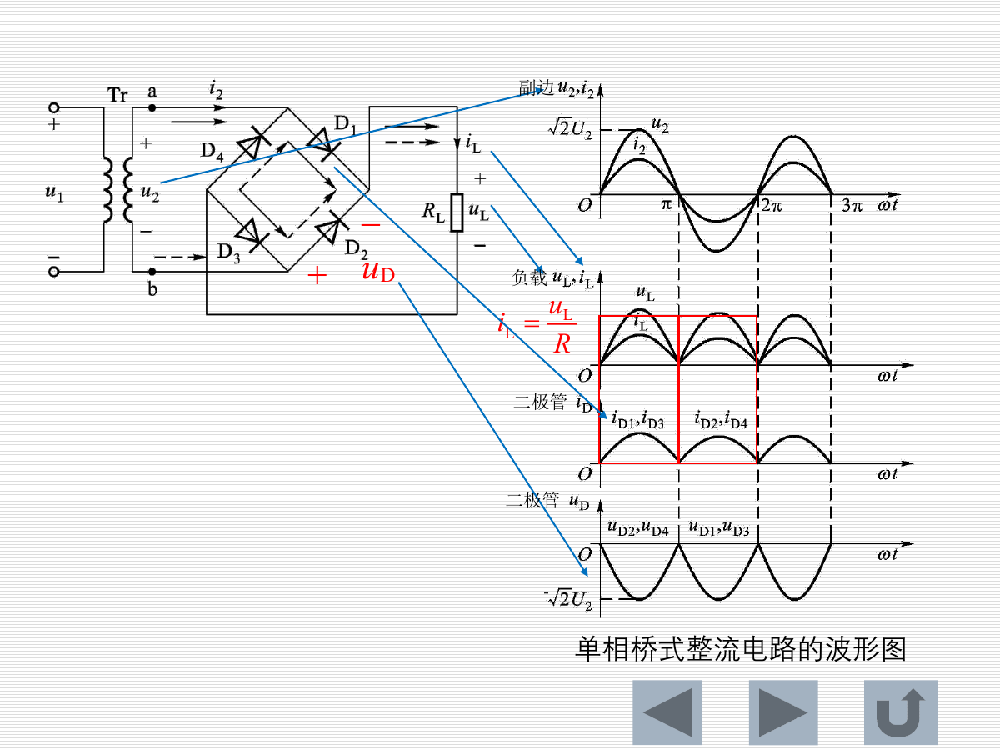

导通规律：

| 输入半周 | 导通二极管 | 负载电流方向 |
|---|---|---|
| $u_2$ 正半周 | $D_1,D_3$ | 不变 |
| $u_2$ 负半周 | $D_2,D_4$ | 不变 |

无滤波、理想二极管、负载为电阻时：

负载电压平均值：

$$
U_L=\frac{1}{\pi}\int_0^\pi \sqrt{2}U_2\sin\omega t\,d(\omega t)
=\frac{2\sqrt{2}}{\pi}U_2\approx 0.9U_2
$$

负载电流平均值：

$$
I_L=\frac{U_L}{R_L}=0.9\frac{U_2}{R_L}
$$

每个二极管的平均电流：

$$
I_D=\frac{1}{2}I_L
$$

二极管承受的最大反向电压：

$$
U_{DRM}=\sqrt{2}U_2
$$

注意：这里的 $U_2$ 是变压器二次侧交流电压的**有效值**，不是峰值。

### 2.3 滤波电路

电容滤波是最常见形式。

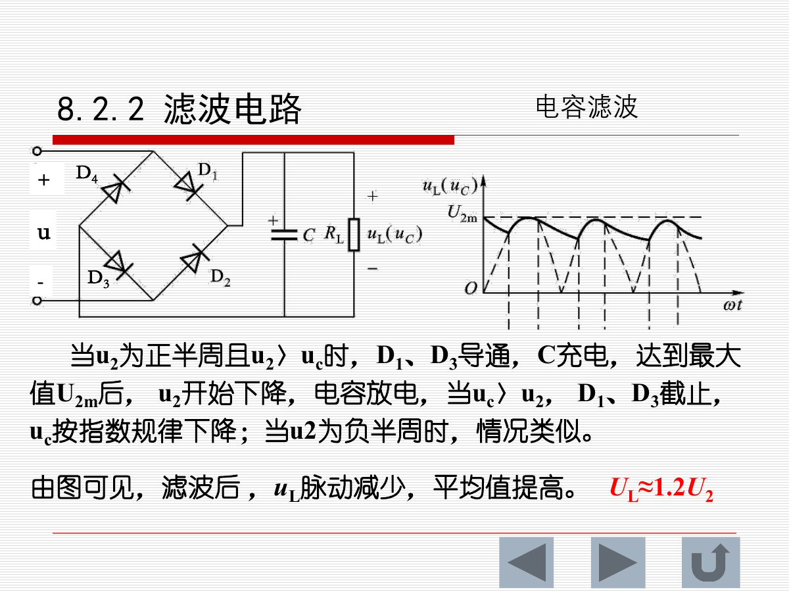

工作过程：

- 整流电压高于电容电压时，二极管导通，电容充电。
- 整流电压低于电容电压时，二极管截止，电容向负载放电。
- 电容充放电使负载电压脉动减小，平均值提高。

桥式整流后接电容滤波时，常用近似：

$$
U_L\approx 1.2U_2
$$

滤波方式对比：

| 滤波形式 | 特点 | 适用场合 |
|---|---|---|
| 电容滤波 | 电路简单，输出平均值高 | 输出电压高、负载电流小、负载变化不大 |
| 电感滤波 | 带负载能力强 | 大电流、负载变化较大 |
| RC/LC/$\pi$ 型滤波 | 滤波效果可进一步改善 | 对纹波要求较高 |

易错点：

- **桥式整流无滤波**：$U_L\approx 0.9U_2$
- **桥式整流加电容滤波**：常用 $U_L\approx 1.2U_2$
- 两个系数适用条件不同，不能混用。

### 2.4 串联型稳压电路

串联型稳压电路由调整管、基准电压源、取样网络、比较放大器组成。

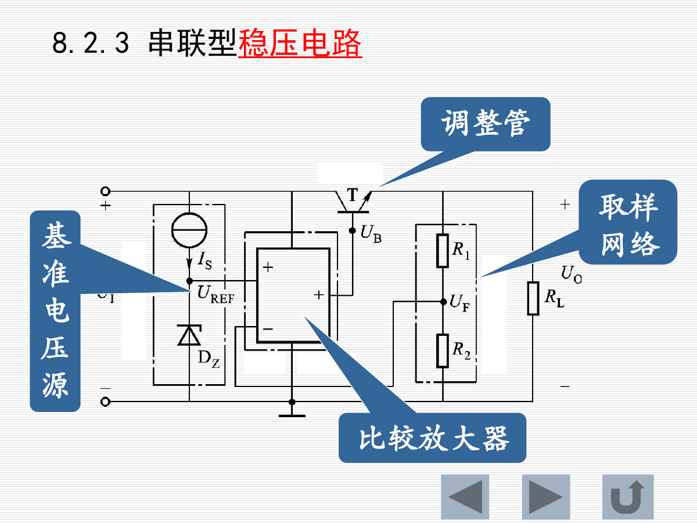

基本思想：

- 调整管与负载串联，相当于一个受控可变电阻。
- 取样网络检测输出电压。
- 比较放大器把取样电压与基准电压比较。
- 当输出电压变化时，通过负反馈调节调整管，使输出恢复稳定。

取样关系：

$$
U_{REF}=\frac{R_2}{R_1+R_2}U_O
$$

因此：

$$
U_O=\frac{R_1+R_2}{R_2}U_{REF}
$$

稳压逻辑可以记为：

$$
U_O变化\rightarrow 取样电压变化\rightarrow 比较放大\rightarrow 调整管压降变化\rightarrow U_O被拉回
$$

### 2.5 三端集成稳压器

固定输出三端稳压器：

| 系列 | 输出极性 | 例子 |
|---|---|---|
| CW7800 | 正电压 | CW7805、CW7812、CW7815 |
| CW7900 | 负电压 | CW7905、CW7912、CW7915 |

“00”用数字代替，表示输出电压值。

可调式三端稳压器：

| 系列 | 输出极性 | 特点 |
|---|---|---|
| CW117 | 可调正电压 | 输出端与调节端之间约 1.25V |
| CW137 | 可调负电压 | 输出端与调节端之间约 1.25V |

CW117 基本可调输出公式：

$$
U_O\approx 1.25\left(1+\frac{R_2}{R_1}\right)
$$

### 2.6 开关型稳压电路

开关型稳压电路用功率管工作在开关状态，通过改变导通时间调节输出。

分类：

- 按调制方式：脉宽调制 PWM、脉频调制 PFM、混合调制。
- 按功率管与负载连接方式：串联型、并联型。

特点：

- 效率高，因为功率管主要工作在导通或截止状态。
- 电路比线性稳压复杂。
- 常需要电感、电容和反馈控制环节。

---

## 3. 功率半导体器件和变流电路

### 3.1 半导体变流技术

半导体变流技术是用功率半导体器件，通过弱电信号控制强电，实现电能转换和控制。

四种基本变流形式：

| 类型 | 能量变换 |
|---|---|
| 整流 | AC -> DC |
| 逆变 | DC -> AC |
| 直流调压 | DC -> DC |
| 交流调压及变频 | AC -> AC |

### 3.2 晶闸管 SCR

晶闸管又称可控硅，端子包括阳极 A、阴极 K、门极 G。

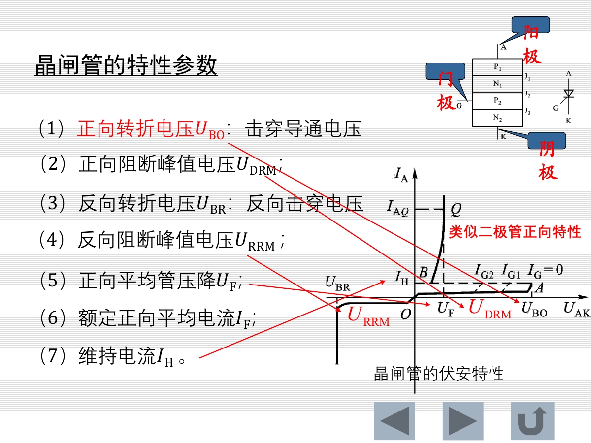

导通条件：

1. 阳极与阴极之间加正向电压：

$$
U_{AK}>0
$$

2. 门极与阴极之间加正向触发信号。

维持导通条件：

$$
I_A>I_H
$$

其中 $I_H$ 是维持电流。

关断方法：

- 增大负载电阻，使阳极电流下降到维持电流以下。
- 降低阳极电压至接近零。
- 给晶闸管施加反向电压。

重点结论：

- 晶闸管是**半控型器件**。
- 门极可以控制晶闸管导通，但不能直接控制其关断。
- 一旦导通，即使门极触发信号消失，只要阳极电流仍大于维持电流，晶闸管会继续导通。

常见参数：

| 参数 | 含义 |
|---|---|
| $U_{BO}$ | 正向转折电压 |
| $U_{DRM}$ | 正向阻断峰值电压 |
| $U_{BR}$ | 反向转折电压 |
| $U_{RRM}$ | 反向阻断峰值电压 |
| $U_F$ | 正向平均管压降 |
| $I_F$ | 额定正向平均电流 |
| $I_H$ | 维持电流 |

### 3.3 IGBT 与全控型器件

晶闸管只能控制导通，不能由门极直接关断，因此属于半控型。

以下属于全控型器件：

- GTR：大功率双极晶体管
- Power MOSFET：功率场效应管
- IGBT：绝缘门极双极晶体管

IGBT 的特点：

- 门极控制类似 MOSFET，驱动功率较小。
- 导通能力类似双极型器件，适合较大功率场合。
- 可以控制开通和关断，是现代电力电子中常用器件。

### 3.4 可控整流电路

可控整流电路的功能：把交流电能变成**电压大小可调的直流电能**。

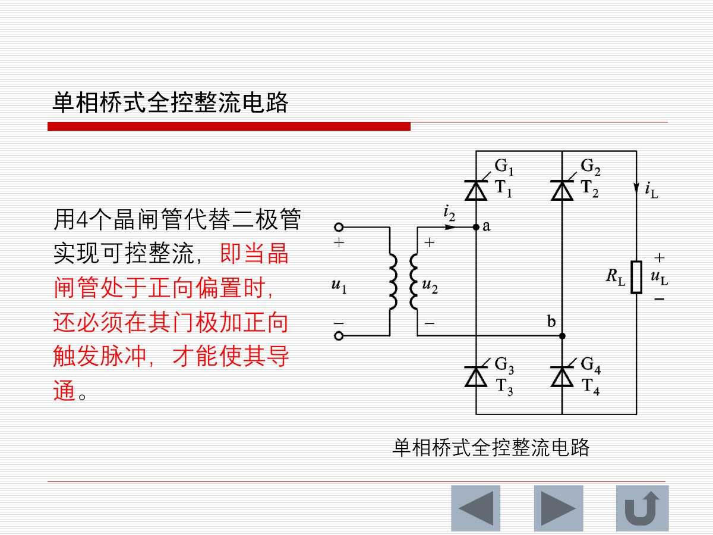

单相桥式全控整流电路：

- 用四个晶闸管代替四个整流二极管。
- 晶闸管正向偏置时，还必须有门极触发脉冲才能导通。
- 通过改变触发延迟角 $\alpha$，改变输出直流平均电压。

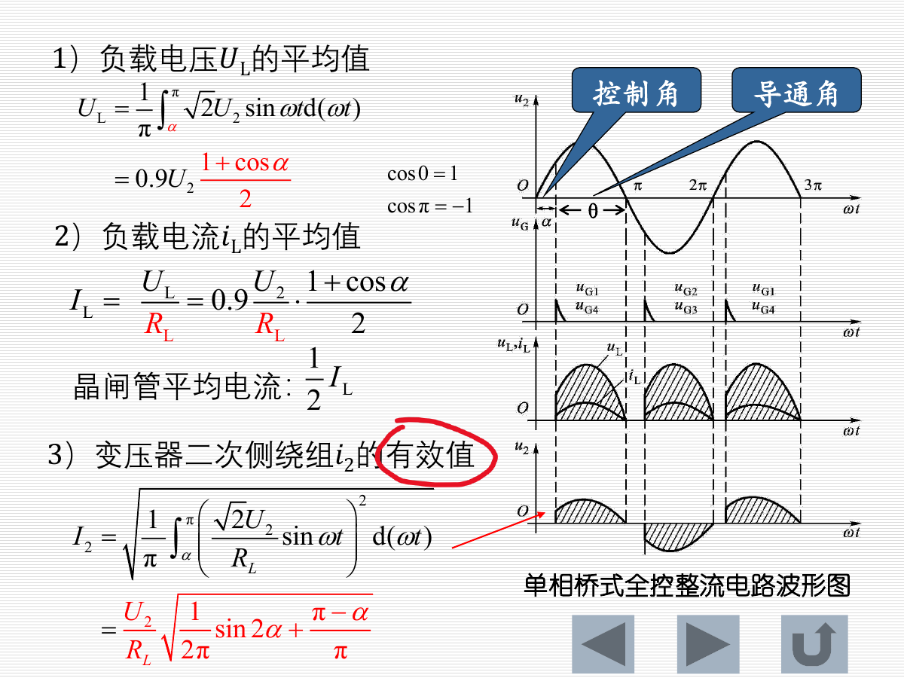

电阻性负载下，负载电压平均值：

$$
U_L=\frac{1}{\pi}\int_{\alpha}^{\pi}\sqrt{2}U_2\sin\omega t\,d(\omega t)
$$

化简得：

$$
U_L=0.9U_2\cdot\frac{1+\cos\alpha}{2}
$$

负载电流平均值：

$$
I_L=\frac{U_L}{R_L}
=0.9\frac{U_2}{R_L}\cdot\frac{1+\cos\alpha}{2}
$$

每只晶闸管的平均电流：

$$
I_T=\frac{1}{2}I_L
$$

控制角规律：

| $\alpha$ | 输出平均电压 |
|---|---|
| $0$ | 最大，等同不可控桥式整流 |
| 增大 | 输出平均电压减小 |
| 接近 $\pi$ | 输出平均电压接近 0 |

### 3.5 交流调压

交流调压直接改变交流输出电压有效值。

相控式交流调压：

- 使用晶闸管或双向晶闸管。
- 改变控制角 $\alpha$，改变负载上得到的交流电压有效值。
- 电路简单，但输出谐波多，深控时功率因数低。

负载电压有效值：

$$
U_L=U_1\sqrt{\frac{\pi-\alpha}{\pi}+\frac{\sin2\alpha}{2\pi}}
$$

双向晶闸管：

- 相当于两只晶闸管反向并联，并共用一个门极。
- 可以在交流正、负半周双向导通。
- 导通后仍需等电流降到维持电流以下才关断。

斩控式交流调压：

- 使用 IGBT 等全控型器件。
- 通过高频开关切割交流波形。
- 输出为按正弦规律变化的脉冲，需要滤波得到较平滑的工频交流电压。

### 3.6 交流变频与 SPWM

交流变频常采用 AC-DC-AC 结构：

$$
\text{交流}\rightarrow\text{整流}\rightarrow\text{滤波}\rightarrow\text{逆变}\rightarrow\text{变频交流}
$$

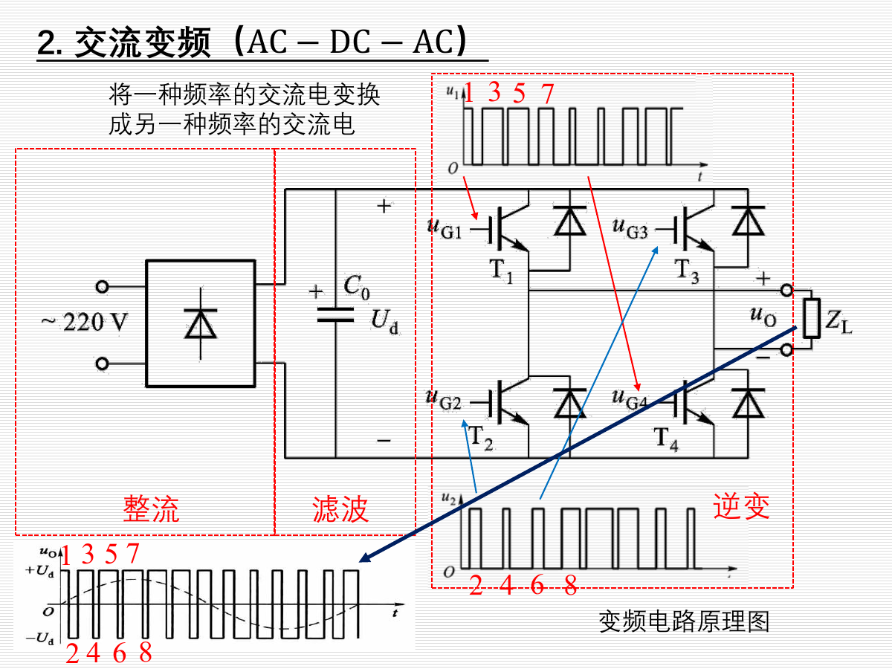

SPWM，即正弦波脉宽调制。

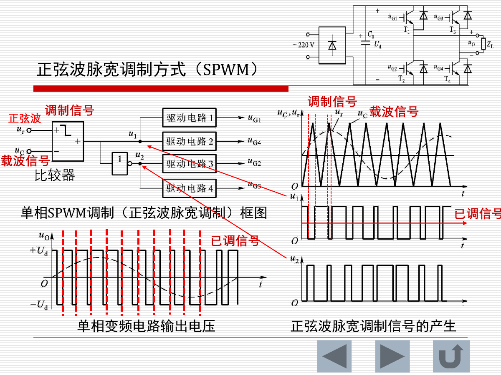

基本思想：

- 用正弦调制信号与高频三角载波比较。
- 比较器输出一系列宽度变化的脉冲。
- 脉冲宽度按正弦规律变化，滤波后可得到近似正弦输出。

需要掌握：

- 输出基波频率由调制正弦波频率决定。
- 输出电压幅值与调制比有关。
- SPWM 是逆变器和变频器中的核心控制方法。

### 3.7 直流调压电路 DC-DC

直流调压电路也叫斩波调压器，利用功率半导体器件作直流开关，通过调节占空比改变输出电压平均值。

占空比定义：

$$
D=\frac{T_{on}}{T_{on}+T_{off}}
$$

#### 降压型斩波器 Buck

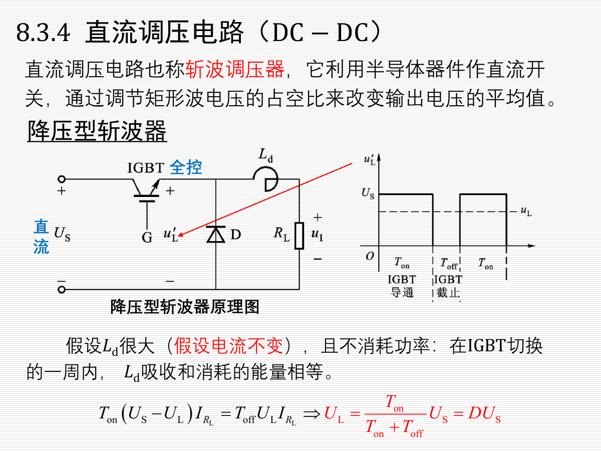

在电感足够大、电流近似连续时：

$$
U_L=DU_S
$$

特点：

- 输出电压小于输入电压。
- 占空比 $D$ 越大，输出电压越高。

#### 升压型斩波器 Boost

升压型斩波器利用电感储能和释放实现升压。

理想情况下：

$$
U_d=\frac{1}{1-D}U_S
$$

特点：

- 输出电压高于输入电压。
- $D$ 越大，升压效果越明显。
- 实际电路中 $D$ 不能无限接近 1，否则电流和损耗会过大。

---

## 4. 公式速查

| 场景 | 公式 | 备注 |
|---|---|---|
| 功放效率 | $\eta=P_O/P_S\times100\%$ | 输出功率与电源功率之比 |
| OCL 最大输出功率 | $P_{Omax}=(U_{CC}-U_{CES})^2/(2R_L)$ | 双电源互补推挽 |
| OCL 理想最大效率 | $\eta_{max}\approx78.5\%$ | 忽略饱和压降 |
| 桥式整流平均电压 | $U_L\approx0.9U_2$ | 无滤波 |
| 桥式整流二极管平均电流 | $I_D=I_L/2$ | 每只二极管导通半个周期 |
| 桥式整流最大反向电压 | $U_{DRM}=\sqrt{2}U_2$ | $U_2$ 为有效值 |
| 电容滤波输出近似 | $U_L\approx1.2U_2$ | 负载较轻时常用 |
| 串联稳压输出 | $U_O=\frac{R_1+R_2}{R_2}U_{REF}$ | 由取样网络决定 |
| CW117 可调输出 | $U_O\approx1.25(1+R_2/R_1)$ | 忽略调整端电流 |
| 可控桥式整流平均电压 | $U_L=0.9U_2(1+\cos\alpha)/2$ | 电阻性负载 |
| 交流调压有效值 | $U_L=U_1\sqrt{(\pi-\alpha)/\pi+\sin2\alpha/(2\pi)}$ | 相控式 |
| Buck 输出 | $U_L=DU_S$ | 降压斩波 |
| Boost 输出 | $U_d=U_S/(1-D)$ | 升压斩波 |

---

## 5. 易错点与复习提醒

1. **$U_2$ 通常是有效值**，峰值是 $\sqrt{2}U_2$。
2. 桥式整流无滤波用 $0.9U_2$，加电容滤波常用 $1.2U_2$，不要混用。
3. OCL 是双电源、无输出电容；OTL 是单电源、通常有输出电容。
4. 乙类功放效率高，但有交越失真；甲乙类通过小偏置减小交越失真。
5. 晶闸管门极只能触发导通，不能直接关断。
6. 可控整流中，控制角 $\alpha$ 越大，输出直流平均电压越小。
7. Buck 中占空比 $D$ 越大输出越高，但仍小于输入；Boost 中输出为 $U_S/(1-D)$，随 $D$ 增大而升高。
8. 7800 系列输出正电压，7900 系列输出负电压；117/137 是可调式三端稳压器。

---

## 6. 建议复习顺序

1. 先背熟三类功放状态：甲类、乙类、甲乙类。
2. 再区分 OCL 与 OTL，重点记住交越失真和效率。
3. 掌握直流稳压电源流程：变压、整流、滤波、稳压。
4. 熟练计算桥式整流的 $U_L$、$I_L$、$I_D$、$U_{DRM}$。
5. 理解晶闸管导通与关断条件。
6. 记住可控整流公式中 $\alpha$ 的作用。
7. 最后复习 Buck/Boost 的占空比公式。
