# 第6章 波形产生和变换：核心知识点总结

> 来源：`6-200506-sun-第6章_波形产生和变换.pdf`  
> 复习主线：正弦波振荡条件 -> RC 正弦振荡 -> 多谐振荡器 -> 555 定时器 -> 单稳态和施密特触发器。

## 0. 本章知识框架

| 章节 | 核心内容 | 关键词 |
|---|---|---|
| 6.1 | 正弦波振荡电路 | 自激振荡、正反馈、幅度平衡、相位平衡、RC 桥式振荡 |
| 6.2 | 多谐振荡器 | 矩形波、运放多谐、555 多谐、占空比 |
| 6.3 | 单稳态触发器和施密特触发器 | 定时、延时、整形、阈值、回差、抗干扰 |

波形产生电路可分为：

- 正弦波产生电路
- 非正弦波产生电路，例如矩形波、三角波等

共同特点：

- 不需要外加周期输入信号，属于自激电路。
- 必须引入足够强的正反馈。

---

## 1. 正弦波振荡电路

### 1.1 自激振荡条件

正弦波振荡电路的核心是：放大电路输出的一部分经反馈网络送回输入端，若反馈信号等效为输入信号，电路就能在没有外部输入的情况下持续振荡。

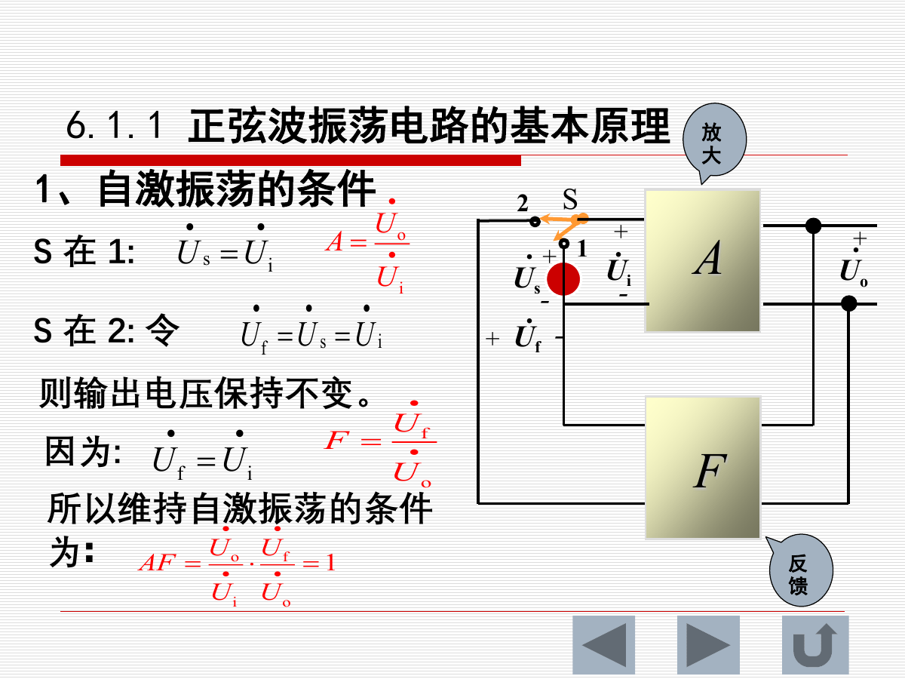

维持自激振荡的条件：

$$
\dot A\dot F=1
$$

其中：

- $\dot A$：放大环节增益
- $\dot F$：反馈网络反馈系数

### 1.2 幅度平衡和相位平衡

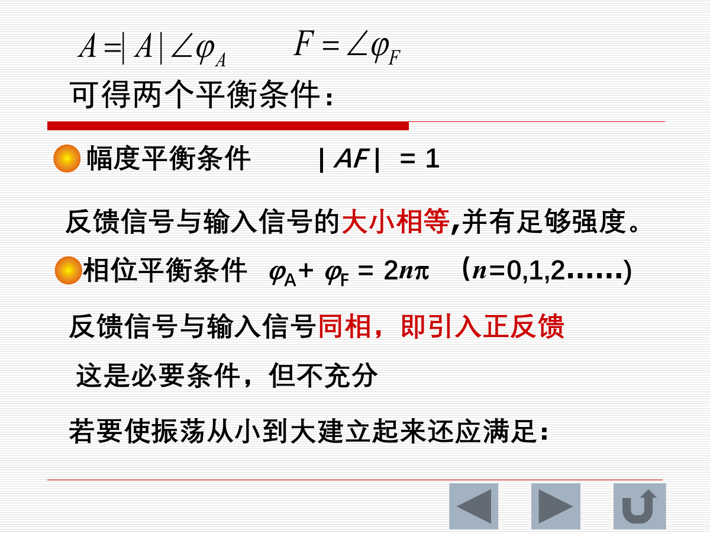

由：

$$
\dot A=|A|\angle\varphi_A,\quad \dot F=|F|\angle\varphi_F
$$

可得两个平衡条件：

幅度平衡：

$$
|AF|=1
$$

相位平衡：

$$
\varphi_A+\varphi_F=2n\pi,\quad n=0,1,2,\dots
$$

含义：

- 反馈信号与输入信号同相，形成正反馈。
- 反馈信号大小正好维持输出幅度。

### 1.3 起振和稳定

平衡条件是维持振荡的必要条件。要使振荡从小到大建立，还要满足起振条件：

$$
|AF|>1
$$

振荡过程：

1. 上电瞬间噪声和扰动含有多种频率成分。
2. 选频网络选出某一频率分量。
3. 若该频率满足起振条件，振幅逐渐增大。
4. 稳幅环节使 $|AF|$ 从大于 1 逐渐变为 1。
5. 电路进入稳定等幅振荡。

正弦波振荡电路应包含四个环节：

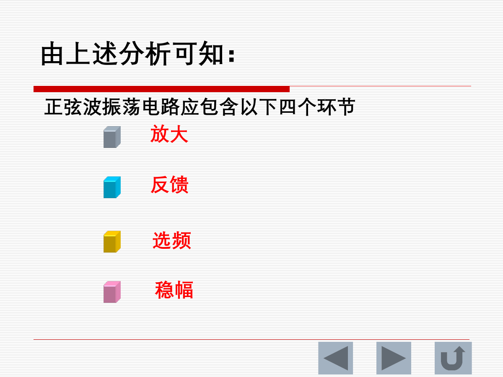

| 环节 | 作用 |
|---|---|
| 放大 | 提供能量补偿 |
| 反馈 | 把输出送回输入形成正反馈 |
| 选频 | 决定振荡频率 |
| 稳幅 | 保持输出幅度稳定 |

---

## 2. RC 正弦波振荡电路

### 2.1 RC 桥式振荡器

RC 正弦波振荡电路常见形式是文氏桥振荡器。

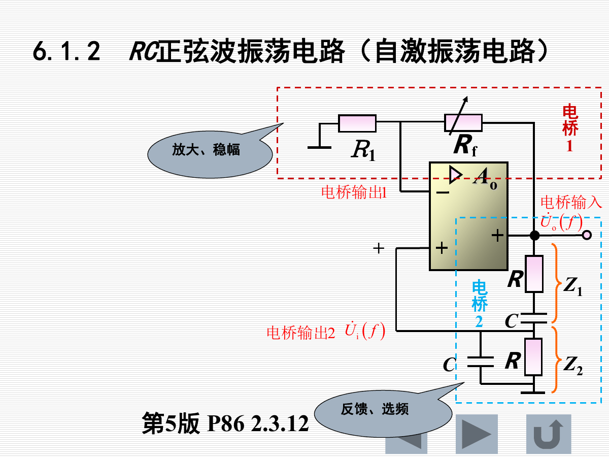

当：

$$
f=f_0=\frac{1}{2\pi RC}
$$

反馈网络满足：

$$
F=\frac{1}{3}\angle0^\circ
$$

即反馈信号与输出同相，且幅度为输出的三分之一。

为了满足幅度平衡：

$$
A\cdot F=1
$$

因此放大电路应满足：

$$
A=3
$$

若放大环节为同相比例放大器：

$$
A=1+\frac{R_f}{R_1}=3
$$

即：

$$
R_f=2R_1
$$

### 2.2 二极管稳幅

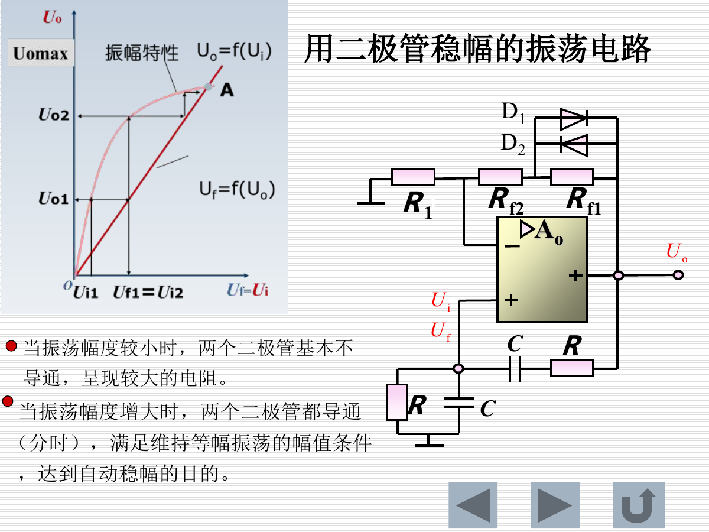

工作思路：

- 振荡幅度较小时，二极管基本不导通，反馈/放大条件使振荡建立。
- 振荡幅度增大后，二极管分时导通，等效改变放大倍数。
- 最终使 $|AF|=1$，维持等幅振荡。

稳幅的本质：让放大倍数随输出幅度自动调整。

---

## 3. 多谐振荡器

### 3.1 运放构成的多谐振荡器

多谐振荡器又称矩形波发生器或方波发生器。

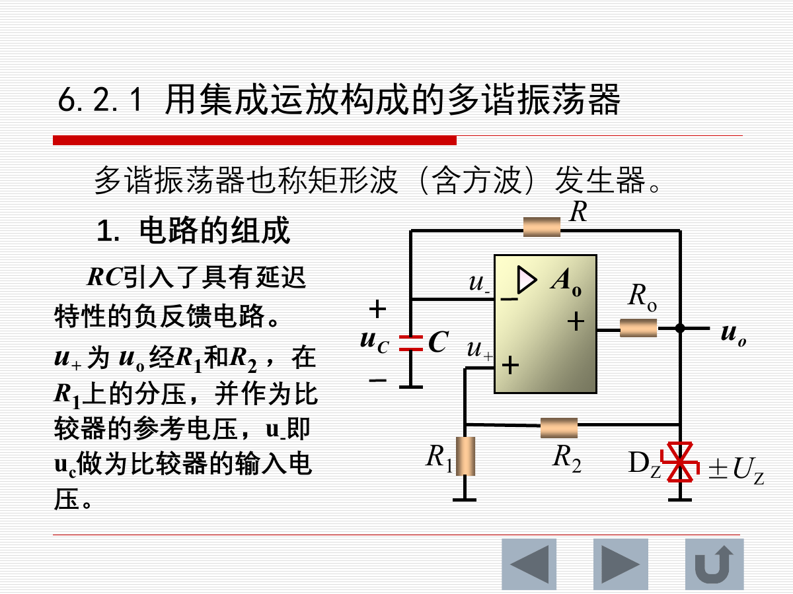

电路组成：

- 运放比较器
- 正反馈阈值网络
- RC 延迟负反馈网络
- 稳压二极管限制输出幅度

工作特点：

- 没有稳定状态，属于无稳触发器。
- 输出在 $+U_Z$ 和 $-U_Z$ 之间周期性翻转。
- 电容电压在两个阈值之间充放电。

### 3.2 运放多谐振荡器周期

课件给出的周期关系：

$$
T_1=RC\ln\left(1+\frac{2R_1}{R_2}\right)
$$

$$
T_2=RC\ln\left(1+\frac{2R_1}{R_2}\right)
$$

因此：

$$
T=T_1+T_2=2RC\ln\left(1+\frac{2R_1}{R_2}\right)
$$

$$
f=\frac{1}{T}
$$

若充放电时间相等，则输出为方波。

### 3.3 占空比可调多谐振荡器

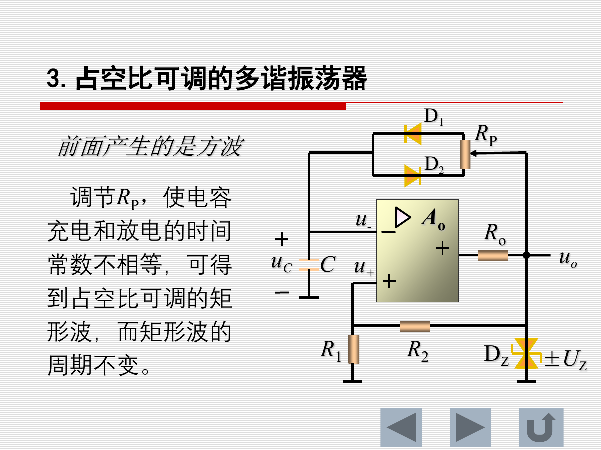

通过二极管和电位器使电容充电、放电路径不同，可使：

$$
T_1\neq T_2
$$

从而获得占空比可调的矩形波。

占空比：

$$
D=\frac{T_1}{T_1+T_2}
$$

---

## 4. 555 集成定时器

### 4.1 555 定时器基本概念

555 定时器是模拟电路和数字电路结合的中规模集成电路。

常见类型：

| 类型 | 例子 |
|---|---|
| 双极型定时器 | 5G1555 |
| CMOS 定时器 | CB7555 |

### 4.2 555 功能表

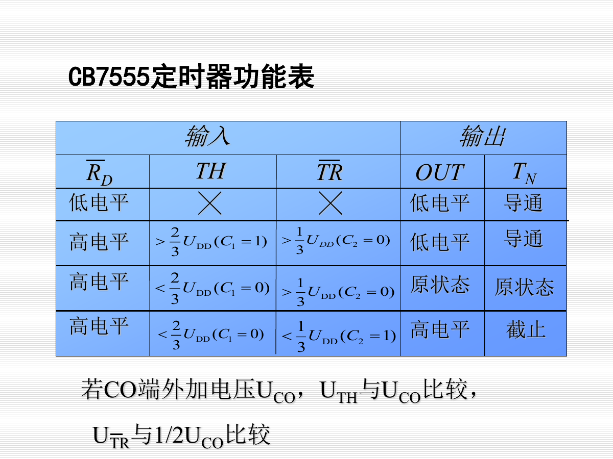

关键阈值：

| 比较端 | 阈值 |
|---|---|
| TH | $2U_{DD}/3$ |
| TR | $U_{DD}/3$ |

典型规律：

| 条件 | 输出 OUT | 放电管 TN |
|---|---|---|
| 复位端 RD 为低电平 | 低电平 | 导通 |
| TH 高于 $2U_{DD}/3$ | 低电平 | 导通 |
| TR 低于 $U_{DD}/3$ | 高电平 | 截止 |
| TH、TR 均未触发翻转 | 保持原状态 | 保持原状态 |

若 CO 端外加控制电压 $U_{CO}$，阈值会随 $U_{CO}$ 改变，从而影响周期或触发电平。

---

## 5. 555 多谐振荡器

555 可构成无稳多谐振荡器，产生矩形波。

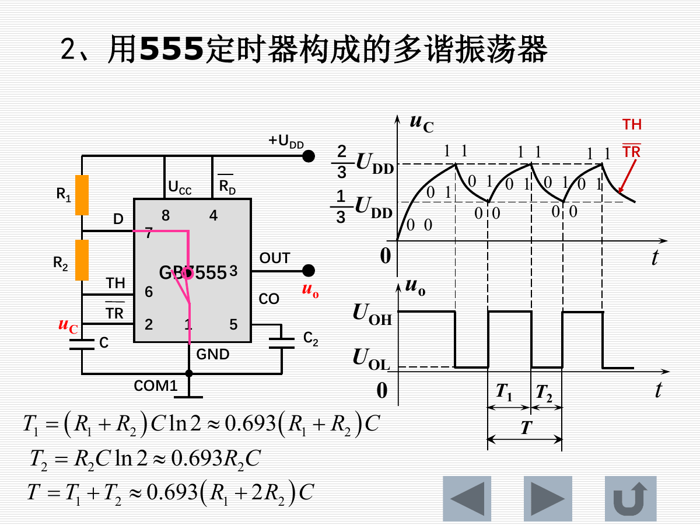

电容充电时间：

$$
T_1=(R_1+R_2)C\ln2\approx0.693(R_1+R_2)C
$$

电容放电时间：

$$
T_2=R_2C\ln2\approx0.693R_2C
$$

周期：

$$
T=T_1+T_2\approx0.693(R_1+2R_2)C
$$

频率：

$$
f=\frac{1}{T}
$$

占空比：

$$
D=\frac{T_1}{T}=\frac{R_1+R_2}{R_1+2R_2}
$$

注意：常规 555 多谐振荡器中 $T_1>T_2$，占空比通常大于 50%。若要获得更灵活占空比，可加入二极管分离充放电路径。

---

## 6. 单稳态触发器

### 6.1 单稳态触发器特点

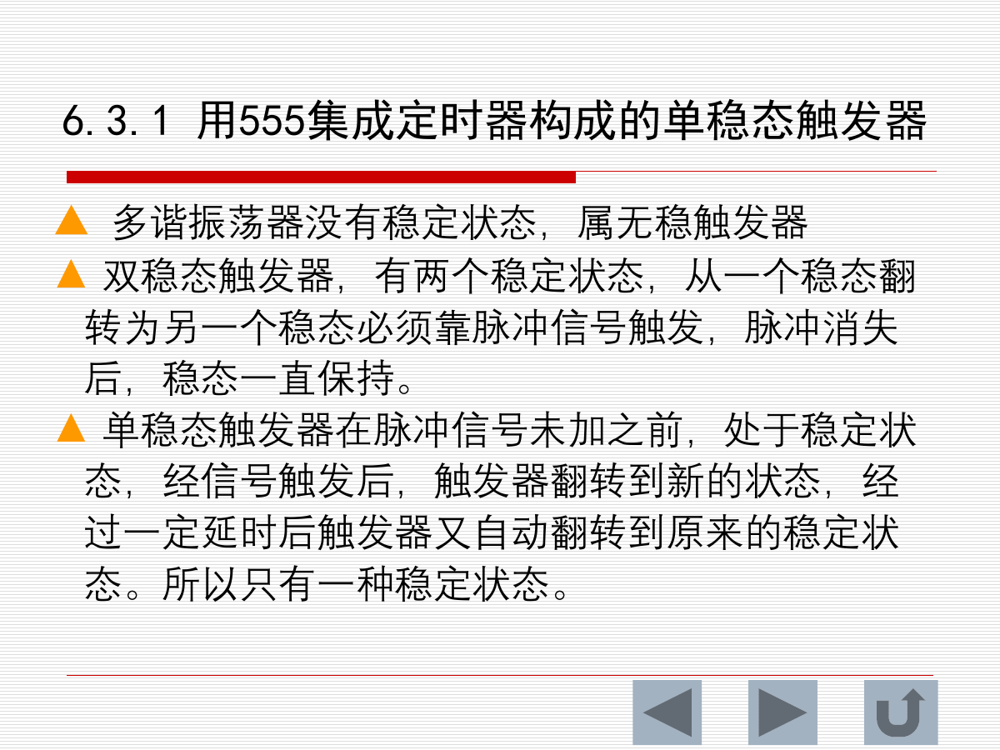

触发器分类：

| 类型 | 稳定状态数量 | 特点 |
|---|---|---|
| 多谐振荡器 | 0 个稳定状态 | 自动周期翻转 |
| 双稳态触发器 | 2 个稳定状态 | 触发后保持新状态 |
| 单稳态触发器 | 1 个稳定状态 | 触发后进入暂态，延时后自动返回 |

单稳态触发器工作过程：

1. 未触发时处于稳定状态。
2. 触发脉冲到来后，输出翻转进入暂态。
3. 电容按 RC 规律充电或放电。
4. 达到阈值后输出自动恢复稳定状态。

### 6.2 单稳态输出脉宽

课件给出的脉宽：

$$
t_w=RC\ln3\approx1.1RC
$$

其中：

- $R$：定时电阻
- $C$：定时电容

主要用途：

- 整形
- 定时
- 延时

---

## 7. 施密特触发器

### 7.1 施密特触发器特点

施密特触发器有两个稳定状态，但它与普通双稳态触发器不同。

特点：

1. 稳定状态依赖输入信号维持。
2. 属于电平触发，不是脉冲触发。
3. 状态翻转的两个输入电压阈值不同。

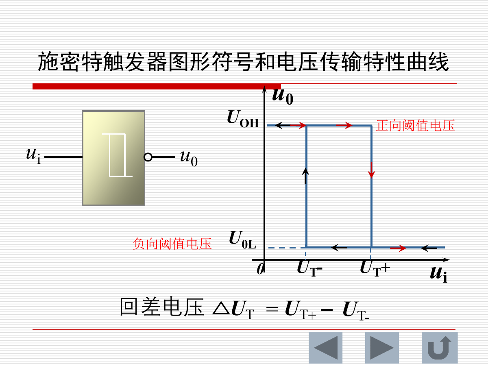

两个阈值：

| 符号 | 含义 |
|---|---|
| $U_{T+}$ | 正向阈值电压 |
| $U_{T-}$ | 负向阈值电压 |

回差电压：

$$
\Delta U_T=U_{T+}-U_{T-}
$$

意义：

- 可把缓慢变化或带噪声的输入变为干净的矩形波。
- 具有抗干扰能力。

### 7.2 555 构成施密特触发器

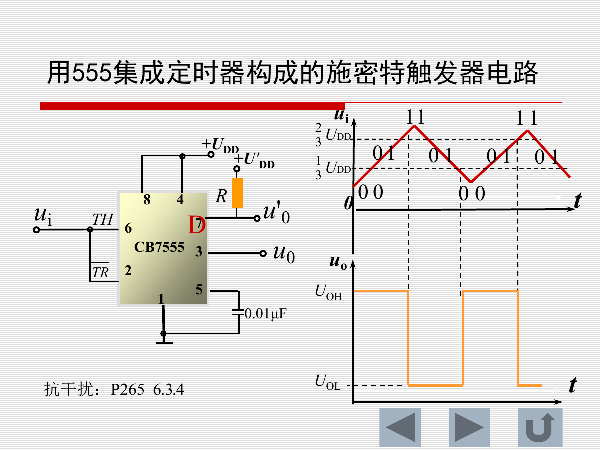

555 构成施密特触发器时，输入电压与内部比较器阈值比较：

| 输入变化 | 翻转阈值 |
|---|---|
| 上升过程 | 约 $2U_{DD}/3$ |
| 下降过程 | 约 $U_{DD}/3$ |

因此：

$$
\Delta U_T\approx\frac{1}{3}U_{DD}
$$

---

## 8. 公式速查

| 场景 | 公式 |
|---|---|
| 振荡平衡条件 | $\dot A\dot F=1$ |
| 幅度平衡 | $|AF|=1$ |
| 相位平衡 | $\varphi_A+\varphi_F=2n\pi$ |
| 起振条件 | $|AF|>1$ |
| RC 桥式振荡频率 | $f_0=1/(2\pi RC)$ |
| RC 桥反馈系数 | $F=1/3$ |
| RC 桥放大倍数 | $A=3$ |
| 运放多谐周期 | $T=2RC\ln(1+2R_1/R_2)$ |
| 555 充电时间 | $T_1\approx0.693(R_1+R_2)C$ |
| 555 放电时间 | $T_2\approx0.693R_2C$ |
| 555 多谐周期 | $T\approx0.693(R_1+2R_2)C$ |
| 555 多谐频率 | $f=1/T$ |
| 555 多谐占空比 | $D=(R_1+R_2)/(R_1+2R_2)$ |
| 单稳态脉宽 | $t_w=RC\ln3\approx1.1RC$ |
| 施密特回差 | $\Delta U_T=U_{T+}-U_{T-}$ |

---

## 9. 易错点与复习提醒

1. 正弦波振荡必须是正反馈，但不是任意正反馈都能产生正弦振荡。
2. 平衡条件 $|AF|=1$ 是维持条件；起振时需要 $|AF|>1$。
3. RC 桥式振荡中，选频网络在 $f_0$ 处反馈系数为 $1/3$，因此放大倍数需为 3。
4. 稳幅环节的作用是把振荡从增幅状态拉回等幅状态。
5. 多谐振荡器没有稳定状态，单稳态只有一个稳定状态，施密特触发器有两个阈值。
6. 555 的核心阈值是 $1/3U_{DD}$ 和 $2/3U_{DD}$。
7. 555 多谐中电容在 $1/3U_{DD}$ 和 $2/3U_{DD}$ 之间充放电。
8. 单稳态脉宽由 $R$、$C$ 决定，近似 $1.1RC$。
9. 施密特触发器的两个阈值不同，因此有抗干扰能力。

---

## 10. 建议复习顺序

1. 先背振荡的幅度平衡、相位平衡和起振条件。
2. 掌握 RC 桥式振荡器的 $f_0=1/(2\pi RC)$ 和 $A=3$。
3. 理解运放多谐振荡器如何靠 RC 充放电周期翻转。
4. 重点记住 555 的 $1/3U_{DD}$、$2/3U_{DD}$ 阈值。
5. 熟练计算 555 多谐周期和单稳态脉宽。
6. 最后区分多谐、单稳和施密特触发器的稳定状态与用途。
