# 第10章 电气控制技术：核心知识点总结

> 来源：`10-200604-sun-第10章-电气控制技术(2).pdf`  
> 复习主线：常用低压电器 -> 继电-接触控制电路 -> PLC 基础 -> 安全用电。

## 0. 本章知识框架

| 章节 | 核心内容 | 关键词 |
|---|---|---|
| 10.1 | 常用低压电器 | QS、FU、QF、KM、KA、KT、FR、SB、ST |
| 10.2 | 三相异步电动机继电-接触控制 | 直接起动、自锁、两地控制、顺序控制、正反转、Y-Δ、行程控制 |
| *10.3 | 可编程控制器 PLC | I/O、循环扫描、梯形图、基本指令 |
| 10.5 | 安全用电 | 触电方式、保护接地、保护接零、防火防爆、静电防护 |

电气控制技术是自动控制技术的重要组成部分。它用电气、电子器件按照生产工艺要求，对被控对象进行控制、保护和联锁。

---

## 1. 常用低压电器

### 1.1 低压电器的定义

低压电器通常指：

- 交流 $1200V$ 以下
- 直流 $1500V$ 以下

用于切换、控制、调节和保护用电设备的电器。

按动作方式分为：

| 类型 | 特点 | 例子 |
|---|---|---|
| 手动电器 | 靠人手操作 | 刀开关、按钮 |
| 自动电器 | 根据电磁、热、时间、位置等信号自动动作 | 接触器、继电器、断路器 |

### 1.2 刀开关 QS

刀开关是一种手动控制电器，主要由动触点和静触点组成。

用途：

- 常用作电源隔离开关。
- 小功率负载时可作为电源开关。
- 一般不宜在负载下切断电源。

符号：`QS`

### 1.3 熔断器 FU

熔断器是一种短路保护电器，串接在被保护电路中。

工作过程：

$$
短路\rightarrow 短路电流增大\rightarrow 熔体发热熔断\rightarrow 切断电路
$$

作用：

- 保护线路
- 保护电气设备

符号：`FU`

注意：熔断器主要用于**短路保护**，不适合替代热继电器完成长期过载保护。

### 1.4 低压断路器 QF

低压断路器又称自动空气开关。

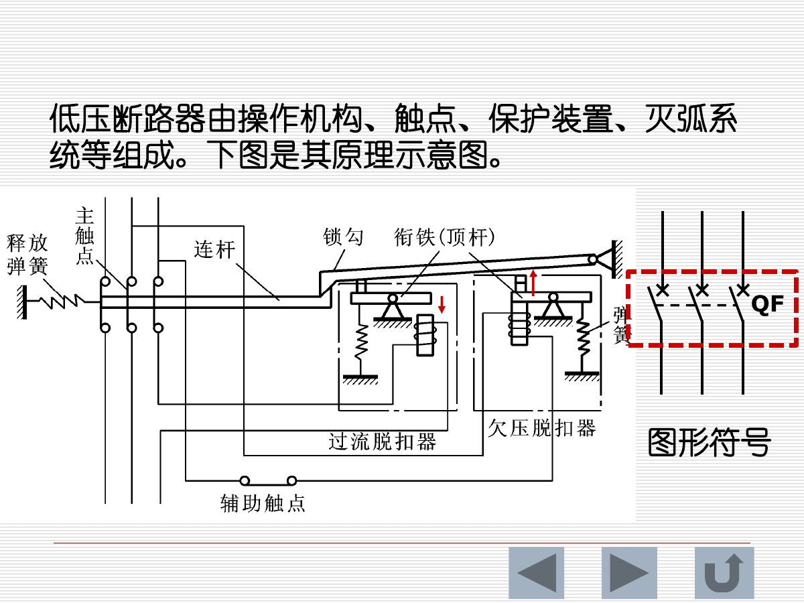

功能：

- 接通和分断负载电路。
- 控制不频繁起动的电动机。
- 发生过载、短路、欠电压等故障时自动切断电路。

常见类型：

| 类型 | 说明 |
|---|---|
| ACB | 万能式/框架式断路器 |
| MCCB | 塑料外壳式断路器 |
| MCB | 小型断路器 |

主要组成：

- 操作机构
- 触点
- 保护装置
- 灭弧系统

符号：`QF`

### 1.5 剩余电流动作保护装置

剩余电流动作保护装置旧称漏电保护器。

用途：

- 对直接触电和间接触电进行保护。
- 对设备漏电引起的危险进行保护。

正常情况下，三相四线制中：

$$
\dot I_U+\dot I_V+\dot I_W+\dot I_N=0
$$

若发生漏电或触电，剩余电流不为零，剩余电流互感器检测到差值，驱动脱扣器使断路器跳闸。

注意：它不是万能保护。若人体同时接触两相，电流仍可能在相线之间形成回路，剩余电流保护不一定动作。

### 1.6 交流接触器 KM

交流接触器是继电-接触控制中的主要器件，利用电磁吸力动作，常用于直接控制主电路。

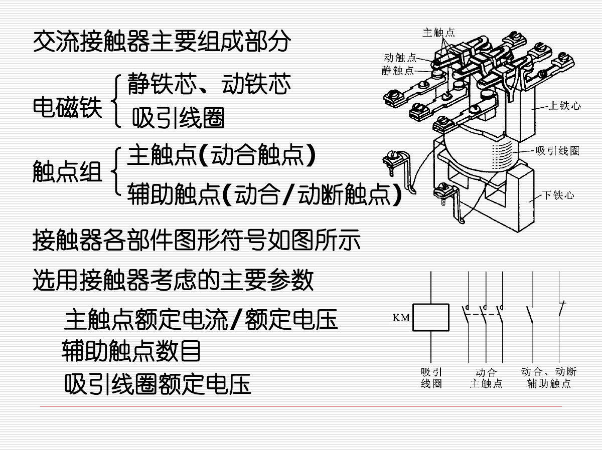

主要组成：

| 部分 | 作用 |
|---|---|
| 电磁铁 | 静铁芯、动铁芯、吸引线圈 |
| 主触点 | 接通/断开主电路，通常为动合触点 |
| 辅助触点 | 用于控制电路，自锁、互锁、信号传递 |

选择接触器时考虑：

- 主触点额定电流
- 主触点额定电压
- 辅助触点数量
- 吸引线圈额定电压

符号：`KM`

重要功能：接触器具有**失压保护**。电源电压消失时线圈失电，主触点断开；电源恢复后若不重新按起动按钮，电动机不会自行起动。

### 1.7 继电器

继电器是一种自动电器。输入量可以是电压、电流，也可以是温度、时间、速度、压力等非电量。当输入量达到设定值时，继电器触点动作。

#### 中间继电器 KA

用途：

- 传递控制信号。
- 增加触点数量。
- 实现一个信号控制多个电路。

特点：结构和工作原理类似接触器，但触点容量较小，触点数量较多。

#### 时间继电器 KT

时间继电器用于实现触点延时接通或延时断开。

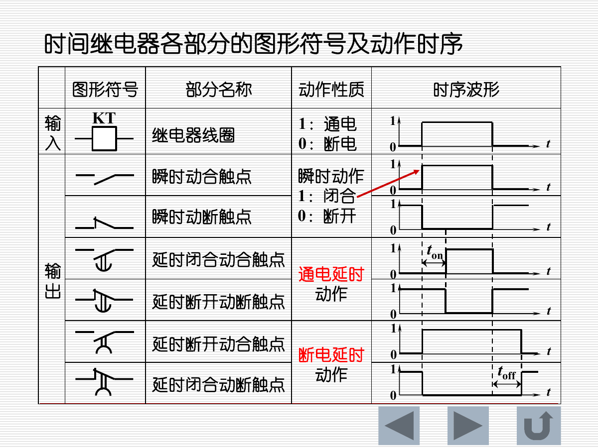

主要环节：

- 延时环节
- 比较环节
- 执行环节

输出触点类型：

| 类型 | 含义 |
|---|---|
| 瞬时触点 | 线圈动作后立即切换 |
| 通电延时触点 | 通电后延时动作 |
| 断电延时触点 | 断电后延时复位或动作 |

#### 热继电器 FR

热继电器用于电动机过载保护。

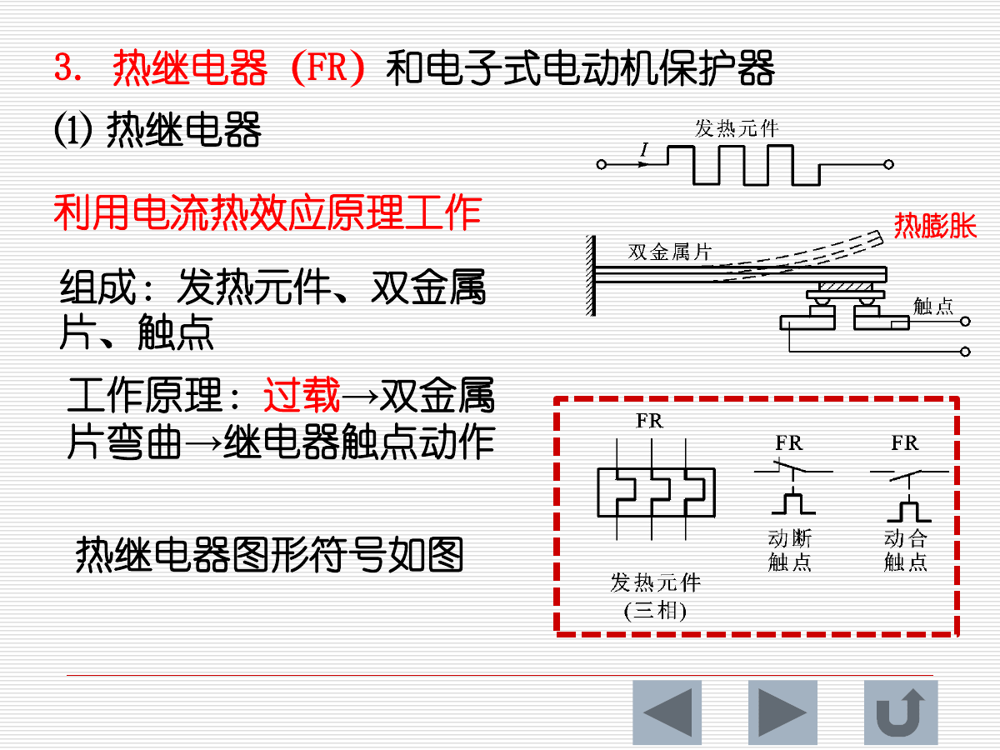

工作原理：

$$
过载\rightarrow 电流增大\rightarrow 发热元件发热\rightarrow 双金属片弯曲\rightarrow 触点动作
$$

注意：

- 热继电器用于**过载保护**。
- 短路保护应由熔断器或断路器承担。

#### 固态继电器 SSR

固态继电器由光电耦合器件、触发器和功率器件组成，是无触点继电器。

特点：

- 输入输出电气隔离。
- 无机械触点，寿命长。
- 开关速度快。
- 有导通压降和漏电流，散热要注意。

### 1.8 按钮和行程开关

按钮和行程开关属于主令电器，用于在控制系统中发出指令。

常见符号：

| 元件 | 符号 | 用途 |
|---|---|---|
| 按钮 | SB | 人工发出起动、停止等指令 |
| 行程开关 | ST | 检测机械位置，实现限位或自动往复 |
| 接近开关 | 课件中作为无触点行程开关介绍 | 检测物体接近 |

---

## 2. 三相异步电动机继电-接触控制

### 2.1 直接起动控制线路

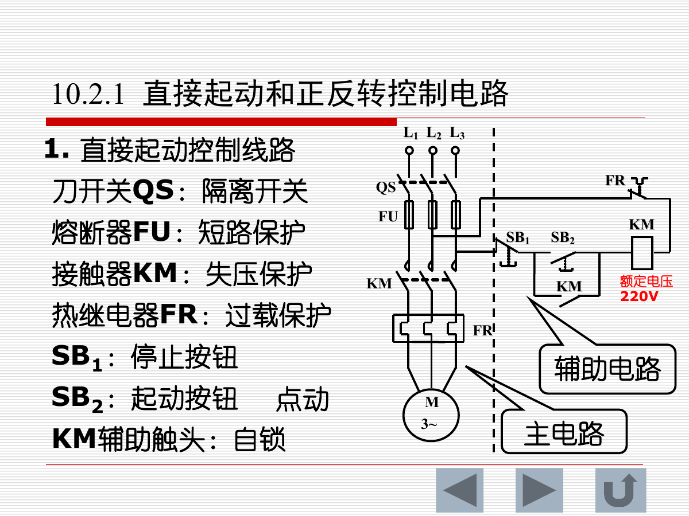

直接起动电路由主电路和控制电路组成。

元件作用：

| 元件 | 作用 |
|---|---|
| QS | 隔离开关 |
| FU | 短路保护 |
| KM | 接触器，控制主电路，并提供失压保护 |
| FR | 热继电器，过载保护 |
| SB1 | 停止按钮，通常为动断触点 |
| SB2 | 起动按钮，通常为动合触点 |
| KM 辅助触点 | 自锁 |

直接起动工作过程：

1. 按下起动按钮 `SB2`。
2. 接触器线圈 `KM` 得电。
3. `KM` 主触点闭合，电动机接通电源。
4. `KM` 辅助动合触点闭合，形成自锁。
5. 松开 `SB2` 后，线圈仍通过自锁触点得电。
6. 按下停止按钮 `SB1` 或热继电器动作时，控制回路断开，电机停止。

自锁的本质：用接触器自己的辅助触点并联起动按钮，使线圈在按钮松开后仍保持通电。

### 2.2 点动、两地控制和顺序控制

点动控制：

- 按下按钮电动机转动。
- 松开按钮电动机停止。
- 不使用自锁。

两地控制：

- 多个停止按钮串联，形成“与逻辑”。
- 多个起动按钮并联，形成“或逻辑”。

顺序控制：

- 用前一台电动机接触器的辅助触点作为后一台电动机的起动许可。
- 例如只有 `M1` 起动后，`M2` 才允许起动。

### 2.3 正反转控制电路

正反转控制通过调换三相电源任意两根相线改变电动机转向。

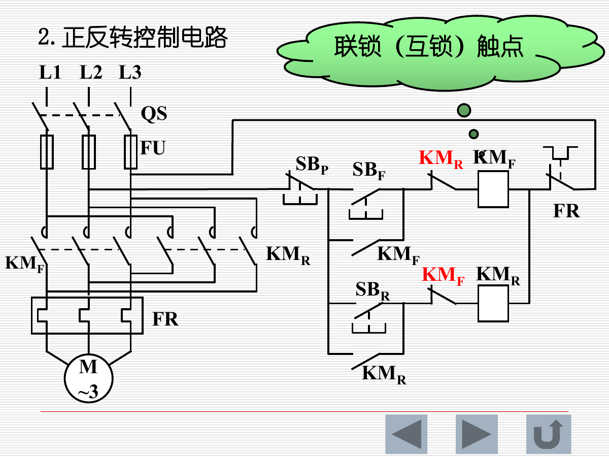

两个接触器：

| 接触器 | 功能 |
|---|---|
| KMF | 正转 |
| KMR | 反转 |

必须设置互锁：

- **电气互锁**：把对方接触器的动断辅助触点串入本方线圈回路。
- **机械互锁**：防止两个接触器机械上同时吸合。

原因：若正转和反转接触器同时吸合，会造成两相电源短路。

### 2.4 时间控制：Y-Δ 起动

时间控制通常用时间继电器实现。课件以三相异步电动机星形-三角形起动为例。

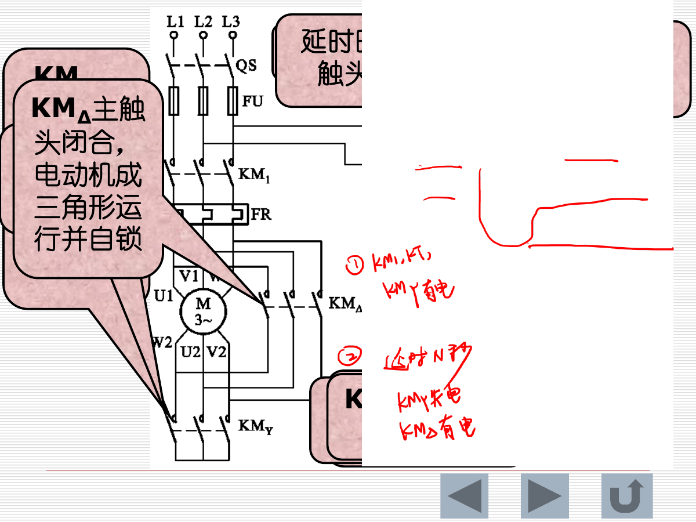

主要接触器：

| 元件 | 作用 |
|---|---|
| KM1 | 控制电动机启停 |
| KMY | 控制定子绕组星形连接 |
| KMΔ | 控制定子绕组三角形连接 |
| KT | 延时切换 |

工作过程：

1. 起动时 `KM1` 和 `KMY` 得电，电动机星形起动。
2. 时间继电器 `KT` 开始计时。
3. 延时时间到，`KMY` 断电。
4. `KMΔ` 得电，电动机切换为三角形正常运行。
5. `KMY` 与 `KMΔ` 必须互锁，避免星形和三角形同时接通。

### 2.5 行程控制

行程控制使用行程开关检测机械位置，实现自动换向、限位和往复运动。

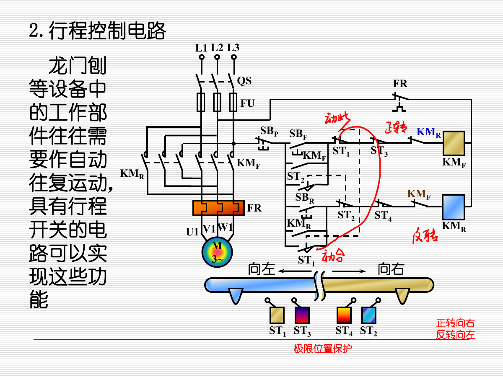

常见应用：

- 龙门刨
- 工作台自动往复
- 限位保护

核心思想：

- 工作部件到达某位置后压下行程开关。
- 行程开关改变控制回路状态。
- 接触器换向或断电，实现自动往复或极限保护。

---

## 3. 可编程控制器 PLC

### 3.1 PLC 的概念

PLC，即 Programmable Logic Controller，可编程控制器，是专为工业环境设计的数字运算电子系统。

课件中的核心定位：

- PLC 是工业自动化领域的“数字大脑”。
- 用程序替代传统继电器接线逻辑。
- 通过监控输入、执行程序、控制输出，实现机器设备控制。

PLC 特点：

- 可靠性高
- 灵活性好
- 编程容易
- 使用维护方便
- 易于组成控制网络

### 3.2 PLC 的结构

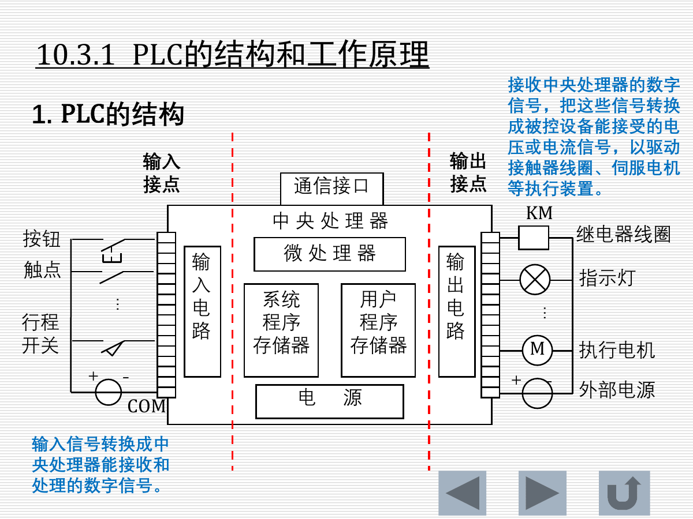

主要部分：

| 模块 | 作用 |
|---|---|
| 中央处理器 CPU | 执行程序、逻辑判断、协调各部分 |
| 系统程序存储器 | 存放系统程序 |
| 用户程序存储器 | 存放用户编写的控制程序 |
| 输入电路 | 把外部开关量/模拟量转换为 CPU 可识别信号 |
| 输出电路 | 把 CPU 指令转换为驱动负载的电压或电流 |
| 电源 | 给 PLC 内部供电 |
| 通信接口 | 编程、调试、联网 |

PLC 结构类型：

| 类型 | 特点 |
|---|---|
| 整体式 | 电源、CPU、I/O 集成在一起，适合小型控制 |
| 模块式 | 电源、机架、CPU、I/O、通信模块独立，扩展灵活 |

### 3.3 PLC 输入/输出等效

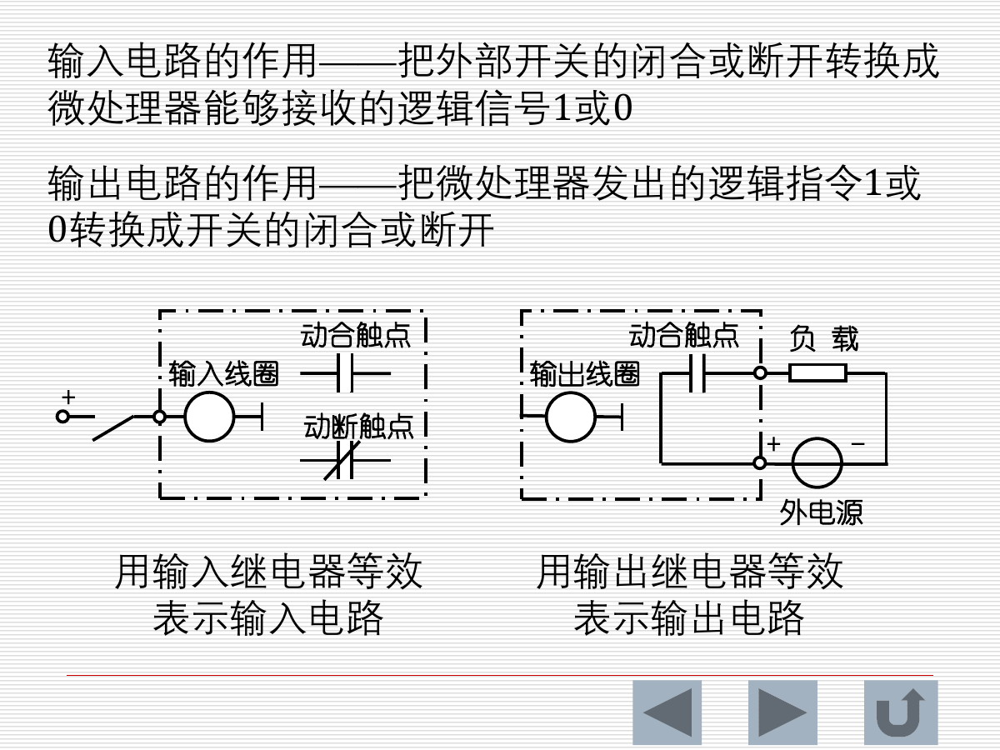

输入电路作用：

$$
外部开关闭合/断开\rightarrow PLC内部逻辑信号1/0
$$

输出电路作用：

$$
PLC内部逻辑指令1/0\rightarrow 外部负载接通/断开
$$

常用等效：

| 外部电路 | PLC 内部等效 |
|---|---|
| 按钮、行程开关等输入元件 | 输入继电器 X |
| 接触器线圈、指示灯等执行元件 | 输出继电器 Y |

### 3.4 PLC 工作原理：循环扫描

PLC 与传统继电器控制的根本区别：

| 继电-接触控制 | PLC 控制 |
|---|---|
| 接线程序控制系统 | 存储程序控制系统 |
| 改功能主要靠改接线 | 改功能主要靠改程序 |

PLC 采用循环扫描方式：

1. 输入扫描
2. 程序扫描
3. 输出扫描
4. 内务整理/自诊断

特点：

- PLC 不一定实时逐点刷新输出，而是按扫描周期执行。
- 程序执行通常按梯形图从左到右、从上到下进行。

### 3.5 PLC 编程语言和梯形图

IEC 标准中 PLC 编程语言包括：

- 梯形图 LD
- 指令表 IL
- 功能块图 FBD
- 顺序功能流程图 SFC
- 结构化文本 ST

本章重点是**梯形图**。

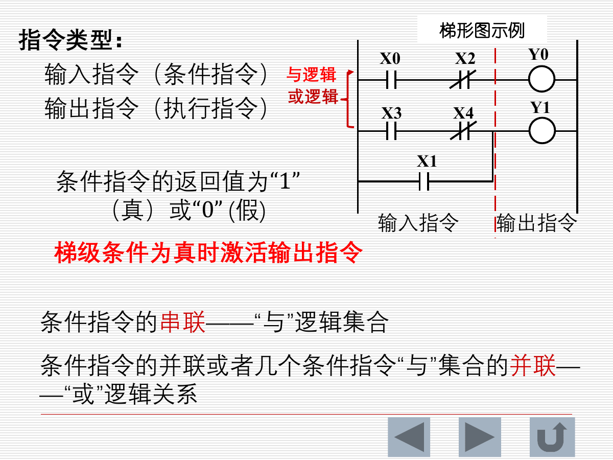

梯形图特点：

- 类似继电器控制线路。
- 左右母线类似电源两端。
- 条件触点串联表示“与”逻辑。
- 条件触点并联表示“或”逻辑。
- 梯级条件为真时，输出指令被激活。

常用软元件：

| 元件 | 说明 |
|---|---|
| X | 输入继电器 |
| Y | 输出继电器 |
| M | 辅助继电器 |
| T | 定时器 |
| C | 计数器 |

### 3.6 FX 系列常用继电器类指令

| 指令 | 含义 |
|---|---|
| LD | 动合输入，条件为 1 时为真 |
| LDI | 动断输入，条件为 0 时为真 |
| OUT | 非保持型输出，梯级真则置 1，假则清 0 |
| SET | 保持型置位 |
| RST | 复位 |
| PLS | 上升沿微分输出，一个扫描周期有效 |
| PLF | 下降沿微分输出，一个扫描周期有效 |

定时器/计数器：

- 定时器按时基累加，到预置值后置完成标志。
- 计数器在梯级条件由假到真跳变时计数。
- 复位指令 `RST` 可清除定时器或计数器状态。

### 3.7 梯形图基本编程规则

1. 每一行从左母线开始，输出指令接右侧。
2. 输入指令不能放在输出指令右边。
3. 同一程序中同一个输出点不应重复作为输出指令，避免误动作。
4. PLC 程序按从左到右、从上到下执行。
5. 输入指令可重复使用，可串联也可并联。

### 3.8 PLC 应用：Y-Δ 起动

课件以 PLC 实现三相异步电动机星形-三角形起动为例。

控制思路：

1. 按下起动按钮，主接触器 `KM1` 得电并自锁。
2. 星形接触器 `KMY` 得电，电机星形起动，同时启动定时器。
3. 定时结束后，`KMY` 断电。
4. 延时后，三角形接触器 `KMΔ` 得电，电机三角形运行。
5. 程序中仍要保证星形和三角形输出互锁。

---

## 4. 安全用电

### 4.1 触电方式

常见触电方式：

| 方式 | 说明 |
|---|---|
| 单相触电 | 人体接触一相带电体，电流经人体流向大地或其他导体 |
| 两相触电 | 人体同时触及两相带电体，承受线电压，最危险 |
| 漏电触电 | 设备外壳因绝缘损坏带电，人体接触外壳触电 |

触电急救第一原则：

$$
迅速、正确地使触电者脱离电源
$$

### 4.2 保护接地

保护接地是把电气设备正常情况下不带电的金属外壳，与埋入地下并和土壤良好接触的接地体连接。

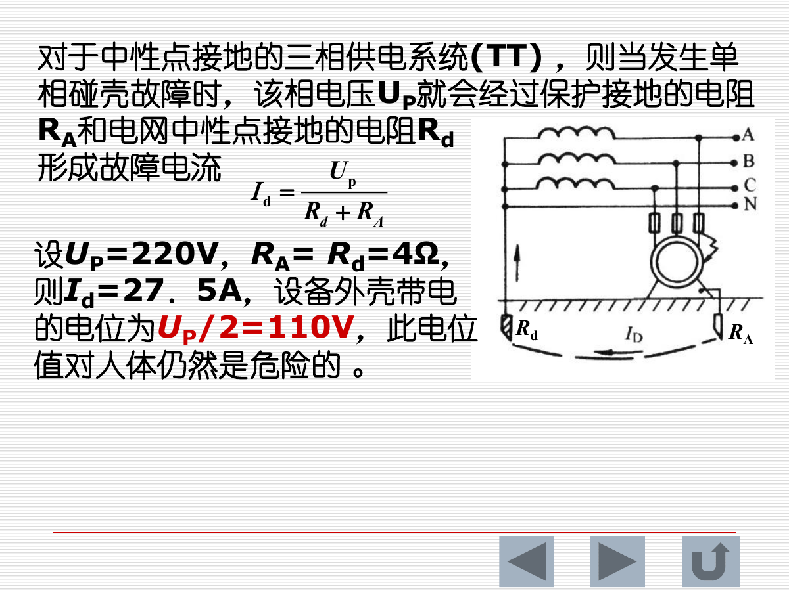

适用场合：

- 中性点不接地的三相供电系统。

要求：

- 对 $1000V$ 以下系统，接地电阻 $R_d$ 一般不大于 $4\Omega$。

### 4.3 保护接零

保护接零是在三相电源中性点接地的情况下，把设备金属外壳接到电源零线/中性线上。

故障时：

$$
相线碰壳\rightarrow 单相短路\rightarrow 熔断器或断路器动作\rightarrow 外壳不再带电
$$

重要注意：

- 采用接零保护时，电源中线不允许断开。
- 保护接零导线中不允许安装开关和熔断器。

### 4.4 电气防火和防爆

引起电气火灾或爆炸的原因：

- 电气设备内部短路
- 电气设备严重过载
- 触点接触不良
- 设备或线路绝缘损坏、老化
- 散热或通风设施损坏

防护措施：

- 在有火灾或爆炸危险场所选用防爆型、密封型、防尘型设备。
- 严格遵守安全操作规程。
- 保证线路不过载、不过热。
- 定期检查绝缘和接线端子。

### 4.5 静电防护

绝缘物体摩擦可产生静电。石油、塑料、化纤、纸张等生产或运输过程中容易积累静电。

常见危害：

- 引发火花放电。
- 点燃可燃气体或粉尘。
- 损坏电子器件。

防护思路：

- 接地泄放。
- 增湿。
- 使用防静电材料。
- 控制摩擦和流速。

---

## 5. 元件符号速查

| 符号 | 名称 | 主要作用 |
|---|---|---|
| QS | 刀开关 | 电源隔离 |
| FU | 熔断器 | 短路保护 |
| QF | 低压断路器 | 通断、过载、短路、欠压保护 |
| KM | 接触器 | 主电路频繁通断、失压保护 |
| KA | 中间继电器 | 信号传递、触点扩展 |
| KT | 时间继电器 | 延时控制 |
| FR | 热继电器 | 过载保护 |
| SB | 按钮 | 人工指令 |
| ST | 行程开关 | 位置检测、限位 |
| SSR | 固态继电器 | 无触点开关 |
| X | PLC 输入继电器 | 输入状态等效 |
| Y | PLC 输出继电器 | 输出状态等效 |
| M | PLC 辅助继电器 | 内部逻辑 |
| T | PLC 定时器 | 定时 |
| C | PLC 计数器 | 计数 |

---

## 6. 易错点与复习提醒

1. 熔断器主要做短路保护，热继电器主要做过载保护。
2. 接触器 `KM` 的主触点控制主电路，辅助触点用于自锁、互锁和信号控制。
3. 停止按钮通常用动断触点，起动按钮通常用动合触点。
4. 自锁触点应与起动按钮并联。
5. 两地控制中，停止按钮串联，起动按钮并联。
6. 正反转控制必须互锁，防止两个接触器同时吸合造成短路。
7. Y-Δ 起动中，星形接触器和三角形接触器必须互锁。
8. PLC 是存储程序控制，改变功能主要靠改程序；继电-接触控制是接线程序控制。
9. 梯形图中输入触点可重复使用，但同一个输出线圈不宜重复输出。
10. 保护接地适合中性点不接地系统；保护接零适合中性点接地系统。
11. 保护接零线中不能装开关和熔断器。
12. 两相触电人体承受线电压，危险性通常比单相触电更大。

---

## 7. 建议复习顺序

1. 先背符号：`QS/FU/QF/KM/KA/KT/FR/SB/ST`。
2. 结合直接起动电路理解主电路、控制电路、自锁和保护。
3. 再学正反转，把“调相序”和“互锁”联系起来。
4. 复习 Y-Δ 起动时，抓住时间继电器和星/三角互锁。
5. PLC 部分按“输入-程序-输出-扫描周期”理解。
6. 安全用电部分重点区分保护接地和保护接零。
