# 第4章 数字集成电路：核心知识点总结

> 来源：`4-200415-sun-第4章_数字集成电路.pdf`  
> 复习主线：逻辑代数 -> 门电路 -> 组合逻辑 -> 触发器 -> 时序逻辑 -> 存储器/PLD。

## 0. 本章知识框架

| 章节 | 核心内容 | 关键词 |
|---|---|---|
| 4.1 | 逻辑代数运算规则 | 与、或、非、反演律、吸收律 |
| 4.2 | 逻辑函数表示与化简 | 真值表、表达式、逻辑图、代数化简 |
| 4.3 | 集成门电路 | TTL、CMOS、三态门、扇出、传输延迟 |
| 4.4 | 组合逻辑电路 | 分析、设计、加法器、编码器、译码器、显示 |
| 4.5 | 集成触发器 | RS、D、JK、T，记忆功能 |
| 4.6 | 时序逻辑电路 | 寄存器、移位寄存器、计数器 |
| *4.7/*4.8 | 存储器和 PLD | ROM、RAM、PROM、PAL、GAL |

---

## 1. 数字电路与逻辑代数

### 1.1 数字信号的特点

数字电路处理的是离散状态信号，通常用二值逻辑表示：

| 逻辑值 | 含义 |
|---|---|
| 0 | 低电平、假、断开、不成立 |
| 1 | 高电平、真、接通、成立 |

逻辑代数又称布尔代数，是研究逻辑关系的数学工具。它的变量只取 0 和 1。

### 1.2 三种基本逻辑运算

逻辑代数有三种基本运算：

| 运算 | 符号 | 逻辑表达式 | 说明 |
|---|---|---|---|
| 与 | $\cdot$ | $F=AB$ | 输入全为 1，输出才为 1 |
| 或 | $+$ | $F=A+B$ | 输入有 1，输出为 1 |
| 非 | 上划线 | $F=\overline A$ | 输入取反 |

其他逻辑运算都可由与、或、非组成。

### 1.3 常用逻辑代数公式

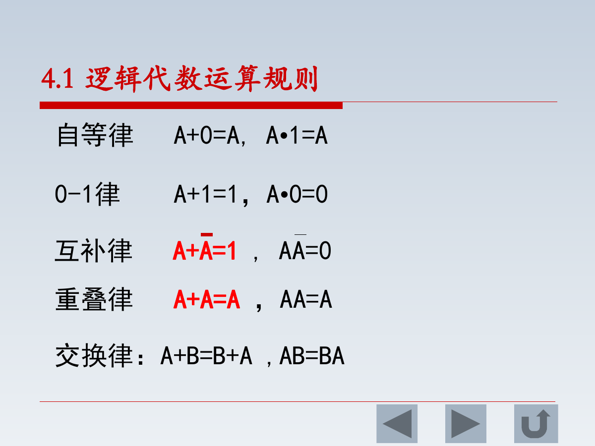

常用规律：

| 名称 | 公式 |
|---|---|
| 自等律 | $A+0=A,\quad A\cdot1=A$ |
| 0-1 律 | $A+1=1,\quad A\cdot0=0$ |
| 互补律 | $A+\overline A=1,\quad A\overline A=0$ |
| 重叠律 | $A+A=A,\quad AA=A$ |
| 交换律 | $A+B=B+A,\quad AB=BA$ |
| 结合律 | $A+(B+C)=(A+B)+C,\quad (AB)C=A(BC)$ |
| 分配律 | $A(B+C)=AB+AC,\quad A+BC=(A+B)(A+C)$ |
| 吸收律 | $A+AB=A,\quad A(A+B)=A$ |
| 反演律 | $\overline{ABC}=\overline A+\overline B+\overline C$，$\overline{A+B+C}=\overline A\,\overline B\,\overline C$ |

### 1.4 逻辑函数的表示方法

逻辑函数可用三种形式表示：

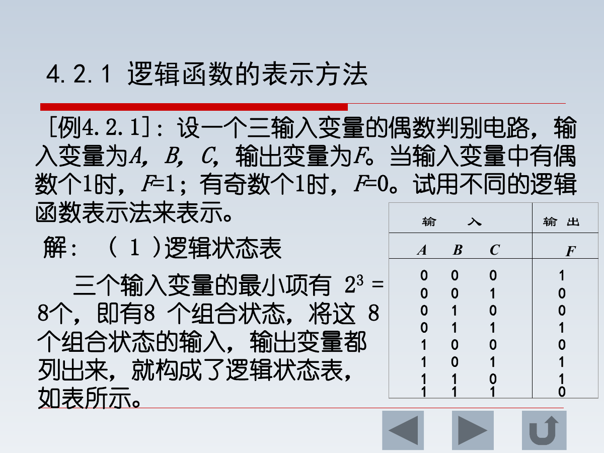

| 表示方法 | 作用 |
|---|---|
| 逻辑状态表/真值表 | 列出输入和输出的全部状态 |
| 逻辑表达式 | 用逻辑代数式表示输入输出关系 |
| 逻辑图 | 用门电路符号实现逻辑关系 |

典型设计流程：

$$
实际问题\rightarrow 定义变量\rightarrow 列真值表\rightarrow 写表达式\rightarrow 化简\rightarrow 画逻辑图
$$

### 1.5 逻辑函数代数化简

化简目标：使表达式中与项数目尽量少、每个与项变量数尽量少。

常用方法：

| 方法 | 典型公式 |
|---|---|
| 合并项法 | $AB+A\overline B=A$ |
| 吸收法 | $A+AB=A$ |
| 消去法 | $A+\overline A B=A+B$ |
| 配项法 | $A=A(B+\overline B)$ |

---

## 2. 集成门电路

### 2.1 常用门电路

门电路是数字电路的基本逻辑单元。

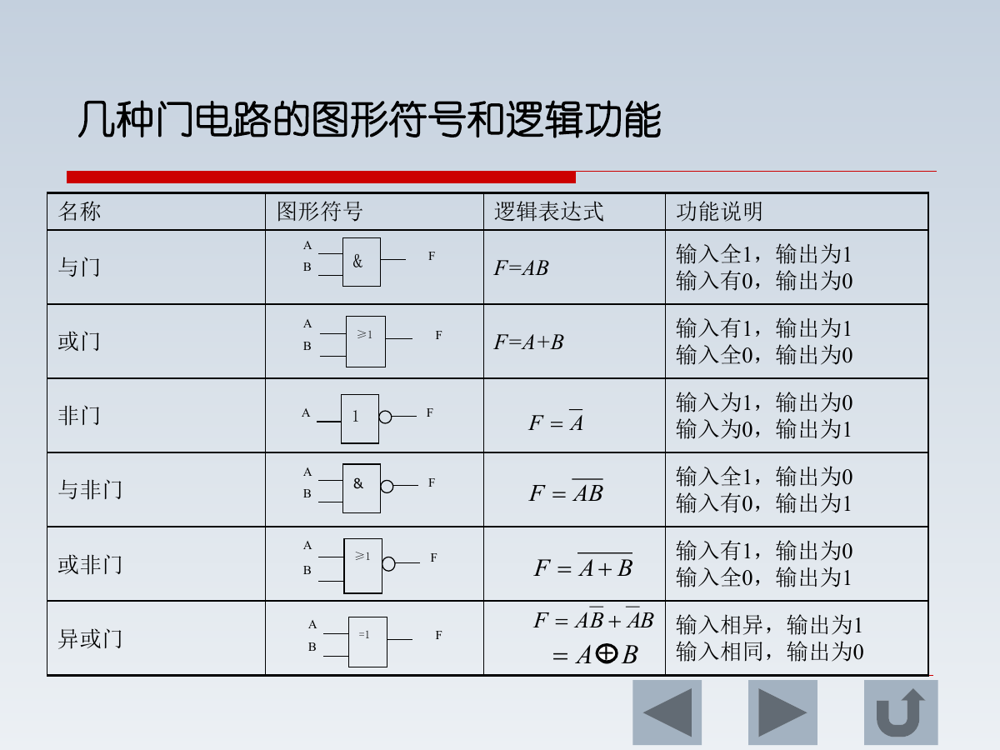

| 门电路 | 表达式 | 功能 |
|---|---|---|
| 与门 | $F=AB$ | 全 1 出 1 |
| 或门 | $F=A+B$ | 有 1 出 1 |
| 非门 | $F=\overline A$ | 取反 |
| 与非门 | $F=\overline{AB}$ | 全 1 出 0 |
| 或非门 | $F=\overline{A+B}$ | 全 0 出 1 |
| 异或门 | $F=A\oplus B$ | 输入相异出 1 |

### 2.2 TTL 与 CMOS

集成门电路常见类型：

| 类型 | 特点 |
|---|---|
| TTL | 以双极型晶体管为基础，速度较快，功耗较大 |
| CMOS | 以 MOS 管为基础，功耗低，输入阻抗高，抗干扰能力强 |

学习重点不是内部管级细节，而是正确理解逻辑功能、输入输出电平、负载能力和速度指标。

### 2.3 TTL 门主要参数

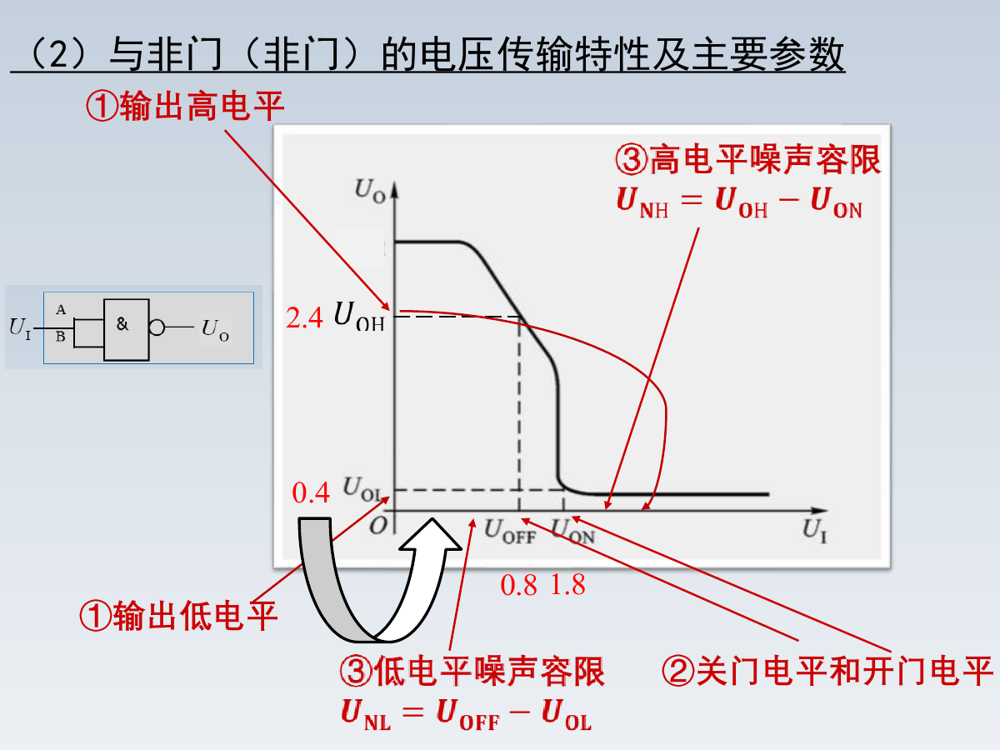

重要参数：

| 参数 | 含义 |
|---|---|
| 输出高电平 $U_{OH}$ | 输出为逻辑 1 时的电压 |
| 输出低电平 $U_{OL}$ | 输出为逻辑 0 时的电压 |
| 关门电平 | 输入低于该值时认为关断 |
| 开门电平 | 输入高于该值时认为开通 |
| 扇出系数 $N_0$ | 一个门能驱动同类门的最大数目 |
| 平均传输延迟时间 $t_{pd}$ | 表示门电路开关速度 |

课件给出：TTL 与非门扇出系数通常规定 $N_0\ge 8$。

### 2.4 三态门

三态门有三种输出状态：

1. 高电平
2. 低电平
3. 高阻态

高阻态相当于输出端与电路断开。

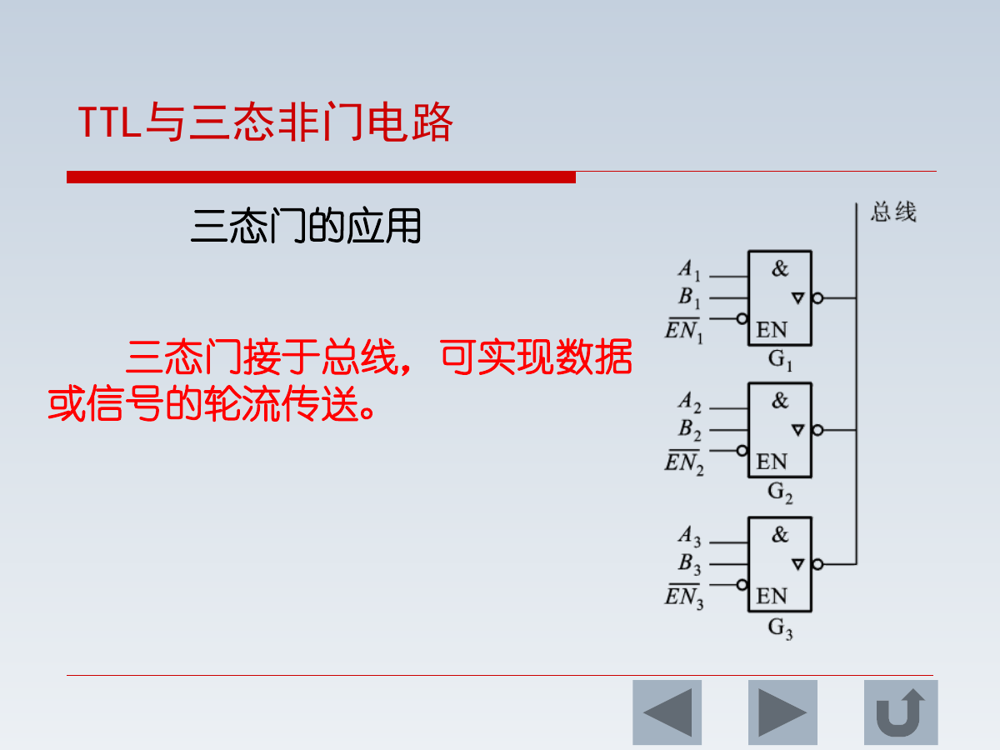

作用：

- 多个逻辑门可共用一条总线。
- 任一时刻只允许一个三态门被使能，其余为高阻态。
- 可实现数据分时传送。

易错点：普通门输出不能直接并联；三态门输出只有在受控分时工作时才能接在同一总线上。

---

## 3. 组合逻辑电路

### 3.1 组合逻辑电路特点

组合逻辑电路由门电路组合而成。

核心特点：

$$
当前输出只与当前输入有关，与电路过去状态无关
$$

这与后面的时序逻辑电路形成对比。

### 3.2 组合逻辑电路分析

分析步骤：

1. 根据逻辑图写出输出表达式。
2. 化简表达式。
3. 列出真值表。
4. 判断电路功能。

### 3.3 组合逻辑电路设计

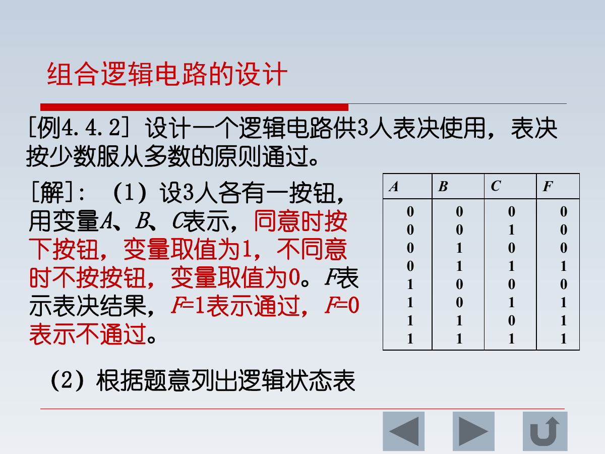

设计步骤：

1. 明确输入变量和输出变量。
2. 按题意列真值表。
3. 由真值表写出逻辑表达式。
4. 化简表达式。
5. 按表达式画逻辑图。

三人表决电路：

当 $A,B,C$ 中至少两个为 1 时，输出 $F=1$。

$$
F=AB+AC+BC
$$

### 3.4 加法器

#### 半加器

半加器实现两个一位二进制数相加，不考虑低位进位。

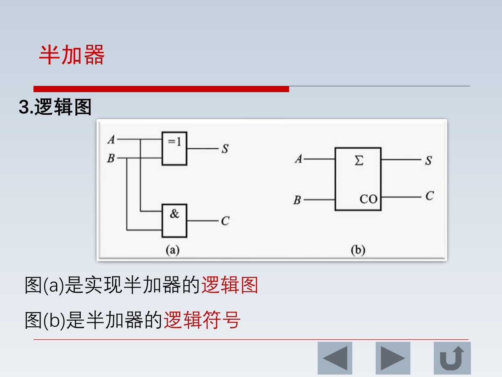

半加器：

$$
S=A\oplus B
$$

$$
C=AB
$$

其中 $S$ 是和，$C$ 是进位。

#### 全加器

全加器考虑来自低位的进位 $C_{n-1}$。

全加器常用关系：

$$
S_n=A_n\oplus B_n\oplus C_{n-1}
$$

$$
C_n=A_nB_n+(A_n\oplus B_n)C_{n-1}
$$

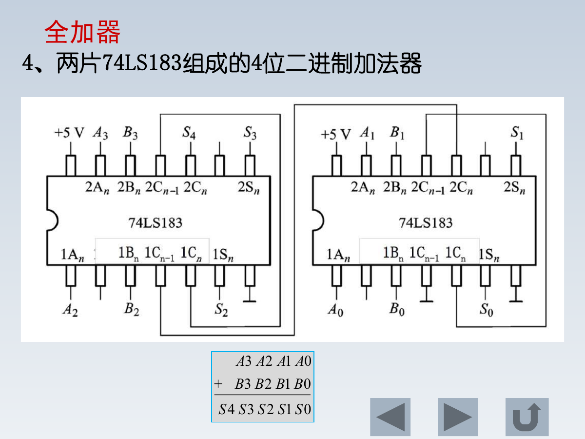

多位加法器可由多个全加器级联实现。

### 3.5 编码器、译码器和数字显示

#### 编码器

编码是用二进制代码表示给定信息。

8421 BCD 码：

$$
十进制数=8D+4C+2B+A
$$

其中 $D,C,B,A$ 分别表示 8、4、2、1 位。

#### 译码器

译码是编码的逆过程。

N 位二进制译码器：

| 输入 | 输出 |
|---|---|
| N 位二进制码 | $2^N$ 个输出端 |

通常称为 N 线- $2^N$ 线译码器，例如 2 线-4 线、3 线-8 线译码器。

#### 数字显示

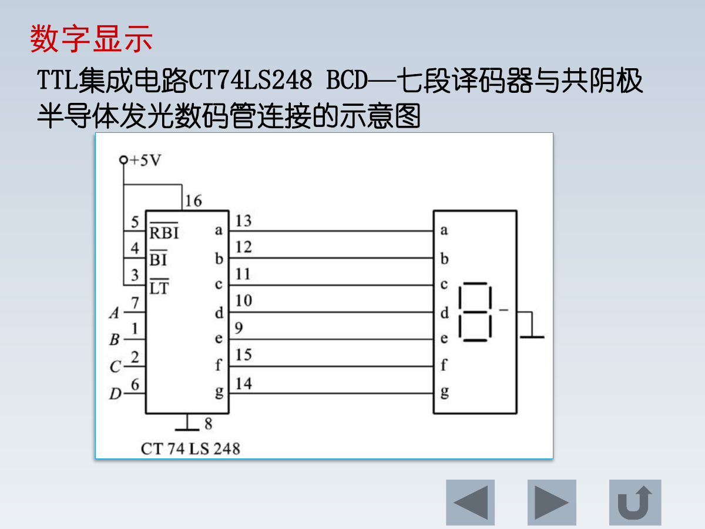

数字显示通常包含：

$$
BCD码\rightarrow 七段译码器\rightarrow 数码管
$$

课件以 CT74LS248 BCD-七段译码器驱动共阴极数码管为例。

### 3.6 数据选择器和数据分配器

| 电路 | 功能 |
|---|---|
| 数据选择器 | 在地址/选择信号控制下，从多个输入中选一路送到输出 |
| 数据分配器 | 在地址/选择信号控制下，把一个输入送到多个输出中的一路 |

---

## 4. 集成触发器

### 4.1 触发器的特点

触发器是组成时序逻辑电路的基本部件。

特点：

- 有 0 和 1 两个稳定状态。
- 能保存 1 位二进制信息。
- 输出次态不仅与当前输入有关，还与原状态有关。

这就是触发器与普通门电路的本质区别。

### 4.2 基本 RS 触发器

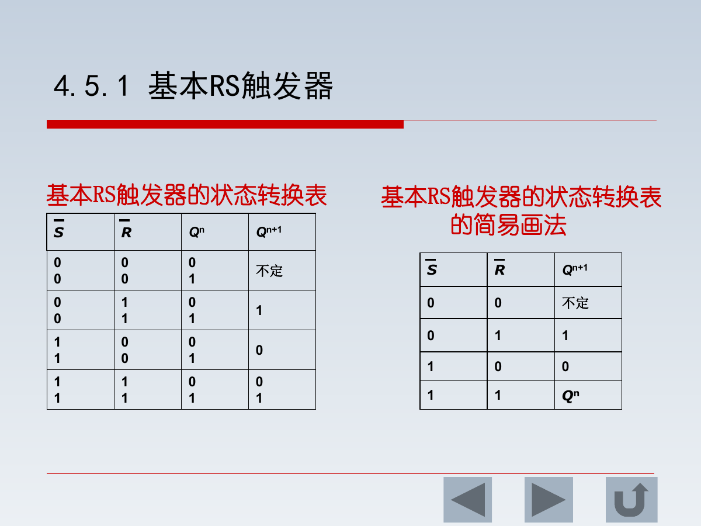

课件中的基本 RS 触发器为低电平触发型，其状态表可记为：

| S | R | $Q^{n+1}$ | 说明 |
|---|---|---|---|
| 0 | 0 | 不定 | 禁止状态 |
| 0 | 1 | 1 | 置 1 |
| 1 | 0 | 0 | 置 0 |
| 1 | 1 | $Q^n$ | 保持 |

要点：

- $S=R=1$ 时保持原状态，体现记忆功能。
- $S=R=0$ 是不允许状态。

### 4.3 D 锁存器和边沿 D 触发器

D 锁存器为电平触发，高电平有效时：

$$
Q^{n+1}=D
$$

时钟低电平时数据不能传入，输出保持。

正边沿 D 触发器只在时钟上升沿到来时采样 D 端。

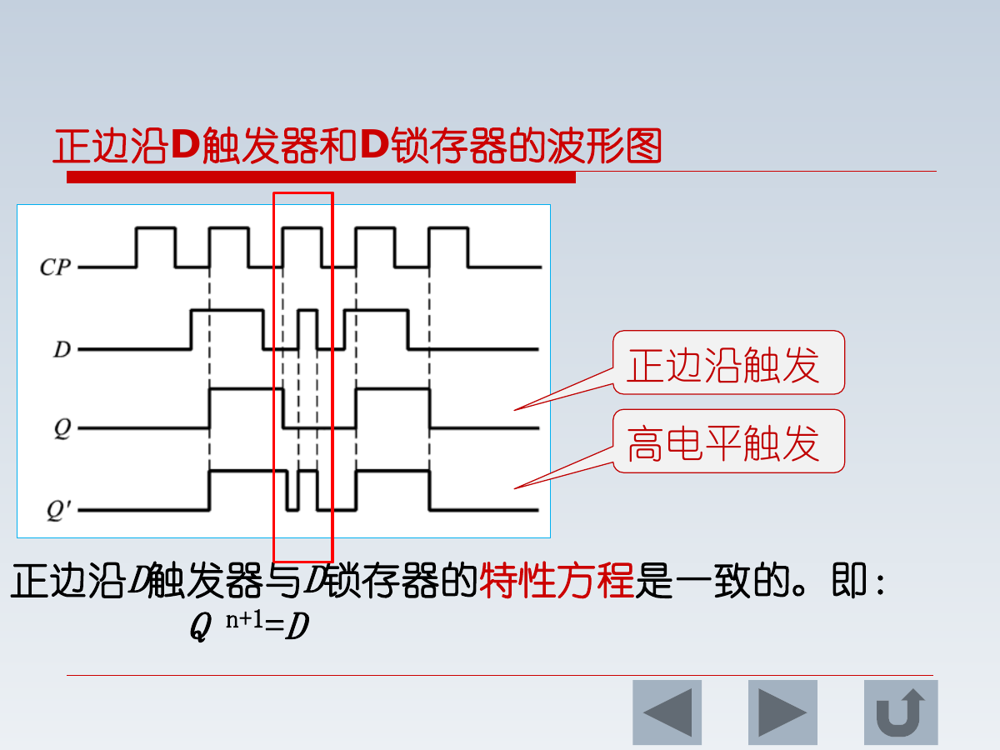

区别：

| 类型 | 触发方式 |
|---|---|
| D 锁存器 | 电平触发 |
| 边沿 D 触发器 | 时钟边沿触发 |

### 4.4 JK 触发器

JK 触发器可看作改进型 RS 触发器，没有 RS 同时有效时的不定状态。

特性方程：

$$
Q^{n+1}=J\overline{Q^n}+\overline K Q^n
$$

状态规律：

| J | K | $Q^{n+1}$ |
|---|---|---|
| 0 | 0 | $Q^n$，保持 |
| 0 | 1 | 0，复位 |
| 1 | 0 | 1，置位 |
| 1 | 1 | $\overline{Q^n}$，翻转 |

### 4.5 T 触发器

T 触发器特性方程：

$$
Q^{n+1}=T\overline{Q^n}+\overline TQ^n
$$

规律：

| T | 功能 |
|---|---|
| 0 | 保持 |
| 1 | 每来一次时钟翻转一次 |

T 触发器常用于计数电路。

---

## 5. 时序逻辑电路

### 5.1 时序逻辑电路特点

时序逻辑电路的输出不仅与当前输入有关，还与电路原来的状态有关。

组成：

- 触发器
- 组合逻辑电路

分类：

| 类型 | 特点 |
|---|---|
| 同步时序逻辑电路 | 各触发器受同一时钟控制 |
| 异步时序逻辑电路 | 触发器时钟不完全相同 |

### 5.2 时序逻辑电路分析步骤

1. 分析电路组成，确定输入、输出和触发器状态。
2. 写出输出方程。
3. 写出各触发器输入端的驱动方程。
4. 将驱动方程代入触发器特性方程，得到状态方程。
5. 列状态转换表。
6. 画状态图和波形图，判断逻辑功能。

### 5.3 寄存器

寄存器用于暂时存放二进制数据。

| 类型 | 功能 |
|---|---|
| 数码寄存器 | 存放数据或运算结果 |
| 移位寄存器 | 存放并实现左移/右移 |

一位触发器可存放一位二进制数。存放 n 位数据需要 n 个触发器。

移位寄存器可用于：

- 串行/并行数据转换
- 二进制数移位
- 计数、顺序脉冲产生

### 5.4 计数器

计数器用于对脉冲个数计数，也可用于分频、定时。

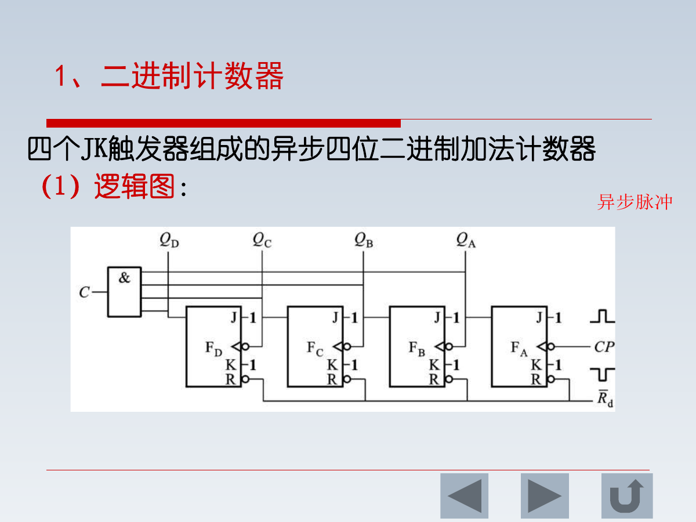

分类：

| 分类依据 | 类型 |
|---|---|
| 计数方向 | 加法、减法、可逆 |
| 脉冲引入方式 | 同步、异步 |
| 进制 | 二进制、十进制、任意进制 |

十进制计数器常用 8421 BCD 码表示，逢十进一。

任意进制计数器可用复位法或置数法由集成计数器构成。

---

## 6. 存储器和 PLD 简要

### 6.1 半导体存储器

| 类型 | 含义 | 特点 |
|---|---|---|
| ROM | 只读存储器 | 存储固定信息，通常读出为主 |
| RAM | 随机存取存储器 | 可读可写，写入会刷新原信息 |

存储容量常用：

$$
字数\times 位数
$$

例如 $4\times8$ ROM 表示有 4 个字，每个字 8 位。

### 6.2 可编程逻辑器件 PLD

PLD 用可编程阵列实现逻辑函数。

| 器件 | 结构特点 |
|---|---|
| PROM | 与阵列固定，或阵列可编程 |
| PAL | 与阵列可编程，或阵列固定 |
| GAL | 通用阵列逻辑，可重复配置，灵活性更高 |

---

## 7. 公式速查

| 场景 | 公式 |
|---|---|
| 与门 | $F=AB$ |
| 或门 | $F=A+B$ |
| 非门 | $F=\overline A$ |
| 异或 | $F=A\oplus B$ |
| 三人表决 | $F=AB+AC+BC$ |
| 半加器和 | $S=A\oplus B$ |
| 半加器进位 | $C=AB$ |
| 全加器和 | $S_n=A_n\oplus B_n\oplus C_{n-1}$ |
| 全加器进位 | $C_n=A_nB_n+(A_n\oplus B_n)C_{n-1}$ |
| D 触发器 | $Q^{n+1}=D$ |
| JK 触发器 | $Q^{n+1}=J\overline{Q^n}+\overline KQ^n$ |
| T 触发器 | $Q^{n+1}=T\overline{Q^n}+\overline TQ^n$ |

---

## 8. 易错点与复习提醒

1. 组合逻辑没有记忆，输出只由当前输入决定。
2. 时序逻辑有记忆，输出与当前输入和原状态都有关。
3. 普通门输出不能直接并联，三态门可通过高阻态实现总线共享。
4. TTL 门要关注扇出能力和传输延迟。
5. 基本 RS 触发器要看清有效电平；课件中的 RS 表是低电平有效。
6. D 锁存器是电平触发，边沿 D 触发器是边沿触发。
7. JK 触发器在 $J=K=1$ 时翻转，不是不定。
8. T 触发器 $T=1$ 时每个时钟翻转一次，常用于计数。
9. BCD 码只编码 0~9，1010~1111 不是有效十进制码。
10. 任意进制计数器常通过复位或置数跳过多余状态。

---

## 9. 建议复习顺序

1. 先背逻辑代数基本律和反演律。
2. 熟悉常见门电路符号和逻辑表达式。
3. 按“真值表 -> 表达式 -> 化简 -> 逻辑图”练组合逻辑设计。
4. 掌握半加器、全加器、译码器、七段显示。
5. 区分 RS、D、JK、T 触发器的状态表和特性方程。
6. 最后复习寄存器和计数器，理解时序逻辑的状态转换。
